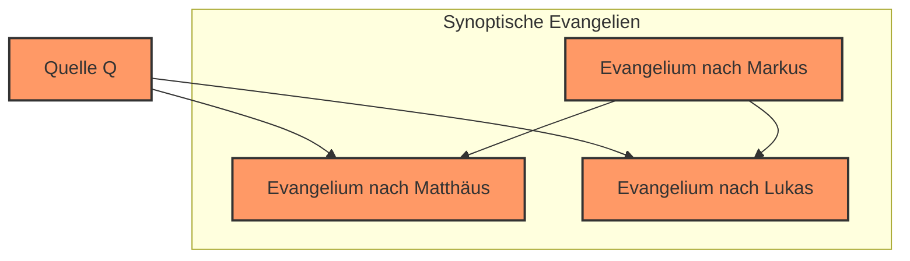

# Inhaltsverzeichnis
```table-of-contents
```


# Einleitung
Das Wort _Apologetik_ kann sich wie _Apology_ anhören, also wie eine _Entschuldigung_ – als müssten Christen sich für ihren Glauben entschuldigen oder Ausreden dafür finden. Das Wort kommt jedoch vom griechischen _apologia_ und bezeichnet eine Verteidigung wie in einem Gerichtsprozess [Craig 2010: Seiten 1 ff.]. Apologetik hat eine konkrete biblische Grundlage. In 1 Petrus 3,15 heißt es: „Seid stets bereit, jedem Rede und Antwort zu stehen, der nach der Hoffnung fragt, die euch erfüllt.“ Das hier mit _Rede und Antwort stehen_ wiedergegebene Wort ist im griechischen Original gerade _apologia_. Die Schrift gebietet uns also tatsächlich, unseren Glauben verteidigen zu können. Klassische katholische Apologetik umfasst gewöhnlich drei große Bereiche. Erstens wird die Existenz Gottes mit philosophischen Argumenten verteidigt. Zweitens führen historische Argumente für die Auferstehung Christi vom allgemeinen Theismus zum Christentum im Besonderen. Drittens wird die katholische Kirche gewöhnlich mit biblischen und historischen Argumenten gegenüber anderen Konfessionen verteidigt. Dieser Text beschränkt sich auf die Argumente für die Existenz Gottes und die Gottheit Jesu.
Der Vortrag wird wie folgt aufgebaut sein:
Zuerst werden Philosophische Argumente für die Existenz Gottes präsentiert. Diese sind aufgeteilt in vier Kosmologische Argumente, das moralische Argument, zwei Teleologische Argumente und zuletzt drei ontologische Argumente.
Danach wird ein grundsätzlicher Ansatz für ein wissenschaftliches Argument präsentiert und danach Argumente von Wundern, mit einem speziellen Fokus auf das Argument für die Auferstehung Jesu.
Zum Schluss werden noch einige populäre Argumente gegen Gott widerlegt.
Zwischendrin wird es immer wieder Exkurse geben. Einerseits zu wichtigen Philosophen die erwähnt werden und andererseits zu wichtigen Konzepten aus Logik und Mathematik, die meist für den speziellen Kontext wichtig sind, aber auch später im Skript noch für ein besseres Verständnis gebraucht werden.
Teilweise wird der Vortrag sehr in die Tiefe gehen. Es ist allerdings nicht wichtig, dass der Leser alle Konzepte versteht um den Argumenten grundsätzlich folgen zu können.


# Kalam Kosmologisches Argument
Das Kalam Kosmologische Argument gehört zur Familie der Kosmologischen Argumente. Diese Argumentieren von bestimmten Fakten über das Universum zu Gott. Speziell für Kosmologische Argumente gibt es auch eine biblische Basis. Paulus schreibt nämlich [Römer 1, 20]:

>Seit Erschaffung der Welt wird nämlich seine unsichtbare Wirklichkeit an den Werken der Schöpfung mit der Vernunft wahrgenommen, seine ewige Macht und Gottheit.

Der Fakt über das Universum von dem aus das Kalam argumentiert ist seine endliche Vergangenheit. Das "Kalam" kommt von einer gleichnamigen islamischen Schule in der das Argument entschieden entwickelt wurde. [Craig, Moreland 2009: Seite 101]. Die Grundstruktur des Arguments ist wie folgt:
1. Alles, das Anfängt zu existieren hat eine Ursache für seine Existenz
2. Das Universum hat angefangen zu existieren
3. Also hat das Universum eine Ursache für seine Existenz (von 1. und 2.)

In einem zweien Schritt wird dann argumentiert, dass diese Ursache gewisse klassisch göttliche Attribute haben muss und deshalb Gott sein muss.
Wir können das Argument also erweitern:

4. Wenn das Universum eine Ursache für seine Existenz hat, dann Existiert Gott
5. Also existiert Gott (von 3. und 4.)

Das Argument wurde Populär gemacht vom amerikanischen Philosophen und evangelikalen Theologen William Lane Craig.

___
## _Exkurs: William Lane Craig_


William Lane Craig (\* 23.08.1949 in Peoria, Illinois, USA) ist Professor für Philosophie an der Biola University. Im Jahr 1977 hat er seinen Doktortitel in Philosophie an der University of Birmingham erhalten. Das Thema seiner Doktorarbeit war das Kalam Kosmologische Argument. Aus seiner Doktorarbeit ist dann auch das Buch _The Kalam Cosmological Argument_ entstanden. Im Jahr 1984 dann hat er an der Universität München seinen Doktortitel in Theologie erhalten. Das Thema dieser Doktorarbeit war das Historische Argument für die Auferstehung Jesu. Aus dieser Doktorarbeit resultiere unter anderem das Buch _The Son Rises_. Dr. Craig hat über 40 Bücher und über 200 Fachartikel veröffentlicht [ReasonableFaith 2021]. Seine Forschungsinteressen liegen vor allem beim Kalam, der Auferstehung Jesu, der Zeitphilosophie, der Existenz von Abstrakten Objekten, generellen Metaphysik und der Historizität von Adam und Eva. Dr. Craig ist evangelikaler Protestant und hat in vielen Debatten sowohl generischen Theismus als auch das Christentum im speziellen Verteidigt. Dabei hat er es mit allen vier sogenannten _New Atheists_ aufgenommen und prominennte atheistische Philosophen, Physiker und Neu-Testament-Forscher debattiert. Der allgemeine Konsens ist, dass Craig sich in fast allen seinen Debatten sehr gut geschlagen hat. Der _New Atheist_ Sam Harris bezeichnete in als "the one Christian apologist who seems to have put the fear of God into many of my fellow atheists" [PremierChristianity 2013]. Meiner Meinung nach ist er der beste Verteidiger von Gottes Existenz und der Auferstehung Jesu in öffentlichen Debatten.
___

Um nun sein Argument und die folgenden deduktiven Argumente richtig verstehen zu können, werden wir nun zuerst die Struktur des Argument analysieren, in einer kleinen Einführung in die Aussagenlogik.

___
## _Exkurs: Aussagenlogik und Deduktive Argumente_
Aussagenlogik ist die Lehre der Bedeutung und Inferenz-Beziehungen zwischen Aussagen. [StanfordEncyclopedia 1]
Es untersucht also die Wahrheitswerte von Aussagen und wie sich die Wahrheitswerte von Aussagen verhalten, wenn sie in Beziehungen zueinander stehen, wobei die Wahrheitswerte von den sogenannten _truth-functional connectives_ abhängen, also von _wahrheitsfunktionale Verknüpfungen_ wie _und_, _oder_, _nicht_ usw.. [Papineau 2012: Seiten 139 ff.]

| \( p \) | \( ¬ p \) |
| ------- | --------- |
| T       | F         |
| F       | T         |

| \( p \) | \( q \) | \( p $\land$ q \) |
| ------- | ------- | ----------------- |
| T       | T       | T                 |
| T       | F       | F                 |
| F       | T       | F                 |
| F       | F       | F                 |

| \( p \) | \( q \) | \( p $\lor$ q \) |
| ------- | ------- | ---------------- |
| T       | T       | T                |
| T       | F       | T                |
| F       | T       | T                |
| F       | F       | F                |

| \( p \) | \( q \) | \( p $\rightarrow$q \) |
| ------- | ------- | ---------------------- |
| T       | T       | T                      |
| T       | F       | F                      |
| F       | T       | T                      |
| F       | F       | T                      |

Was hier zu sehen ist sind sogenannte Wahrheitstabellen, sie zeigen an, wie sich Wahrheitswerte die in Beziehung zueinander stehen miteinander verhalten. Das "¬" in der ersten Tabelle bedeutet _nicht_, also wenn _p_ wahr ist, dann muss _nicht p_ falsch sein. _p_ und _q_ stehen hier für beliebige Aussagen, wie _1+1=2_, _Schnee ist weiß_ oder _Die Erde ist flach_. Also wenn _Die Erde ist flach_ wahr ist, dann ist _Die Erde ist nicht flach_ falsch. Die formale Logik ist hier eben nur dass System, dass angibt, was die Implikationen sind, **wenn** eine Aussage einen bestimmten Wahrheitswert hat. Somit müssen wir in unseren Argumenten nur die Wahrheit von einer oder wenigen Aussagen herleiten und können dann mit den Logischen Folgerungsregeln weitere Wahrheiten ableiten, die **notwendigerweise** wahr sind, unter der Bedingung, dass unsere Prämissen wahr sind.
Wichtig ist hierbei eine Unterscheidung zwischen der _validity_ und der _soundness_ eines Arguments vorzunehmen. _Validity_ kann mit _Gültigkeit_ übersetzt werden und _soundness_ mit _Schlüssigkeit_. So ist _Die Erde ist flach, also ist es falsch, dass die Erde nicht flach ist_ zwar ein _gültiges_ Argument, ist aber nicht _schlüssig_. Ein Argument ist immer dann _gültig_, wenn eine Folgerung nach den logischen Deduktionsregeln von den Prämissen folgt, es ist aber nur dann _schlüssig_, wenn es sowohl _gültig_ ist, also auch die Prämissen wahr sind. So folgt aus _Die Erde ist flach_ zwar nach den logischen Regeln tatsächlicher Weise _Es ist falsch, dass die Erde nicht flach ist_ allerdings ist die Prämisse also _Die Erde ist flach_ nicht wahr, weshalb das Argument nicht schlüssig ist.
Das "$\land$" in der zweiten Tabelle bedeutet _und_, das "$\lor$" in der dritten Tabelle bedeutet _oder_ und in der vierten Tabelle bedeutet das "→" _wenn, dann_, also _wenn p, dann q_. Das letztere ist wichtig für das Kalam, es benutzt nämlich die Inferenz-Regel die sich _modus ponens_ nennt, welche folgendes aussagt:
1. $p \rightarrow q$
2. $p$
3. $\therefore q$

Das "$\therefore$" bedeutet _therefore_, also _also_. In Worten Ausgedrückt lässt es sich wie folgt formulieren: _Wenn p dann q, p, also q_. Wir müssen also nur etablieren, dass _Wenn p wahr ist, dann q auch wahr sein muss_ und dass _p wahr ist_ und dann können wir aufgrund der Inferenzregel ableiten, dass _q_ auch wahr sein muss. Manchmal wird "$\rightarrow$" auch als "$\supset$" geschrieben, diese Schreibweise verdeutlicht eine alternative Sichtweise um diese Inferenzregel zu interpretieren. $p \supset q$ würde man nämlich in der mathematischen Mengenlehre als _p ist eine Teilmenge von q_ interpretieren. Beide Interpretationen drücken aber die gleiche Wahrheit aus, was sich am besten mit einem Beispiel zeigen lässt. Lassen wir _p_ für Pudel stehen und _q_ für Hund. Es zeigt sich, dass Pudel ist eine Teilmenge von Hund auch impliziert, dass wenn etwas ein Pudel ist, es dann auch notwendigerweise ein Hund ist. Wenn also jeder Hund ein Säugetier ist und Pudel eine Teilmenge von Hunden ist, dann können wir ableiten, dass auch jeder Pudel ein Säugetier ist.
___

## Prämisse 1: Alles, das Anfängt zu existieren hat eine Ursache für seine Existenz

Die Erste Prämisse ist äquivalent zu _Wenn etwas anfängt zu existieren dann hat es eine Ursache für seine Existenz_ oder eben _Alle Dinge die Anfangen zu existieren sind eine Teilmenge der Menge der Dinge die eine Ursache für Ihre Existenz haben_.
Diese Prämisse ist die weniger kontroverse der beiden Prämissen, in unserer Alltagserfahrung sehen wir niemals, dass einfach ein Elefant in unsrem Zimmer auftaucht oder, dass ein Tisch entsteht, ohne dass ein Schreiner in gemacht hat. Allerdings sollten wir hier dennoch die Argumente und Gegenargumente betrachten. In seinem 1979 erschienen Buch _The Kalam Cosmological Argument_, dass aus William Lane Craigs Doktorarbeit entstanden ist gibt er dafür zwei Argumente [Craig 1979: Seiten 141-149], in seinem Artikel im _Blackwell Companion to Natural Theology_ [Craig Moreland 2009: Seiten 182-190], gibt er noch ein weiteres. Der Katholische Philosoph Professor Robert C. Koons von der University of Texas gibt in einem Vortrag an seiner Universität [UniversityOfTexas 2014] noch ein komplett neues Argument, an welches auch Prof. Alexander Pruss auf seinem Blog anknüpft [Pruss 2009]. Hier präsentieren wir ein von Dr. Craig inspiriertes Argument und noch Koons Argument.

### Unterstützendeds Argument #1: Empirisches Argument
Das Erste Argument ist ein Induktives Argument.

___
#### _Exkurs: Induktive Argumente_
Anderst als bei deduktiven Argumenten folgt hier die Schlussfolgerung nicht notwendigerweise, sondern ist nur wahrscheinlicher als Unwahrscheinlich. Bei deduktiven Argumenten wird vom Allgemeinen auf das spezielle geschlossen. Also wenn alle Schwäne zwei Beine haben, dann hat jeder einzelne Schwan auch zwei Beine. Bei Induktiven Argumenten geht es anderstrum, es wird vom speziellen auf das allgmeine geschlossen: _Ich habe einen weißen Schwan gesehen, also sind wahrscheinlich alle Schwäne weiß_. Allerdings gibt es in Australien tatsächlich Schwarze Schwäne, die Schlussfolgerung ist also falsch. Das bedeutet allerdings nicht, dass induktive Argumente generell unzuverlässig sind. Induktive Argumente können auch Stochastisch Interpretiert werden, dann zeigt sich wie jede Beobachtung die Kraft einen Induktiven Argument stärkt. Wird ein Würfel einmal gewürfelt und landet auf einer Sechs so ist dies schon ein induktives Argument dafür, dass er gezinkt ist, allerdings ein relativ schwaches. Jeder darauffolgende Wurf der auch eine Sechs ist stärkt dann das Induktive Argument dafür, dass er gezinkt ist.
___

Das Empirische Argument für die Prämisse, dass Alles, das Anfängt zu existieren eine Ursache für seine Existenz hat, ist ein sehr starkes Induktives Argument.
Erstens hat noch nie jemand beobachtet, dass etwas einfach ohne Ursache anfängt zu existieren und, noch viel wichtiger, ist jedes mal wenn etwas Anfängt zu existieren wird beobachtet, dass es eine Ursache dafür gibt. Die Erste Prämisse hat wahrscheinlich die größte überhaupt Mögliche empirische Unterstützung. Nun werden wir zwei Gegenargumente Betrachten, zuvor allerdings eine Begriffserklärung.

___
#### _Exkurs: Defeater_
Ein _Defeater_ ist ein Gegenargument. Unterschieden werden können _Defeater_ in sogenannte _undercutting defeater_ und _rebutting defeater_. Wir benutzen hier die Übersetzung _Untergrabendes Gegenargument_ und _Widerlegendes Gegenargument_.
Ein _Untergrabendes Gegenargument_ zeigt nur, dass ein Argument nicht funktioniert, weil es einen Fehler hat. Es könnte allerdings immer noch sein, dass die Aussage wahr ist, nur dass das Argument dafür eben einen Fehler hat, es könnte ein anderes existieren, das funktioniert. Ein _Wiederlegendes Gegenargument_ oder _rebutting defeater_ hingegen ist stärker. Es zeigt ein Gegenbeispiel für die Schlussfolgerung eines Arguments und zeigt somit, nicht nur dass es tatsächlich falsch ist, sondern implizit auch, dass in den Prämissen ein Fehler sein muss.
___

#### Gegenargument #1: Quantenphysik
Dies ist ein _rebutting defeater._
In einem Subatomischen Vakuum können tatsächlich Teilchen Spontan entstehen. Allerdings ist eine spontane Entstehung keine Ursachenlose Entstehung. Die Spontanität zeigt hier ausschließlich, dass die Ursache indeterministisch ist, aber indeterministische Ursachen sind trotzdem Ursachen. Auch ist ein Quantenvakuum nicht _Nichts_, als ob die Teilchen keine Ursache hätten. Ein Quantenvakuum ist ein Feld mit fluktuierender Energie, regiert von physikalischen Gesetzen. Die spontane Entstehung von Teilchen in diesem Beispiel ist also keine ursachenlose Entstehung, sondern hat das Quantenvakuum als indeterministische Ursache. [vgl. Craig Moreland 2009: Seiten 182,183]

#### Gegenargument #2: Mereologischer Nihilismus
Dieses Argument ist ein _undercutting defeater_, also _nur_ ein _Untergrabendes Gegenargument_. Mereologie ist eine Subdisziplin der Metaphysik, die sich mit der Beziehung von Teilen zu Gesamt beschäftigt. [StanfordEncyclopedia 2] Mereologischer Nihilismus ist hier eine Position, nach der zusammengesetzte Objekte nicht wirklich existieren. Wirklich existieren tun nur fundamentale Partikel, die selbst nicht aus noch kleineren Teilchen bestehen. Alle zusammengesetzte Objekte wie Tische oder Menschen existieren also nicht als solche. Unser Gehirn konstruiert nur diese Objekte während per se nur ihre fundamentalen Teile existieren. Das Argument behauptet dann, dass weil Dinge wie Tische nicht wirklich existieren beobachten wir auch nicht wirklich das Entstehen von neuen Objekten. Ein Tisch fängt nicht wirklich an zu existieren, es sind nur Fundamentale Partikel, die Ihre Position ändern und das _Anfangen zu existieren_ eines neuen Objekts ist nur ein Konstrukt unseres Gehirns. Dies würde also unser Induktives Argument untergraben. Allerdings funktioniert das Argument nicht, sogar, wenn wir hypothetisch Annehmen, dass mereologischer Nihilismus wahr ist. Schließlich können wir in Teilchenbeschleunigern beobachten, wie neue Teilchen anfangen zu existieren. Auch ist das vorherige Gegenargument aus der Quatenphysik ein Gegenbeispiel dafür. Dass meiste, was das Gegenargument vom mereologischen Nihilismus zeigen kann ist, dass wenn mereologischer Nihilismus wahr ist, dann das Induktive Argument weniger Unterstützende Beispiele hat.

### Unterstützendes Argument #2: Empirischer Skeptizismus
Das zweite Argument für die Prämisse, dass alles was Anfängt zu existieren eine Ursache für seine Existenz hat die Form eines _Modus Tollens_. Der _Modus Tollens_ ist quasi der Inverse _Modus Ponens_. Anstatt
1. $p \rightarrow q$
2. $p$
3. $\therefore q$

lautet der _Modus Tollens_:
1. $p \rightarrow q$
2. $¬q$
3. $\therefore ¬p$

Das Argument lässt sich wie folgt formulieren:
1. Wenn Dinge ohne Ursache Anfangen können zu existieren, dann ist empirisches Wissen unmöglich
2. Empirisches Wissen ist möglich
3. Also können Dinge nicht ohne Ursache Anfangen zu existieren

Die zweite Prämisse hier ist kontrovers und würde nur von den radikalsten Skeptizisten angezweifelt werden. Wenn man Versucht tatsächlich eine Metaphysik um so eine Position aufzubauen würde es sich als sehr schwierig gestalten.
Koons fokussiert sich deshalb darauf die erste Prämisse zu verteidigen. Sein Argument ist, dass wenn Dinge ohne Ursache Anfangen könnten zu existieren, dann könnten die Ursachen z.B. für unsere Sinneseindrücke einfach so anfangen zu existieren, ohne dass Sie zu realen Substanzen korrespondieren. Wenn Ich also jemanden mit einem blauen T-Shirt sehe, wer sagt, dass das Licht in der blauen Wellenlänge nicht einfach so mitten in der Luft angefangen hat zu existieren und das T-Shirt tatsächlich rot ist?
Auch wird es unmöglich Wahrscheinlichkeiten zu empirischen Wissen zuzuordnen.
Warum könnte nicht ein sogenanntes Boltzmann-Gehirn anfangen zu existieren? Ein Gehirn in einer Petrischale mit den genau Gleichen Erinnerungen wie Ich? Wie viele davon könnten Anfangen zu existieren? Schon wenn zwei Anfangen könnten zu existieren, wäre es wahrscheinlicher, dass Ich selbst so ein Bolzmann Gehirn bin, bei dem alle meine Erinnerungen nicht zu tatsächlichen Ereignissen korrespondieren. Ich könnte auf nichts von meinem a-posteriori Wissens vertrauen. Eine offensichtliche Absurdität.

___
### _Exkurs: Robert C. Koons_


Rob Koons (\* 22.02.1957 in Saint Paul, Minnesota, USA) ist Professor für Philosophie an der University of Texas in Houston, wo er seit über 35 Jahre unterrichtet. Er ist Autor von fünf Büchern und vielen Fachartikeln. Er ist spezialisiert auf Metaphysik und philosophische Logik [RobKoons 2024]. Die letzte Zeit hat er sich viel mit Wissenschaftsphilosophie beschäftigt in dem er thomistische Metaphysik mit moderner Physik und Biologie in Kontakt bringt. Koons ist gläubiger Katholik. Zusammen mit Alexander Pruss ist er ein weiterer Katholik und Thomist der in den letzten Jahren das Kalam Kosmologische Argument nicht nur akzeptiert sondern auch entscheidend vorgetrieben hat.
___

## Prämisse 2: Das Universum hat angefangen zu existieren
Nun beschäftigen wir uns mit der kontroverseren der zwei Prämissen des Kalam: Das Universum hat begonnen zu existieren. Dr. Craig verteidigt diese Prämisse sowohl mit philosophischen als auch wissenschaftlichen Argumenten. Wissenschaftliche Argumente sind in ihrer Natur nach immer provisionell und können mit neuen Erkenntnissen überholt werden, deshalb werden wir uns hier mit den philosophischen Argumenten befassen. Bei einem der Argumente werden wir nicht Craigs Variante verwenden sondern eine neuere Variante, die von Koons und Pruss verteidigt werden. Das Grundargument wird immer sein, dass die Vergangenheit endlich ist, es somit einen ersten Zeitpunkt gibt und deshalb das Universum angefangen haben muss zu existieren.
Um die Argumente zu verstehen ist ein grundlegendes Verständnis von mathematischer Unendlichkeit hilfreich, weshalb wir nun einen ersten mathematischen Exkurs machen werden.

___
### _Exkurs: Mathematische Unendlichkeit_
Man kann grundsätzlich zwei Arten von Unendlichkeiten unterscheiden: _potential Infinities_ und _actual infinities_, also _potentielle_ und _tatsächliche Unendlichkeiten_. _Potentielle Unendlichkeit_ ist ein dynamischer Begriff. Mathematisch ist es zum Beispiel die Betrachtung wie sich eine Funktion verhält, wenn sie immer größer wird. Also z.B. $\lim_{x \to \infty} f(x)$. Dabei ist die Funktion an jedem Punkt immer noch endlich groß, es wird nur das generelle Verhalten betrachtet wenn die Funktion ohne Ende sich immer mehr der Unendlichkeit annähert. _Tatsächliche Unendlichkeiten_ hingegen befassen sich mit einer tatsächlich unendlichen Anzahl von Dingen. In der Mathematik befasst sich die Mengenlehre mit solchen Unendlichkeiten.
Noch Aristoteles hatte argumentiert, dass solch eine tatsächliche Unendlichkeit nicht existieren kann [Aristoteles 1: 3.5.204b1-206a8 zitiert in Craig Moreland 2009: Seite 103]. Kantors Mengenlehre bildete dann eine Grundlage um Mathematik mit tatsächlichen Unendlichkeiten machen zu können.
Hier ist eine unendliche Menge definiert, als jede Menge $M$, die ein echte Teilmenge $N$ hat, die die Gleiche Kardinalität wie $M$ hat.
Mathematisch:
$M \in \text{InfiniteSets} \iff \exists N \, (\forall x \, (x \in N \implies x \in M) \land (\exists y \, (y \in M \land y \notin N)) \land |N| = |M|)$
Die Kardinalität einer Menge ist die Anzahl der Elemente in einer Menge, also wenn
$S = \{9,10,11\}$ dann ist die Kardinalität $|S|=3$
Die Menge der Natürlichen Zahlen $\mathbb{N}$ ist unendlich, da die Menge $\mathbb{N} \setminus \{1\}$ der Natürlichen Zahlen ohne 1 gleich groß ist wie die Menge der Natürlichen Zahlen. Nur weil eine Zahl von den Natürlichen Zahlen fehlt, ist die Menge immer noch unendlich groß.
Die Kardinalität von $\mathbb{N}$, also die Anzahl der natürlichen Zahlen wird mit $\aleph_0$ denotiert.
Allerdings gibt es noch andere Arten von tatsächlichen Unendlichkeiten in der Mengenlehre.
Zuvor muss man allerdings wissen, dass laut Definition zwei Mengen $S$ und $T$ die gleiche Kardinalität haben wenn eine 1 zu 1 Beziehung zwischen den Elementen aus $S$ und $T$ hergestellt werden kann.
Wenn $T = \{-5,0,8\}$ dann können wir sagen, dass $|S|=|T|$ da wir eine 1 zu 1 Korrespondenz ihrer Elemente wie folgt bilden können :
$9 \leftrightarrow -5$
$10 \leftrightarrow 0$
$11 \leftrightarrow 8$
Für Unendliche Mengen ergeben sich allerdings dadurch Besonderheiten, so ist die Menge $\mathbb{Z}$ der ganzen Zahlen $]-\infty, \infty[$ gleich groß wie die Menge $\mathbb{N}$ der Natürlichen Zahlen $[1, \infty[$, obwohl sie laut Intuition ja doppelt so groß sein müsste. Dass $|\mathbb{N}| = |\mathbb{Z}| = \aleph_0$ ergibt sich aus der 1 zu 1 Beziehung:
$1 \leftrightarrow 1$
$2 \leftrightarrow -1$
$3 \leftrightarrow 2$
$4 \leftrightarrow -2$
$5 \leftrightarrow 3$
$6 \leftrightarrow -3$
$\vdots$
Dieser Fakt hält sogar für die rationalen Zahlen $\mathbb{Q}$.
Wir können alle möglichen Bruchzahlen in einer Matrix anordnen, indem wir die Spalten und Reihen mit den natürlichen Zahlen nummerieren und wo die Reihe den Zähler und die Spalte der Nenner der Bruchzahl angibt.

$$\begin{array}{c|ccccc}
  & 1 & 2 & 3 & 4 & 5 \\\hline
1 & \frac{1}{1} & \frac{1}{2} & \frac{1}{3} & \frac{1}{4} & \frac{1}{5} \\
2 & \frac{2}{1} & \frac{2}{2} & \frac{2}{3} & \frac{2}{4} & \frac{2}{5} \\
3 & \frac{3}{1} & \frac{3}{2} & \frac{3}{3} & \frac{3}{4} & \frac{3}{5} \\
4 & \frac{4}{1} & \frac{4}{2} & \frac{4}{3} & \frac{4}{4} & \frac{4}{5} \\
5 & \frac{5}{1} & \frac{5}{2} & \frac{5}{3} & \frac{5}{4} & \frac{5}{5} \\
\end{array}
$$
Man muss in dieser Tabelle dann einfach die Werte Diagonal durchgehen nach dem Muster:
$$\begin{array}{c|ccccc}
  & 1 & 2 & 3 & 4 & 5 \\\hline
1 & \rightarrow & \swarrow & \rightarrow & \swarrow & \rightarrow \\
2 & \downarrow & \nearrow & \swarrow & \nearrow & \frac{2}{5} \\
3 & \nearrow & \swarrow & \nearrow & \frac{3}{4} & \frac{3}{5} \\
4 & \downarrow & \nearrow & \frac{4}{3} & \frac{4}{4} & \frac{4}{5} \\
5 & \nearrow & \frac{5}{2} & \frac{5}{3} & \frac{5}{4} & \frac{5}{5} \\
\end{array}
$$
Daraus ergibt sich die 1 zu 1 Beziehung mit den Natürlichen Zahlen wie folgt:
$$
\begin{aligned}
1 &\leftrightarrow \frac{1}{1} \\
2 &\leftrightarrow \frac{1}{2} \\
3 &\leftrightarrow \frac{2}{1} \\
4 &\leftrightarrow \frac{3}{1} \\
5 &\leftrightarrow \frac{2}{2} \\
6 &\leftrightarrow \frac{1}{3} \\
7 &\leftrightarrow \frac{1}{4} \\
8 &\leftrightarrow \frac{2}{3} \\
9 &\leftrightarrow \frac{3}{2} \\
&\vdots \\
\end{aligned}
$$
Jetzt könnte man meinen dass alle unendlichen Mengen gleichgroß sind, schon für die reellen Zahlen hält das aber nicht mehr. Dies sind Zahlen mit unendlichen Nachkommastellen wie $\pi$ oder $\phi$ , denn egal wie wir die Zahlen anordnen, z.B.:
$$
\begin{aligned}
1 &\leftrightarrow 1.32487082437321... \\
2 &\leftrightarrow 7.68732472310478... \\
3 &\leftrightarrow 9.75742174321749... \\
&\vdots \\
\end{aligned}
$$
kann eine neue Zahl 1.398... gebildet werden, die sich von der ersten Zahl in der ersten Nachkommastelle unterscheidet, von der zweiten Zahl in der zweiten Nachkommastelle und so weiter. So kann die Zahl nicht in der 1 zu 1 Beziehung enthalten sein. Die Menge ist also größer als $\aleph_0$. Somit sind nicht alle unendlichen Mengen gleich groß. Es gibt sogar eine unendliche Anzahl von unendlichen Kardinalitäten, was hier allerdings zu weit führen würde.
___

### Unterstützendes Argument #1: Tatsächliche Unendlichkeit durch sukzessive Addition formen
Das erste unterstützende Argument lautet wie folgt [Copan Craig 2017: Seite 218]:
1. Eine Sammlung, die durch sukzessive Addition gebildet wird, kann nicht tatsächlich unendlich sein.
2. Die zeitliche Abfolge vergangener Ereignisse ist eine Sammlung, die durch sukzessive Addition gebildet wird.
3. Daher kann die zeitliche Abfolge vergangener Ereignisse nicht tatsächlich unendlich sein. (von 1. und 2.)

Der Bezug zur zweiten Prämisse des Kalam ist dann:

4. Wenn die zeitliche Abfolge vergangener Ereignisse nicht tatsächlich unendlich sein kann, dann hat das Universum angefangen zu existieren
5. Das Universum hat angefangen zu existieren (von 3. und 4.)

Das Argument ist recht intuitiv, wenn immer nur 1 zu 1 addiert wird, egal wie oft, dann ist diese Operation zwar potentiell unendlich, weil sie sich immer näher Unendlichkeit annähert, allerdings wird sie nie tatsächlich Unendlich sein. Das Argument schlägt meiner Meinung nach aber fehl, denn eine tatsächliche Unendlichkeit **kann** durch sukzessive Addition geformt werden. $\aleph_0 +1 +1 = \aleph_0$: hier wurde eine _tatsächliche Unendlichkeit_ durch sukzessive Addition geformt. Funktionieren würde es nur, wenn es heißen würde _Sukzessive Addition startend bei einer endlichen Zahl_. Dann impliziert die Prämisse aber genau das was sie zu Beweisen versucht und begeht somit den logischen Fehlschluss der sich _Begging the question_ nennt.

### Unterstützendes Argument #2: Absurditäten von echten Unendlichkeiten
Das Argument lässt sich wie folgt formulieren [Copan Craig 2017: Seiten 217,218]:
1. Eine tatsächliche Unendlichkeit kann nicht existieren.
2. Ein unendlicher zeitlicher Regress von Ereignissen ist eine tatsächliche Unendlichkeit.
3. Daher kann ein unendlicher zeitlicher Regress von Ereignissen nicht existieren. (von 1. und 2.)

Der Bezug zur zweiten Prämisse des Kalam wäre dann:

4. Wenn ein unendlicher zeitlicher Regress von Ereignissen nicht existieren kann, dann hat das Universum angefangen zu existieren
5. Das Universum hat angefangen zu existieren (von 3. und 4.)

Die Erste Prämisse wird unterstützt, indem Absurditäten aufgezeigt werden, die entstehen könnten, wenn tatsächliche Unendlichkeiten möglich wären.

#### Absurdität #1: Umlaufzeiten von Planeten
Eine relativ simple Absurdität. Die Erde braucht ein Jahr um die Sonne zu umkreisen, der Mars braucht ungefähr zwei Jahre (322 Tage [Astrowiki 1]). In der Zeit wo der Mars die Sonne umkreist umkreist die Erde also zwei Mal die Sonne. Wenn also beide Planeten schon seit einer unendlichen Vergangenheit die Sonne umkreisen, haben beide die gleiche Anzahl von Umdrehungen um die Sonne beendet. Dies ist natürlich kein logischer Widerspruch aber zumindest mal eine unintuitive Absurdität die entsteht wenn eine unendliche Vergangenheit möglich wäre.

#### Absurdität #2: Herunterzählen
Was wenn eine Person seit einer unendlichen Vergangenheit die negativen Zahlen Richtung $0$ herunterzählt, dann müsste er Heute fertig werden, da jeder Vergangene Tag zu den Zahlen $0, -1, -2, -3$ bis $-\infty$ korrespondiert. Aber die Frage ist, warum ist er nicht schon gestern fertig geworden?

#### Absurdität #3: Das Tristram Shandy Paradoxon
[Oppy 2002] Tristram Shandy braucht ein Jahr lang um einen Tag den er erlebt hat in sein Tagebuch aufzuschreiben. Wenn er seit einer unendlichen Zeit sein Tagebuch schreibt, dann hängt er konstant hinterher, aber trotzdem korrespondiert jeder Eintrag seines Tagebuchs zu einem tag aus seinem Leben, also müsste er zum jetzigen Zeitpunkt einen Eintrag zu jedem seiner gelebten Tage haben, allerdings müssen mindestens $364$ Tage keinen Eintrag im Tagebuch haben, da er ja ein Jahr braucht um einen Tag aufzuschreiben. Hier haben wir schon einen Konkreteren Wiederspruch.

#### Absurdität #4: Unendliches Kartendeck
Nehmen wir ein gemischtes Kartendeck an, wo jede Karte eine natürliche Zahl hat. Dann können wir uns zwei paradoxische Szenarien ausdenken:
1. Obwohl das Kartendeck perfekt zufällig gemischelt ist, ist jede Karte die gezogen wird mit Wahrscheinlichkeit $100 \%$ kleiner als die nächste Karte die gezogen wird
2. Zwei Personen ziehen jeweils eine Karte, die Person mit der höheren Karte gewinnt. Da keine Karte zweimal vorkommt, muss genau eine Person gewinnen. Allerdings muss jede Person, wenn Sie die Karte gezogen hat annehmen, dass die andere Person gewinnt

Die Erklärung ist die gleiche für beide Szenarien. Egal welche Karte gezogen wird. Die Anzahl an größeren Karten ist immer unendlich größer als die Anzahl an kleineren Karten.

#### Absurdität #5: Hilberts Hotel
Hilberts Hotel ist ein Gedankenexperiment des Mathematikers David Hilbert. Hier stellen wir uns vor, dass es ein Hotel gibt mit einer unendlichen Zahl an Zimmern. Allerdings sind alle Zimmer belegt. Wenn nun aber ein neuer Besucher eintrifft, kann jeder Gast der ein Zimmer mit Zimmernummer $n$ belegt einfach in das Zimmer $n+1$ wechseln. Weil es kein Letztes Zimmer gibt erhält jeder Gast ein Zimmer und der neu ankommende Besucher kann in Zimmer $1$. Das Hotel hat also noch Platz für einen weiteren Besucher obwohl es komplett belegt ist. Es kann sogar für jede endliche Anzahl $k$ an neuen Besuchern Platz gemacht werden indem jeder Gast in das Zimmer $n+k$ wechselt. Das Gedankenexperiment kann sogar noch absurder gemacht werden, denn wenn eine unendliche Zahl von neuen Besuchern kommt und jeder Gast in das Zimmer $2 \cdot n$ wechselt. Wir haben also die Absurdität, dass das Hotel eigentlich komplett belegt ist und dennoch Platz für neue Besucher hat. *Hier Witz über Maria und Joseph einfügen wie sie ein freies Zimmer in einer Herberge in Bethlehem suchen*

Wir haben also hier zumindest demonstriert, dass eine tatsächliche Unendlichkeit zu extrem unintuitiven Absurditäten führen kann. Man könnte einige der Absurditäten sogar zu expliziten Wiedersprüchen umformulieren, wobei diese dann aber tiefergehende Gegenargumente provozieren würden, auf die wir hier nicht eingehen wollen. Allerdings gilt es noch die zweite Prämisse _Ein unendlicher zeitlicher Regress von Ereignissen ist eine tatsächliche Unendlichkeit_ zu verteidigen. Dazu müssen wir einen kurzen Exkurs in die Metaphysik von Zeit unternehmen.

___
#### _Exkurs: Zeittheorien_
Es gibt zwei große Zeittheorien: _Presentism_ und _Eternalism_ und außer diesen noch eine weitere, die sich _Growing Block Theory_ nennt. Diese drei Theorien handeln vom _ontologischen_ Status von zeitlichen Ereignissen. _Ontologie_ ist die Studie von dem was existiert [StanfordEncyclopedia 3]. Es wird oft in Abgrenzung _Epistemologie_ verwendet, die Studie davon, was und wie wir wissen. Wenn wir also nach dem _Ontologischen Status_ von zeitlichen Ereignissen fragen geht es nicht nach unserer subjektiven Wahrnehmung von Zeit sondern davon, inwieweit Zeitpunkte _tatsächlich_ existieren. _Presentism_ vertritt die These, dass nur die Gegenwart tatsächlich existiert, die Zukunft ist rein potentiell und die Vergangenheit existiert nicht mehr. _Eternalism_ hingegen vertritt die These, dass alle Zeitpunkte gleich real sind. Die Gegenwart ist nur ein subjektives Konstrukt unseres Geistes und ist nicht weniger Real wie ein Tag vor oder in einem Jahr. Nach der _Growing Block Theory_ ist die Gegenwart und die Vergangenheit real und nur die Zukunft als reines Potential nicht tatsächlich existierend. Manchmal werden _Presentism_ und _Eternalism_ auch als _A-_ und _B-Theory_ bezeichnet, in Anlehnung an den Philosophen John McTaggart Ellis McTaggart. Bei Ihm bezeichnet ein _A-Serie_ eine Serie, bei der Ereignisse geordnet sind nach den Relationen _Vergangenheit_, _Gegenwart_ und _Zukunft_. Bei einer _B-Serie_ hingegen sind die Ereignisse nur nach den Relationen _Früher_ und _Später_ geordnet. [StanfordEncyclopedia 4]
___

Dass "Ein unendlicher zeitlicher Regress von Ereignissen eine tatsächliche Unendlichkeit" konstituiert scheint also nur unter Eternalism und der Growing Block Theory wahr zu sein. Schließlich existiert die Vergangenheit unter Presentism gar nicht mehr. Dr. Carig ist Presentist meint aber, dass das Argument auch unter seiner Zeittheorie funktioniert. Sein Argument ist, dass auch unter Presentism in der Gegenwart tatsächliche Unendlichkeiten existieren könnten allein aus dem Fakt, dass die Vergangenheit unendlich ist. Wenn zum Beispiel eine Person für jeden Tag eine Zahl zählt, dann wär in der Gegenwart die Anzahl der gezählten Zahlen tatsächlich unendlich.
Dieses Unterstützende Argument kann auch abgewandelt werden. Alexander Pruss vertritt eine These die sich *Causal Finitism* nennt. Sie ist eine bescheidenere These, die nicht behauptet, dass alle tatsächlichen Unendlichkeiten unmöglich sind sondern, dass nichts eine unendliche kausale Vergangenheit haben kann. Diese These schließt auch die meisten Absurditäten aus, umgeht aber die Diskussion um Zeittheorien und ist als bescheidenere These grundsätzliche _a priori_ wahrscheinlicher.

### Unterstützendes Argument #3: Grim Messanger Paradoxon
Das Argument lautet wie folgt:
1. Wenn die Vergangenheit unendlich sein kann, dann wäre ein Grim Messanger Paradoxon möglich
2. Ein Grim Messanger Paradoxon ist unmöglich
3. Daher kann die Vergangenheit nicht unendlich sein (von 1. und 2.)
4. Wenn die Vergangenheit nicht unendlich sein kann, dann hat das Universum angefangen zu existieren
5. Das Universum hat angefangen zu existieren (von 3. und 4.)

Das Grim Messanger Paradox lässt sich wie folgt formulieren. Stellen wir uns vor es gibt eine Reihe von Menschen nummeriert von links nach rechts mit natürlichen Zahlen startend bei $1$. Diese geben von rechts nach links ein Blatt Papier durch. Ihre einzige Aufgabe: Wenn das Blatt Papier leer ist, schreibe deine Zahl auf das Blatt, wenn schon eine Zahl drauf steht, gebe es unverändert nach links weiter. Nun stellen wir uns erst eine endliche Anzahl $n$ Menschen vor. Die erste Person wir seine Nummer $n$ drauf schreiben und dann wird das Blatt Papier von Mensch $n$ nach links bis zur Person $1$ durchgegeben werden. Bei Ihm wird $n$ auf dem Blatt Papier stehen. Nun stellen wir uns eine unendliche Anzahl Personen vor. Wenn das Blatt Papier bei Person $1$ ankommt, was ist auf dem Blatt Papier zu sehen? Nun es kann nicht leer sein, denn sonst hätte spätestens Person $1$ die Zahl "$1$" darauf geschrieben. Aber es kann auch keine Zahl $x$ sein, weil sonst schon Person $x+1$ seine Zahl aufs Blatt geschrieben hat. Wir haben also einen echten logischen Wiederspruch: Es muss eine Zahl auf dem Blatt stehen, aber keine einzige Zahl kann auf dem Blatt stehen.
Eine andere Variante ist das _Eternal Society Paradoxon_. [Tisthammer 2020] In diesem Gedankenexperiment existiert eine Gemeinschaft seit schon immer seit einer unendlichen Vergangenheit. Die Gemeinschaft hat eine Webseite oder eine Buch oder eine Mündliche Tradition die das Ergebnis eines Jährlichen Rituals festhält. Das Ritual (ein bisschen abgewandelt vom Beispiel in der Quelle) ist wie folgt: Die ganze Gemeinschaft trifft sich auf dem Dorfplatz und läutet die Glocken der Kirche, aber nur wenn die Glocken noch nie zuvor geläutet wurden. Es ergibt sich der gleiche Wiederspruch: Wurden die Glocken jemals geläutet? Nun für jedes Jahr $x$ können die Glocken nicht geläutet werden, denn wenn sie im Jahr $x$ noch niemals geläutet wurden dann wären sie schon im Jahr $x-1$ geläutet worden. Gleichzeitig müssen sie aber mindestens einmal geläutet werden, denn wenn sie noch niemals geläutet worden wären, dann würden sie spätestens dieses Jahr geläutet.
Diese Beide Paradoxa sind Beispiele von _Bernadete Paradoxa_, benannt nach Jose Bernadette. Dieser veröffentlichte 1964 eine Reihe von Unendlichkeits-Paradoxa [Bernadette 1965]. Nicholas Shackel veröffentlichte dann 2005 ein Artikel [Shackel 2005], in dem er die Allgemeine Form dieser Paradoxa aus den einzelnen Gedankenexperimenten abstrahierte und zeigte aus welchen Bedingungen genau der logische Wiederspruch resultierte.

___
#### _Exkurs: Prädikantenlogik_
Für die Formulierung des Paradoxon in formaler Logik reicht die Aussagenlogik die wir uns bis jetzt angeschaut haben nicht aus, das Argument wird nämlich in Prädikantenlogik formuliert. Wir hatten schon eine erste Begegnung, wenn wir eine unendliche Menge definiert hatten. Die Prädikantenlogik erweitert nun die Aussagenlogik um sogenannte Quantoren. Der Allquantor $\forall$ lässt sich in natürlicher Sprache mit _für alle_ übersetzen und der Existenzquantor $\exists$ lässt sich mit _existiert mindestens ein_ übersetzen.
Hier ein paar Beispiele um die Quantoren besser zu verstehen.

$\forall x: Mensch(x) \rightarrow Saeugetier(x)$
Es gilt für jedes $x$: Wenn $x$ ein Mensch ist, dann ist $x$ auch ein Säugetier

$\forall x: PunktAufKugel(x) \rightarrow \exists y: (PunktAufKugel(y) \land LinksVon(y,x))$
Es gilt für jedes $x$: Wenn $x$ ein Punkt auf einer Kugel ist, dann Existiert mindestens ein $y$ welches auch ein Punkt auf einer Kugel ist, für das gilt, dass es links von $x$ ist

$IstEbene(P) \rightarrow \exists x: (IstAuf(x,P) \land \neg \exists y: (IstAuf(y,P) \land LinksVon(y,x)))$
Wenn $P$ eine Ebene ist, dann existier mindestens ein Punkt $x$ auf $P$ für den gilt: Es gibt keinen Punkt $y$ auf $P$ der links von $x$ ist

Aus der Erweiterung der Aussagenlogik zur Prädikantenlogik ergeben sich auch neue Folgerungsregeln.
Zum Beispiel, wenn etwas für alle $x$ gilt, dann existiert kein $x$ für das das nicht gilt:
$\forall x: Eigenschaft(x) \rightarrow \neg \exists x: \neg Eigenschaft(x)$
___

Nun zur formalen Herleitung des Wiederspruchs aus den Anfangsbedingungen von Bernadete Paradoxa.
Die einzigen Bedingungen die notwendig sind um bei einem logischen Wiederspruch anzugelangen sind folgende:
1. Eine anfangslose Menge $S$
2. Die _ANB-Bedingung_: Für alle $x$ in $S$: $E$ zum Zeitpunkt $x$ _iff_ $x$ nirgends bevor $x$

Der Wiederspruch ergibt sich wie folgt:
1. $\forall x \in S: \exists y: y \in S \land y <x$  (Definition $S$)
2. $\forall x,y \in S:E(x) \iff \neg E(y<x)$ (_ANB-Bedingung_)
3. $\forall y \in S: \exists z: z \in S \land z <y$ (von 1. per Substitution)
4. $\neg E(x) \iff E(y)$ (von 2.)
5. $\neg E(y) \iff E(z)$ (von 3. und 4.)
6. $E(x) \iff E(z)$ (von 2. und 5.)

Da $z<y<x$ steht 6. im logischen Widerspruch zu 2..
Das Grim Messenger Paradoxon ist ein praktisches Beispiel, wie der beschriebene Wiederspruch entstehen kann. Man muss nur $x$ durch _Person mit Nummer $x$_ ersetzen und _E_ mit _Schreibt seine Zahl auf ein Blatt_. Wir haben also die zweite Prämisse dieses Arguments bewiesen, die Prämisse "Ein Grim Messanger Paradoxon ist unmöglich".

Nun wollen wir also noch für die erste Prämisse argumentieren, nämlich "Wenn die Vergangenheit unendlich sein kann, dann wäre ein Grim Messanger Paradoxon möglich". Dazu müssen wir einen weiteren neuen Begriff Einführen: _Mögliche Welten_.

___
#### _Exkurs: Mögliche Welten und Modallogik_
_Mögliche Welten_ sind eine Sprechweise um Argumente über hypothetische Zustände unserer Welt formulieren zu können. Eine Mögliche Welt ist eine Beschreibung eines Hypothetischen Universums, dass sich von unserem in keinem oder mindestens einer Eigenschaft unterschiedet. Dabei können wir einige modale Eigenschaften von Aussagen mit Hilfe der _Mögliche Welten Semantik_ ausdrücken. Wenn wir zum Beispiel sagen:

_Ich stehe gerade hier, aber es ist möglich, dass ich zwei Meter weiter links stehe._
können wir das mit der Mögliche Welten Semantik wie folgt ausdrücken:
_Es existiert eine mögliche Welt in der Ich zwei Meter weiter links stehe._

Jede mögliche Welt muss aber immer noch logisch Konsistent sein, so können wir richterweise sagen:

_Es existiert keine Mögliche Welt in der 1+1=4 ist_
und auch:
_In jeder möglichen Welt ist 1+1=2_

Die Erweiterung der Prädikantenlogik zur _Modallogik_ kann dann mit diesen _Möglichen Welten_ umgehen. Hier werden zwei weitere Operatoren eingeführt. Der Operator $\Box$ steht für _notwendigerweise_ und der Operator $\Diamond$ steht für _möglicherweise_. Wenn etwas in mindestens einer möglichen Welt (von denen die tatsächliche eine ist) dann existiert es _möglicherweise_. Wenn es in allen möglichen Welten existiert, dann existiert es _notwendigerweise_.
*In jeder möglichen Welt ist 1+1=2* ist also gleichbedeutend wie $\Box (1+1=2)$.
Dies ist äquivalent zu $\neg \Diamond (1+1=2)$
Diese Modallogische Folgerungsregel ist auch dank der Mögliche Welten Semantik sehr einleuchtend, denn wenn etwas in allen Möglichen Welten wahr ist, dann existiert keine mögliche Welt in der es nicht wahr ist.
___

Um nun die Prämisse "Wenn die Vergangenheit unendlich sein kann, dann wäre ein Grim Messanger Paradoxon möglich" zu rechtfertigen müssen wir zeigen, dass wenn es grundsätzlich Möglich ist, dass die Vergangenheit unendlich ist, dann mindestens eine Mögliche Welt existiert, in der das Grim Messanger Szenario existiert.
In einem 1986 Erschienen Buch [Lewis 1986] beschreibt der Philosoph David Lewis wie wir Mögliche Welten konstruieren können. Die Konstruktionskriterien nennen sich das _Patchwork Principle_. Vereinfach besagen diese, dass wenn wir begrenzte Raumzeit-Regionen haben dann können wir diese in einer neuen Möglichen Welt anordnen, unter der Bedingung, dass die Raumzeit-Regionen nicht überlappen und alle Eigenschaften der Raumzeit-Region intrinsisch zu dieser Region sind. Um an Lewis Beispiel anzuknüpfen: Wenn ein Einhorn und ein Drache individuell möglich sind, dann können wir eine mögliche Welt $w_1$ konstruieren, in der sowohl ein Drache als auch ein Einhorn existieren:
$(\Diamond E \land \Diamond D) \rightarrow \exists w_{1}: (E \in w_{1} \land D \in w_{1})$
Voraussetzung ist dabei eben, dass die Raumzeit-Regionen $R_D$ and $R_E$ die den Drachen und das Einhorn enthalten sich in $w_1$ nicht überlappen. Alle extrinsischen Eigenschaften des Drachen und des Einhorns bleiben in $w_1$ nicht erhalten. Wenn also das Einhorn in _seiner_ Welt $w_E$ die Eigenschaft hatte eines von $1000$ existierenden Einhörnern zu sein, dann erlaubt uns dass _Patchwork Principle_ nicht diese Eigenschaft auch für $E$ in $w_1$ anzunehmen.
Es schließt es aber auch nicht aus. Schließlich könnten wir auch eine Mögliche Welt $w_2$ mit $1000$ dieser Einhörner konstruieren, in dieser diese extrinsische Eigenschaft immer noch halten würde.
In einem 2014 Erschienen Artikel [Koons 2014] generalisiert Prof. Koons Lewis Binäres Patchwork Principle zu einem unendlichen Patchwork Principle $PInf$, das er wie folgt formuliert:

>If S is a countable series of possible worlds, and T a countable series of regions within those worlds such that T_i, is part of W_i, (for each i), and f is a metric and topology structure-preserving function from T into the set of spatiotemporal regions of world W such that no two values of f overlap, then there is a possible world W' and an isomorphism f' from the spatiotemporal regions of W to the spatiotemporal regions of W' such that the part of each world W_i, within the region R_i, exactly resembles the part of W' within region f'(f(R_i)).

Weiter in diesem Artikel führ Koons noch aus, wie alle relevanten Eigenschaften eines Messangers komplett intrinsisch zu diesem sind. Da wir wissen, dass ein individueller Messanger Möglich ist (da er in der echten Welt existieren kann), aller relevanten Eigenschaften intrinsisch zu Ihm sind, erlaubt uns $PInf$ tatsächlich eine Mögliche Welt zu konstruieren in der das Grim Messanger Paradoxon existiert, unter der Voraussetzung, dass unendliche Vergangenheiten möglich sind. Somit haben wir gezeigt, dass auch die erste Prämisse "Wenn die Vergangenheit unendlich sein kann, dann wäre ein Grim Messanger Paradoxon möglich" wahr ist.

Wir können also ableiten, dass das Universum hat angefangen zu existieren.

#### Schmids Gegenargumente
Seit 2023 hat Joe Schmidt fünf Artikel in Philosophischen Fachjournalen veröffentlicht, die das Grim Messanger Paradoxon im Kontext des Kalam Kosmologischen Arguments kritisieren [Schmid 2024-1]. Wir werden uns hier nur auf seine beste Kritik konzentrieren. Um seine Position nicht misszurepräsentieren und meine Gegenargumente gegen Ihn abwägen zu können befand Ich mich vom 03.06.2024 bis zum 05.06.2024 in einem E-Mail-Austausch mit Ihm.

___
##### _Exkurs: Joe Schmid_


Joe Schmid wurde im August 2000 in den USA geboren. Er wurde katholisch erzogen, bezeichnet sich heute allerdings als agnostisch [YoutubeFandom 1]. Er ist momentan Doktorand für Philosophie an der Princeton University und obwohl er noch keinen höheren akademischen Grad erlangt hat, hat er dennoch schon wiederholt Artikel in Philosophischen Fachzeitschriften veröffentlicht und schon zwei eigene Bücher veröffentlicht. Eines davon zusammen mit dem Daniel Lindford über den Springer Verlag. [JosephSchmid 1] Er betreibt einen YouTube-Kanal mit Namen "Majesty of Reason". Der theistische Philosoph Dr. Josh Rasmussen bezeichnete Schmid als "jungen Magnus Carlson der Philosophie" und sagte, nachdem er einen Artikel von Schmid reviewte, dass dieser Artikel Schmids "Legendenstatus" noch weiter steigern würde. [Twitter 1]
___

In einem 2024 erschienen Artikel [Schmid 2024-2] weißt Schmid darauf hin, dass die Eigenschaft Information zu einem anderen Messanger übertragen zu können eine Extrinsische Eigenschaft des Messangers ist. Somit würde und das Patchwork Principle allein nicht erlauben, zu folgern, dass ein Grim Messanger Paradoxon möglich ist, nur weil die Anordnung von unendlichen Messangern mit den relevanten Eigenschaften in einer möglichen Welt möglich ist. Meine Antwort zu Schmid ist, dass seine Kritik grundsätzlich korrekt ist, am eigentlichen Argument aber nicht viel ändert. Die Möglichkeit Information von einem Messanger zu einem anderen Übertragen zu können ist tatsächlich nicht intrinsisch zu einem Messanger. Allerdings haben wir dennoch gute Gründe zu glauben, dass der Messanger in der gepatchten Welt diese Eigenschaft besitzt.
Im Einhorn-Beispiel haben wir gesehen, dass extrinsische Eigenschaften zwar nicht allgemein erhalten bleiben, aber dennoch zufällig erhalten bleiben können. Mein Argument warum die extrinsische Eigenschaft Information an einen anderen Messanger übertragen zu können erhalten bleiben sollte lautet wie folgt:
Nehmen wir an wir haben zwei Raumzeit-Regionen $R_1$ und $R_2$ in der echten Welt mit jeweils einem Grim Messanger. Wir können experimentell feststellen, dass Kommunikation zwischen $R_1$ und $R_2$ möglich ist. Wenn nun $R_1$ und $R_2$ direkt aneinander grenzend sind und Ihre Duplikate $R_1'$ und $R_2'$ in einer gepatchten Welt $w'$ auch direkt aneinander grenzend sind, dann sind die Regionen $R_{1,2}$ und $R'_{1,2}$ die die jeweiligen zwei Raumzeit-Regionen umfassen exakt äquivalent und deshalb gibt es keinen Grund anzunehmen dass Kommunikation zwischen zwei Messangern in $R'_{1,2}$ nicht möglich sein sollte. Nun wenn Kommunikation in $R'_{1,2}$ möglich ist gibt es keinen Grund anzunehmen, dass nicht auch Kommunikation zwischen den Messangern in den Regionen $R_n'$ und $R_{n+1}'$ möglich sein sollte und deshalb auch Kommunikation zwischen allen Messangern in $w'$ möglich sein sollte. Somit wäre in $w'$ das Grim Messanger Paradoxon möglich.
Also auch wenn uns $PInf$ alleine nicht folgern lässt, dass das Grim Messanger Paradoxon möglich ist, so ist es doch ein wichtiger Schritt um die mögliche Welt $w'$ zu konstruieren von der wir gute Gründe haben zu glauben, dass ein Grim Messanger Paradoxon in $w'$ möglich ist.

## Prämisse 4: Wenn das Universum eine Ursache für seine Existenz hat, dann Existiert Gott
Die meisten Argumente für Gott lassen sich in zwei Stufen einteilen. In der ersten Stufe wird etabliert, dass etwas wie ein notwendiges Wesen, eine notwendige Erklärung oder in diesem Fall eine erste Ursache existiert. In der zweiten Stufe wird dann argumentiert, dass dieses Wesen/Erklärung/Ursache Gott sein muss weil sie gewisse klassisch göttliche Eigenschaften haben muss. Nachdem wir hier eine erste Ursache etabliert haben befinden wir uns nun in der zweiten Stufen, wo wir Argumentieren, dass diese Ursache bestimmte göttliche Attribute haben muss die ausreichend sind um zu schließen, dass diese Ursache tatsächlich Gott sein muss.

### 1. Göttliches Attribut: Ewigkeit
Wäre die Ursache des Universums nicht außerhalb der Zeit, dann würde auch es nach unserer Definition anfangen zu existieren. Dann bräuchte auch es eine Ursache für seine Existenz. Da dieser Regress nicht in eine unendliche Vergangenheit weitergehen könnte muss die allererste Ursache außerhalb der Zeit sein. Außerhalb der Zeit zu sein ein erstes klassisch göttliches Attribut.

### 2. Göttliches Attribut: Nicht-Materiell
Durch empirische Erfahrung beobachten wir, dass Materie grundsätzlich in der Zeit und veränderbar ist. Dies würde dafür sprechen, dass die ewige unveränderbare Ursache nicht materiell sein kann.

### 3. Göttliches Attribut: Mächtigkeit
Das Kalam lässt uns zwar nicht direkt schließen, dass die erste Ursache allmächtig ist, aber es lässt uns wenigstens schließen, dass es als Ursache des kompletten Universums, aller materieller zeitlicher Existenz **extrem** Mächtig sein muss.

### 4. Göttliches Attribut: Unveränderlichkeit und Persönlichkeit
Da Zeit ein Maß für Veränderung ist wäre eine Ursache außerhalb der Zeit auch unveränderlich. Laut Craigs Modell von Gott ist Gott nur ohne Schöpfung unveränderlich und tritt mit der Schöpfung in die Zeit ein. Nach unserer Definition von _Anfangen zu existieren_ ist dies aber nicht möglich. Nun fragen wir uns: wie könnte eine atemporale Ursache einen temporalen Effekt haben? Ohne die Schöpfung (Man beachte die Formulierung die die Inkorrekte Bezeichnung "vor der Schöpfung" umgeht) sind keine distinkten Momente in der Ursache, sie Existiert ewig. Stellen wir uns analog einen Mann mit freiem Willen und einen deterministischen Roboter vor die seit Ewigkeit auf einer Parkbank Existieren. Nur der Mann könnte seit Ewigkeit sitzen  und spontan sich entscheiden aufzustehen, da der freie Wille die einzige Ursache ist die ohne vorherige bestimmende Umstände einen spontan einen Effekt hervorbringen kann [Craig Moreland 2009: Seite 194].
Craig formuliert es auch so: Wenn die Ursache ausreichend ist um den Effekt hervorzubringen und seit Ewigkeit unverändert ist, dann sollte sie auch seit Ewigkeit den Effekt hervorbringen [Craig 2002]. _Agent-Causation_ analog zum Mann auf der Bank befreit uns aus diesem Dilemma.


Nun haben wir also gezeigt, dass das Kalam Kosmologische Argument auf eine Unveränderliche, *extrem* Mächtige, ewige, immaterielle und persönliche Ursache schließen lässt die buchstäblich Himmel und Erde Erschaffen hat. Diese Ursache nennen wir Gott.

## Warum das Kalam Kosmologische Argument?
Das Kalam wurde hier so ausführlich Vorgestellt, wie es kein weiteres Argument für die Existenz Gottes in diesem Vortrag wird. Die Antwort auf Joe Schmid war ein Gegenargument gegen ein Gegenargument gegen das Patchwork Principle. Dies war wiederum ein Argument für das Grim Messanger Paradoxon, was ein Argument für die Prämisse 2 im Ursprünglichen Kalam Argument war. Wir befinden uns also vier Ebenen unter dem Ursprünglichen Syllogismus. Dies sollte Illustrieren wie tief nur eine Prämisse eines Arguments ausdiskutiert werden kann. Man kann sich Vorstellen wie Gegenargumente zu Gegenargumente und Unterstützende Argumente zu unterstützenden Argumenten die Diskussion um ein anfangs recht einfaches Argument sehr breit werden lassen können. Dies Gilt für Praktisch alle hier Präsentierten Argumente, von denen die meisten hunderte Jahre alt sind.
Wenn man zum ersten Mal mit guten Gottesbeweisen in Berührung kommt und die Argumente eventuell auch nur von Theisten präsentiert bekommt kann man schnell übermütig werden. Ich hoffe dass dieses tiefe Einsteigen dieser Überheblichkeit vorbeugen kann und eine gewisse Intellektuelle Bescheidenheit veranlasst.
Auch kann es passieren, dass man wenn man zum ersten mal mit guten Gegenargumente konfrontiert wird sehr desillusioniert wird und zu zweifeln beginnt. Ich hoffe hier trotz den angebrachten Bescheidenheit dennoch ein gewisses vertrauen in die Argumente gibt, da es auch den besten Atheistischen Gegenargumenten die Stirn bieten kann.

Der Hauptgrund weshalb Ich das Kalam gewählt habe ist aber, dass es einfach ein sehr gutes Argument ist. Auch wenn wir hier sehr tief eingestiegen sind glaube ich auch, dass es sehr einfach mit "normalen" Leuten geteilt werden kann.
Das Grundargument ist sehr einfach:
1. Alles, das Anfängt zu existieren hat eine Ursache für seine Existenz
2. Das Universum hat angefangen zu existieren
3. Also hat das Universum eine Ursache für seine Existenz

Die Erste Prämisse wird wahrscheinlich sogar ohne Gegenargument von einem Atheisten akzeptiert einfach aufgrund der empirischen Erfahrung. Sollte es dennoch Angezweifelt werden kann man mit Absurditäten argumentieren: Wenn Dinge ohne Ursache anfangen können zu existieren, warum taucht nie einfach ein Elefant in einem Zimmer auf. Oder mit konkreterem Bezug auf Koons Argument: Woher wüsstest du, dass du nicht einfach ein Gehirn bist, dass vor zwei Sekunden mit falschen Erinnerungen angefangen hat zu existieren?
Beim zweiten Argument kann man entweder eines der Absurditäten von tatsächlichen Unendlichkeiten anführen oder noch besser: direkt das Grim Messanger Pardoxon. Es ist recht anschaulich und ein tatsächlicher logischer Wiederspruch lässt sich recht leicht etablieren. Dann kann man einfach fragen: Ein einzelner Messanger ist offensichtlich Möglich, wenn eine unendliche Vergangenheit tatsächlich möglich wäre, dann müsste doch auch dieses Paradoxon möglich sein.
Schon hat man einem Atheisten sehr überzeugende Gründe geliefert, an eine Ursache des Universums zu glauben.
Zuletzt muss man nur noch die relevante Attribute der Ursache ableiten um die Existenz Gottes zu etablieren. Die hier gelieferten Argumente sind kurz und intuitiv, also leicht erklärbar. Das Argument für die Persönlichkeit ist etwas weniger intuitiv, aber die Analogie mit dem Mann auf der Parkbank macht auch dieses Argument anschaulich.

Dr. Craig ist die wahrscheinlich bekannteste Person der gegenwärtigen Apologetik, der sowohl auf einem populären Level schreibt und debattiert als auch auf einem akademischen. Das Kalam ist sein Steckenpferd-Argument. Durch diese Kombination wurde es über die letzten Jahrzehnte zu einem der kontroversest diskutierten Gottesbeweise. Es hat diesem Druck nicht nur bis heute standgehalten, sondern ist durch Weiterentwicklungen von Pruss und Koons sogar noch stärker geworden.
Zusätzlich ist es in seiner Grundform sehr einprägsam und größtenteils intuitiv.
Für die Unterstützenden Argumente lassen sich meist anschauliche Gedankenexperimente finden, die die Unterargumente verdeutlichen.
Meiner Ansicht nach hat es also die idealen Bedingungen um erfolgreich in der Apologetik benutzt zu werden, sowohl auf einem Laien- als auch einem Experten-Level.


# Aristoteles und Tomas von Aquins "Unbewegter Beweger"
Das Argument für einen _Unbewegten Beweger_ wird erstmal von Aristoteles im Buch 8 seiner Physik formuliert [StanfordEncyclopedia 5]. Später wird dieses Argument von Thomas von Aquin adaptiert. Er baut das Argument in der _Summa Theologica_ und der _Summa Contra Gentiles_ aus und macht es zu einem der einflussreichsten Gottesbeweise.

___
## _Exkurs: Aristoteles_


Aristoteles (384–322 vor Christus) gilt als einer der größten und Einflussreichsten Philosophen die jemals gelebt haben. Seine über 2000 Jahre Alten Argumente werden noch bis heute diskutiert. Er hat wohl um die 200 Werke verfasst, von denen rund 31 bis heute überlebt haben. In seinen Werken behandelte er Themen von Logik, Metaphysik, Geistesphilosophie, Ethik, Politiktheorie, Ästhetik, Rhetorik bis zu Physik und Biologie.
Er wurde im nordöstlichen Griechenland geboren. Mit rund 17 Jahren fing er an in Athen in Platos Akademie zu studieren. Dort blieb er bis zu Platos Tod in 347 vor Christus, woraufhin er sich in Kleinasien niederlies. Im Jahr 343 begann er den 13-jährigen, Sohn der Mazedonischen Königs zu unterrichten, der später als "Alexander der Große" bekannt werden sollte. Im Jahr 335 etablierte er in Athen seine eigene Schule. [StanfordEncyclopedia 6]
Neber seinem Einfluss auf die gesamte folgende westliche Philosophie hatte er also Haupteinfluss von Thomas von Aquin auch einen sehr großen Einfluss auf die katholische und generell Christliche Philosophie und Theologie und das katholische Gottesverständnis.
___

Das Argument ist bekannt als das Argument für einen _unmoved Mover_, also einen unbewegten Beweger. Um dies richtig zu verstehen müssen wir wissen, was Aristoteles und der heilige Thomas unter Bewegung verstehen. Wir verstehen Bewegung meist als _Änderung der Position im Raum_. Für Aristoteles ist dies aber nur eine Art der Bewegung, Bewegung versteht als _Veränderung_ im Allgemeinen. Nachdem wir wissen *was* Aristoteles unter Bewegung versteht müssen wir noch verstehen *wie* Aristoteles Bewegung, also Veränderung versteht. Aristoteles Analyse von Veränderung entsteht aus seiner Antwort auf Parmenides.

## Akt und Potenz
Parmenides hatte bestritten, dass Veränderung überhaupt stattfindet. Sein Argument bewies ihm, dass Veränderung eigentlich nur Illusion sein muss, da Veränderung gar nicht möglich ist. Eine Tasse Kaffee kann sich beispielsweise verändern indem sie zuerst warm und später kalt ist. Für Parmenides bedeutet dies, dass die *Kaltheit* zuerst nichts war und später etwas. Da aber nicht etwas von nichts kommen kann, kann der Kaffee nicht kalt werden. Die Veränderung kann nur illusionär sein.
Sein Argument lässt sich wie folgt zusammenfassen [Feser 2014: Seite 34]:
1. Veränderung würde bedingen, dass Existenz von Nicht-Existenz kommen kann
2. aber Existenz kann nicht von Nicht-Existenz kommen
3. also ist Veränderung unmöglich

Aristoteles hat weder ein Problem mit Prämisse 2, noch mit der logischen Inferenz, er bestreitet die Prämisse 1. Dazu schlägt er eine alternative Analyse von Veränderung vor. Für ihn gibt es zwei Arten zu *sein*, nämlich _potential beeing_ und _actual beeing_, also _potentielles_ und _tatsächliches sein_. Dies bezeichnen wir als die _Akt Potenz Unterscheidung_. So wäre die Tasse Kaffee zu Anfang _tatsächlich_ warm und _potentiell_ kalt und später _potentiell_ warm und _tatsächlich_ kalt. Die *Kaltheit* würde also nicht von Nicht-Existenz zu Existenz gehen, sondern von einer Art Existenz (_potentiellem Sein_) zu einer anderen Art der Existenz (_tatsächlichem Sein_) übergehen.
Ich denke dass die meisten Menschen Aristoteles zustimmen würden, dass Veränderung möglich ist. Aber viele würden wahrscheinlich seiner Motivation für die Akt Potenz Unterscheidung nicht folgen. Sie würden wahrscheinlich wie Aristoteles die erste Prämisse von Parmenides ablehnen, aber nicht die Notwendigkeit für die Akt Potenz Unterscheidung sehen um diese zu entkräften.

### Anderes Argument für die Akt-Potenz-Unterscheidung
Eine andere Art an der Akt-Potenz-Unterscheidung anzugelangen, ist die Frage zu beantworten, was die Art einer Veränderung bewirkt. Warum hat eine Ursache $X$ auf $Y$ genau den Effekt $A$ und nicht den Effekt $B$? Warum bewirkt die chemische Reaktion zweier Wasserstoffatome mit einem Sauerstoffatom, dass Wasser entsteht und nicht Kohlendioxid? Warum kann aus Ton eine Tasse werden aber kein Computer? Nun die Aristotelische Erklärung ist, dass $X$ das Potential für $A$ hat, nicht aber für $B$.
Man kann die Frage auch allgemeiner nach der Erklärung für Regularität in der Natur fragen. Häufig wir es so formuliert, dass die Welt von Naturgesetzen regiert wird, aber was ist ein Naturgesetzt? Ein Naturgesetz ist keine Substanz, kein konkretes Objekt. Allerhöchstens sind Naturgesetze abstrakte Objekte. Aber Abstrakte Objekte haben keine kausale Wirkungskraft. Nicht jedes mal wenn eine Masse beschleunigt wird kommt das zweite Newtonsche Gesetz herbei und _verursacht_, dass die nun wirkende Kraft dem Produkt aus Masse und Beschleunigung entspricht.
Naturgesetze sind viel simpler verstanden als Verallgemeinerungen der Potenzen individueller Substanzen. Jedes materielle Objekt hat die Potenz Energie entsprechend dem Produkt seiner Masse uns der quadrierten Lichtgeschwindigkeit freizusetzen. Dies erklärt genau die Grenzen der Veränderung die bewirkt werden können, also die Art der Veränderung die möglich ist.

### Weiteres Argument für die Akt-Potenz-Unterscheidung
Hier eine andere Formulierung des Dilemmas als von Parmenides, inspiriert von einem Fachartikel von Thomas McLaughlin. [McLaughlin 2011: Seite  218]
Die Informelle Formulierung lautet wie folgt:
1. Wenn $X$ gleich ist wie $Y$ mir Bezug auf $a$, dann kann bewirkt $Z$ in Bezug auf $a$ den gleichen Effekt in $X$ wie in $Y$
2. Es existiert mindestens ein $X,Y,Z$ und $a$, sodass $X$ und $Y$ im _tatsächlichen Sein_ gleich sind im Bezug auf $a$ und $Z$ aber einen anderen Effekt aus $a$ in $X$ hervorbringt wie aus $a$ in $Y$
3. Wenn aber $X$ und $Y$ im _tatsächlichen Sein_ gleich sind im Bezug auf $a$ und $Z$ aber einen anderen Effekt aus $a$ in $X$ hervorbringt wie aus $a$ in $Y$, dann müssen sich $X$ und $Y$ im Bezug auf $a$ auf eine andere Art wie das _tatsächliche Sein_ unterscheiden
4. Die andere Art wie das _tatsächliche Sein_ kann entweder _Nicht-Sein_ sein, oder eine andere Art von _Sein_ sein
5. Es kann nicht _Nicht-Sein_ sein
6. Also unterscheiden sich $X$ und $Y$ mit Bezug auf $a$ auf eine andere Art des _Seins_ wie das _tatsächliche Sein_
7. Es existiert eine andere Art des _Seins_ wie das _tatsächliche Sein_
8. Diese andere Art sein ist das _potentielle Sein_.

Aus Prämissen I und II folgt also logisch, dass mindestens eine Sache und mindestens eine Eigenschaft existiert, bei der das *tatsächliche Sein* der Sache in Bezug auf die Eigenschaft nicht Identisch zu der Sache im Bezug auf die Eigenschaft ist. Anderst formuliert: Das _tatsächliche Sein_ einer Eigenschaft allein erklärt hier die Eigenschaft nicht komplett umfassend. Was anderes als das _tatsächliche Sein_ könnte es also erklären? Es kann nicht _Nicht-Sein_ sein, denn Nicht-Existenz kann nichts erklären. Also muss es eine andere Art des _Seins_ sein. Diese andere Art nennen wir _potentielles Sein_.
Nun müssen wir die beiden Prämissen noch rechtfertigen.
Die erste ist, dass "Wenn $X$ gleich ist wie $Y$ mir Bezug auf $a$, dann kann bewirkt $Z$ in Bezug auf $a$ den gleichen Effekt in $X$ wie in $Y$". Wir rechtfertigen dies Induktiv. Wenn sowohl ein Blatt Papier ($X$), als auch ein Auto ($Y$) Gelb sind ($a$), dann bewirkt rote Farbe hinzuzufügen ($Z$), bei beiden, dass sie orange werden. Dieses Prämisse scheint empirisch universell zu halten *wenn* man die Variablen ausführlich genug beschreibt. Man könnte als Gegenargument nämlich folgendes anführen: Eine volle Badewanne ($X$) und ein Glas Wasser ($Y$) sind gleich im Bezug auf ihre Wassertemperatur ($a$), die $100°C$ ist. Aber das Einfüllen von $100 ml$ $50°C$-warmen Wassers ($Z$) hat einen Unterschiedlichen Effekt, da sich die Wassertemperatur im Glas auf $75°C$ senkt, in der Badewanne aber nur auf $99.9°C$. Dies zeigt aber nicht, das Prämisse I falsch ist, sondern nur, dass der Effekt in Bezug auf $a$ nicht ausführlich Genug dargestellt wurde. Zu sagen der Effekt ist eine Senkung der Temperatur um $25°C$ ist nämlich eine mangelnde Beschreibung des Effekts. Eine Ausführlichere Beschreibung des Effekts wäre, dass er die Wassertemperatur um $25°C$ pro $100ml$ Wasser senkt, in welchem Fall der Effekt auf von $Z$ auf $X$ und $Y$ in Bezug auf $a$ wieder gleich wäre.
Die Wahrheit der Zweite Prämisse, "Es existiert mindestens ein $X,Y,Z$ und $a$, sodass $X$ und $Y$ im _tatsächlichen Sein_ gleich sind im Bezug auf $a$ und $Z$ aber einen anderen Effekt aus $a$ in $X$ hervorbringt wie aus $a$ in $Y$", lässt sich mein einem Beispiel von McLaughlin selbst demonstrieren: Eine Kind und ein Esel sind im _tatsächlichen Sein_ im Bezug darauf ein Mathematiker zu sein beide exakt gleich, denn beide sind absolut keine Mathematiker. Allerdings hat das Lehren von Mathematik einen unterschiedlichen Effekt auf das Kind wie auf den Esel. Die Erklärung dafür: Nun das Kind ist eben im _tatsächlichen Sein_ kein Mathematiker, aber dafür im _potentiellen Sein_ einer, wohingegen der Esel weder _tatsächlich_ noch _potentiell_ ein Mathematiker ist.
Wird dem Kind Mathematik gelehrt verändert er sich vom Nicht-Mathematiker zum Mathematiker, und diese Veränderung ist eben gleichbedeutend mit der Verwirklichung eines Potentials (*the actualization of a potential*).

## Formulierung nach Thomas von Aquin
Nachdem wir nun verstanden haben, dass Veränderung die Verwirklichung eines Potentials ist, können wir uns den Syllogismus des Gottesbeweises anschauen. Thomas von Aquin formuliert den Beweis mit explizitem Bezug auf Aristoteles wie folgt [Aquin 1: Buch I Kapitel 13 3.]:

>Alles, was bewegt wird, wird von etwas anderem bewegt. Dass sich einige Dinge bewegen - zum Beispiel die Sonne - ist durch die Sinne offensichtlich. Daher wird sie von etwas anderem bewegt, das sie bewegt. Dieser Beweger wird entweder selbst bewegt oder nicht bewegt. Wenn er nicht bewegt wird, haben wir unsere Schlussfolgerung erreicht – nämlich, dass wir einen unbewegten Beweger annehmen müssen. Dies nennen wir Gott. Wenn er bewegt wird, wird er von einem anderen Beweger bewegt. Wir müssen folglich entweder ins Unendliche fortschreiten, oder wir müssen zu einem unbewegten Beweger gelangen. Nun ist es nicht möglich, ins Unendliche fortzuschreiten. Daher müssen wir einen ersten unbewegten Beweger annehmen.

Das Erste was es hier also zu beweisen gilt ist, dass alles was sich ändert (*bewegt*) von etwas anderem verändert werden muss. Der katholische Philosoph Ed Feser erklärt dies wie folgt [Feser 2017: Seite 10]:
Die _Kaltheit_ der Tasse Kaffee existiert ja nur potentiell. Und potentielle Existenz kann keine Effekte haben, da sie ja gerade nicht tatsächlich Existiert, deshalb kann Sie nicht selbst ihr potential verwirklichen. Das Potential kann also nur von etwas anderem, das selbst bereits tatsächlich Existiert verwirklicht werden (wie zum Beispiel der kalten Luft um die Tasse). Man könnte nun sagen, dass ja aber zum Beispiel eine Person Ihr Potential zu laufen selbst verwirklichen kann, dies ist aber ein Missverständnis. Hier wird vielmehr das Potential eines ganzen durch die Wirklichkeit eines Teiles verwirklicht. Die Person ist potentiell laufend, dieses Potential wird von den Füßen verwirklicht die tatsächlich laufend sind.

Wir erhalten also Ketten von Verwirklichungen von Potentialen: Die Kaltheit der Kaffees wird von der kalten Luft verwirklicht, die Kaltheit der Luft wird durch die Klimaanlage verwirklicht, diese wiederum durch den Strom, usw.. So eine Kette kann nun enden, in welchem Fall wir an einem unbewegten Beweger angelangt sind, oder sie kann bis ins Unendliche weitergehen. Da sie nicht ins Unendliche weitergehen kann, muss es einen unbewegten Beweger geben.

Nun müssen wir also noch zeigen, dass so eine Kette nicht bis ins Unendliche weitergehen kann. Thomas von Aquin und Aristoteles argumentieren hier komplett anderst als wir im Kalam argumentiert haben. Das folgt daraus, dass beide zwischen zwei Arten von Kausalen Ketten unterscheiden. Einer _zufällig geordneten Kette_ (*accidentally ordered chain*) und einer _essentiell geordneten Kette_ (*essentially ordered chain*). Eine _zufällig geordnete Kette_ könnte laut Thomas unendlich sein. Dies ist eine Kette bei der die Glieder die kausale Kraft aus sich selbst haben und nicht durch etwas anderes. Eine Kette aus Vätern die Söhne zeugen könnte laut Thomas prinzipiell bis ins unendliche gehen (er wusste nichts von Grim Messangern), da ein Sohn die Kraft einen Sohn zu zeugen aus sich selbst hat und nicht in dem er an der Zeugungskraft seines Vater teilhat. Ein Beispiel für eine essentiell geordnete Serie andererseits ist eine Brücke, die einen Mann hebt, die einen Stock hebt, die ein Blatt hebt. Hier haben die Glieder die Kraft nicht zu fallen nicht aus sich selbst sondern nur durch die Teilhabe an einem anderen Glied der Kette. Während ein Vater sterben kann und der Sohn trotzdem noch Leben kann, kann nicht die Brücke Einstürzen, ohne dann auch das Blatt fällt. Eine _essentiell geordnete Serie_ ist also eine Serie wo alle Glieder eine Eigenschaft nur haben können, wenn die Kette ein erstes Glied hat. Da eine Serie von Bewegern eine _essentiell geordnete Kette_ ist (die Tasse hat Kälte nur durch die Kälte der Luft und nicht aus sich selbst) braucht sie ein erstes Glied und kann somit nicht ins unendliche gehen. Wir sind also bei einem unbewegten Beweger angelangt. Etwas das Veränderung verursacht ohne selbst verändert zu werden.

## Syllogismus nach Davies
Ein Syllogismus des Arguments von Davies [Davies 2016] den Schmid und Linford zitieren [Schmid Linford 2022: Seite 19] lautet wie folgt:
1. Einige Dinge befinden sich im Prozess der Veränderung.
2. Was sich im Prozess der Veränderung befindet, wird von etwas anderem verändert.
3. Was etwas anderes bewegt, wird entweder selbst bewegt oder nicht bewegt.
4. Ein unendlicher Regress von Veränderern, die jeweils von einem anderen verändert werden, ist unmöglich.
5. (Daher) gibt es eine erste Ursache der Veränderung, die sich selbst nicht im Prozess der Veränderung befindet.

## Kritik von Schmid und Linford
Schmid und Linford präsentieren zwei Probleme mit diesem Syllogismus, die Folgerung 5. hält nämlich nur wenn (a) und (b) halten:
	(a) Wir interpretieren die Schlussfolgerung dahingehend, dass <es mindestens eine erste Ursache für mindestens einige Veränderungen gibt, die sich selbst nicht im Prozess der Veränderung befindet>; und
	(b) Prämisse (4) wird so interpretiert, dass sie die Möglichkeit der folgenden Konjunktion verneint: (b.i) jedes erste Glied in jeder per se-Kette der Veränderung wird selbst in einer Weise verändert, die nicht im Zusammenhang mit der Kausalität der Serie steht, für die dieses erste Glied als Endpunkt dient, und (b.ii) jedes erste Glied in jeder per accidens-Kette der Veränderung wird in irgendeiner Weise verändert, sei es in einer per se- oder per accidens-Serie.
Die Bedingung (a) zeigt uns also, dass das Argument nicht einen einzigen unbewegten Beweger etabliert, der die erste Ursache aller Veränderung ist.
Sie sagen praktisch wir können nicht davon, dass es für jede Kette einen Terminus gibt, darauf schließen, dass es einen Terminus für jede Kette gibt. Dass es einen Unterschied gibt, kann in natürlicher Sprache widersprüchlich klingen, aber es ist ein perfektes Beispiel um zu zeigen, warum formale Logik so wichtig ist. Dies Aussage lässt sich wie folgt übersetzen, wenn wir $T()$ für *Terminus von* stehen lassen und $x$ Existenz-Ketten sind, dann:
$\forall x: \exists y: T(y,x) \vdash  \exists y:\forall x: T(y,x)$
Der Fehlschluss $\forall x \exists y$ mit $\exists y \forall x$ gleichzusetzen ist die sogenannte *Quantifier Shift Fallacy*. Das Literaturbeispiel um diesen Fehlschluss zu Illustrieren ist das folgende: Aus der Aussage "Jeder Mensch hat eine Mutter" lässt sich nicht schließen, dass "Genau eine Frau existiert, die die Mutter aller Menschen ist".

## Fazit
Auch dieses Argument lässt sich grob in zwei Stufen einteilen. In der ersten wird die Existenz einer ersten Ursache (hier der Ursache für Veränderung) etabliert. In der zweiten Stufe wird etabliert, dass diese Ursache Gott sein muss. Das Problem ist, dass für die Argumente von Aristoteles und Thomas nur funktionieren wenn (a) falsch wäre. Da (a) aber als notwendig für 5. von Schmid und Linford demonstriert wurde, hat es keinen Sinn diesen Weg weiterzuverfolgen. Meiner Meinung nach schlägt dieser Weg zu Gott schlicht fehl. Wir müssen allerdings festhalten, dass es noch andere Formulierungen von Aristoteles Argument gibt, die den Problemen nicht zum Opfer fallen. Speziell Feser konzentriert sich in seiner Version des Arguments nicht auf Veränderung im Allgemeinen, sondern auf die Verwirklichung des Potentials zu existieren im speziellen. Er pickt sich also eine Kette der vielen Kausalketten von Veränderung heraus und zeigt, dass das erste Glied dieser Kette Gott sein muss.

___
### _Exkurs: Ed Feser_


Edward Charles Feser (\*16.04.1968) ist ein US-Amerikanischer Professor für Philosophie am Pasadena City College in Kalifornien. Er hat über zehn Bücher veröffentlicht und viele Akademische Fachartikel. Seine Forschungsinteressen sind vor allem in den philosophischen Subdisziplinen der Metaphysik, Natürlichen Theologie, Geistesphilosophie, Moralphilosophie und politischer Philosophie. Feser ist traditioneller Katholik [EdFeser 2024]. Er gilt als einer der einflussreichsten gegenwärtigen Verteidiger der Thomistischen Metaphysik. Im Bereich der Gottesbeweise war sein Buch "Five Proofs for the Existence of God" sehr bedeutend, auch weil die Argumente Einfluss auf den bekannten konservativen politischen Kommentator Ben Shapiro hatten.
___

Wir fassen also zusammen, dass eine naive Version der Unbewegten Beweger Arguments nicht ausreicht um Gottes Existenz zu etablieren. Das Problem ist, dass die Verschiedenen Ketten von Verwirklichungen von Potentialen zwar jeweils ein erstes Glied haben müssen, dass unbewegt ist im Hinblick auf die verwirklichte Eigenschaft dieser Kette, dies aber noch nicht bedeutet, dass es genau eine Entität gibt, die der Terminus aller dieser Ketten ist. Es gibt jedoch Varianten des Arguments, die trotzdem noch funktionieren können. Fesers Variante ist so eine. Allerdings hat sie, wenn alle Unterargumente erklärt werden, sehr große Überschneidung mit dem De Ente Argument, das wir als nächstes analysieren wollen. Deshalb werden wir hier nicht näher auf Fesers Version eingehen, sondern uns nun mit dem De Ente Argument befassen.


# Das "De Ente Argument" von Thomas von Aquin
Das _De Ente Argument_ hat seine umgangssprachliche Bezeichnung von einem Frühwerk von Thomas von Aquin mit dem Namen _De Ente et Essentia_ ("Über das Seiende und das Wesen"). In der Aristotelische Metaphysik gibt es die Kategorien Form und Materie. Jede Substanz, also zum Beispiel Menschen, Steine und Bäume sind als Substanz zusammengesetzt aus Form und Materie. Die Materie ist der Stoff aus dem etwas besteht und die Form erklärt, warum die Materie diese spezielle Substanz ist und keine andere, beziehungsweise warum sie als Substanz mehr als nur die Summe ihrer Teilchen ist. Hierbei verhalten sich Form zu Materie wie Akt zu Potenz. Die Materie ist als solche reine Potenz, die grundsätzliche alles Mögliche sein kann, nichts davon aber tatsächlich ist. Die Form verwirklich ihrer Natur nach die Materie dann zu einer bestimmten Substanz.  Thomas von Aquin, der der Aristotelischen Metaphysik folgte, aber als gläubiger Katholik zusätzlich noch Glaubensgrundsätze in seine Metaphysik integrieren musste, denen sich Aristoteles als Heide nicht stellen musste, sah sich nun mit einer Frage konfrontiert:
Wenn Engel immateriell sind und sich Form und Materie wie Akt zu Potenz verhalten, bedeutet dies, dass Engel also reiner Akt ohne Potenz sind und somit gleich sind wie Gott?
Dieser Frage geht er in _De Ente et Essentia_ nach und entwickelt im Zuge dessen auch ein Argument für die Existenz Gottes, dass nicht in seinen fünf Wegen der _Summa Theologica_ vorkommt.

___
## _Exkurs: Thomas von Aquin_


Thomas von Aquin wurde im Jahr 1225 bei Aquin, ungefähr in der Mitte zwischen Rom und Neapel geboren. Entgegen den Wünschen seiner Familie trat er im Alter von 19 Jahren in den Dominikaner Orden ein. Nachdem er drei Jahre in Paris studierte studierte er in 1248 unter dem Heiligen Albertus Maximus in Köln. Albertus war ein Anführer der Bewegung christliche Theologie mit Arabischer und Griechischer Philosophie zu harmonisieren. Nachdem er seinen Doktortitel erhielt lehrte er einige Jahre in Paris [StanfordEncyclopedia 7]. Neben seiner Tätigkeit als Professor fing er an seine *Summa Theologica* ("Die Summe der Theologie") zu schreiben. Diese wahr Angedacht als Textbuch für Theologiestudenten und belesene Laien. Sie gliedert sich in drei Teile [Wikipedia 1]:
1. Die Existenz und Natur Gottes; die Schöpfung der Welt; Engel; und die Natur des Menschen
2. Moral, Rechtstheorie, Tugend und Laster
3. Die Person und das Werk Christi, der der Weg des Menschen zu Gott ist; und die Sakramente

Der letzte Teil blieb unvollendet, nachdem Thomas eine Offenbarung von Gott hatte, gegenüber der Ihm sein ganzes Lebenswerk "wie Stroh" erschien. Schon zuvor war ihm Christus persönlich erschienen, der sagte: "Du hast gut über mich geschrieben, Thomas. Welchen Lohn möchtest du für deine Arbeit?" voraufhin er antwortete: "Non nisi te, domine" - "Nichts als dich Herr". Thomas starb im Jahr 1274. Die _Summa_ wurde von seinen Studenten fertiggestellt.
Thomas ist unbestritten der bedeutendste Katholische Philosoph und der Philosoph der den weitaus größten Einfluss auf katholische Philosophie und Theologie hatte.
Er wurde im Jahr 1323 heiliggesprochen und im Jahr 1567 zum Doktor der Kirche ernannt. Sein Festtag ist traditionell der 07. März bevor er auf den 28. Januar verschoben wurde.
___

## Kette von Teilhabenden Attributen
Diese Variante des _De Ente Arguments_ beginnt mit einer Analyse der Attribute von zusammengesetzten Objekten. Diese lassen sich in zwei Arten unterscheiden: _Entstehende Attribute_ und _Teilhabende Attribute_. Die Potenz zu Fahren ist ein _Entstehendes Attribut_ eines Autos, da keines der Teile der Autos auf sich selbst gestellt diese Potenz hat. Erst wenn sie zu einem Auto zusammengesetzt werden entsteht dieses Attribut. Ein _Teilhabendes Attribut_ wäre im Gegensatz dazu die rote Farbe einer Backsteinmauer. Die ganze Mauer hat das Attribut rot zu sein, da sie Teil hat an der roten Farbe der einzelnen Steine die die Mauer konstituieren.
Ein _Entstehendes Attribut_ zu sein, bedeutet, dieses Attribut aus sich selbst zu haben, ein _Teilhabendes Attribut_ zu sein bedeutet, das Attribut aus etwas anderem zu haben.
Nun schauen wir uns das Attribut _Existenz_ an. _Existenz_ kann kein Entstehendes Attribut sein, da die Teile eines zusammengesetzten Objekt ja schon existieren mussten damit dass zusammengesetzte Objekt existieren kann. Also muss Existenz ein Teilhabendes Attribut sein, das heißt jedes zusammengesetzte Objekt existiert, weil es Teil hat an der Existenz seiner Teile.  Bestehen die teile wiederum aus Teilen, dann gilt dieses Prinzip auch dafür. Hier haben wir wieder eine essentiell geordnete Serie, die ein erstes Glied haben muss. Nun ist die Frage, was dieses erste Glied sein könnte.

Wir wissen auf jeden Fall, dass es keine physischen Teile haben kann, da dessen Teile in der essentiell geordneten Serie vor ihm kommen würden. Sollte es Physisch sein, dann könnte es höchstens ein mereologisches Atom sein, also ein tatsächlich unspaltbares hypothetisches Teilchen ohne physische Teile. Kann also ein mereologisches Atom der Terminus einer essentiell Geordneten Kette sein bei der die Glieder ihre Existenz durch Teilhabe an der Existenz des vorherigen Glieds der Kette haben? Thomas würde nein sagen, den selbst in so einer simplen Sache ist immer noch eine Zusammensetzung, zwar nicht aus physischen Teilen, aber auch metaphysischen Teilen. Die grundlegendste davon ist die Unterscheidung in Existenz und Essenz. Also eine Unterscheidung in *das* etwas ist und *was* etwas ist. Diese Unterscheidung ist auch Thomas Antwort darauf, warum Engel nicht ohne Akt Potenz Unterscheidung existieren, obwohl sie nicht aus Form und Materie zusammengesetzt sind. Denn auch Essenz und Existenz verhalten sich zueinander wie Potenz zu Akt.

## Essenz und Existenz
Thomas' Argument für die Essenz Existenz Unterscheidung ist, dass wir eine Essenz verstehen können, ohne zu wissen ob sie tatsächlich existiert. Wir können zum Beispiel die Essenz eines Phönix verstehen, als Vogel der verbrennt und danach aus seiner Asche wieder aufersteht. Dies sagt uns aber noch nichts darüber aus, ob solch ein Phönix wirklich existiert. [Kerr 2015: Seite 10].
Eines Essenz ist nach Thomas einfach das, was bestimmt, was eine Sache ist. Zum Beispiel ist die Essenz eines Menschen ein rationales Tier zu sein. Wenn eine Sache nicht entweder kein Tier ist oder nicht rational ist, dann kann es auch kein Mensch sein. Hingegen ist *Zweibeinigkeit* nicht essenziell für einen Menschen, da ein Mensch ein Bein verlieren kann ohne aufzuhören ein Mensch zu sein. Das Essenzen existieren (im wenigsten als Geistesabhängige Mengen von Attributen) ist offensichtlich, da wir erkennen können das es Dinge gibt, die als solches notwendigerweise eine bestimmte Eigenschaft haben müssen. Zum Beispiel *Tierhaftigkeit* bei Menschen. Wenn wir also nach der Existenz einer Sache fragen, fragen wir *ob* etwas ist, wenn wir nach der Essenz einer Sache fragen, *was* etwas ist.
Das es tatsächlich Essenzen gibt ist die Grundvoraussetzung, dass überhaupt individuelle Dinge existieren können. Wenn wir sagen $x$ existiert, also $\exists x$, dann sagen wir das es eine Sache gibt die $x$ ist. Dass irgendeine Sache existieren kann muss Sie also sein und sie muss $x$ sein, sie muss also unterscheidbar sein von _Nicht-$x$_. Das was eine Sachen von anderen Unterscheidet ist gerade, dass es eine individuelle Essenz hat. Gäbe es keine Essenzen gäbe es keine Unterscheidung zwischen individuellen Dingen die existieren. Wir wissen zu allermindest, dass wir existieren und dass es außer uns noch anderes gibt, dass existiert. Also gibt es individuelle Dinge und deshalb muss es auch Essenzen geben.

Das Dinge entweder Existenz als Attribut besitzen oder nicht ist auch offensichtlich. Nun könnte eine Sache seine Existenz entweder aus sich selbst haben oder aus etwas anderem. Wenn es seine Existenz aus etwas anderem hat, dann kann es nicht der Terminus unserer essentiell geordneten Kette sein.
Was bedeutet es nun Existenz aus sich selbst zu haben?
Nun, wenn seine Existenz separat von seiner Essenz ist, dann kann es nicht aus sich selbst existieren. Denn die Essenz kann nicht Ihr eigenes Potential verwirklichen zu existieren, als sie dafür ja zuvor bereits existieren müsste.
Kann eine Sache essenziell Existieren, indem Existenz Teil der Essenz einer Sache sein? Nehmen wir an eine Substanz $X$ hätte Existenz als Teil seiner Essenz. Also so wie ein Mensch ein rationales Tier ist, also Rationalität und Tierhaftigkeit Teile seiner Essenz sind, wären $a$, $b$ und Existenz Teile der Essenz von $X$. Was erklärt nun die Existenz von $X$? Wäre es seine Essenz, dann wäre $a$, $b$ und Existenz **zusammen** die Erklärung für die Existenz von $X$. Also wäre Existent nicht mehr ein Teil seiner Essenz, sondern die Essenz an sich, was unserer Ausgangsthese widerspricht, dass Existenz ein Teil seiner Essenz ist.  Aber könnte Existent als Teil der Essenz die Existenz von $X$ erklären? Nein, weil dann wäre die Existenz von $X$ nur abhängig von einem seiner Essenziellen Attribute. Also wären $a$ und $b$ nicht mehr Essenziell zu $X$, wodurch $X$ nicht mehr $X$ wäre.
Wir haben also Dinge in denen es eine Unterscheidung zwischen Essenz und Existenz gibt. Diese Dinge können nicht aus sich selbst Existieren, da Existenz nicht Teil Ihrer Essenz sein kann, also müssen sie aufgrund etwas anderen Existieren. Diese Kette ist eine hirarchische Kette die ein erstes Glied braucht. Damit es das erste Glied sein kann darf in diesem also keine Unterscheidung sein zweischen seiner Essenz und seiner Existenz. Die Antwort auf die Frage, _was_ es ist, ist also, _dass_ es ist. Es ist das Sein / die Existenz an sich. Der heilige Thomas nennt dies _ipsum esse subsistense_, der subsistierende Akt des Seins an sich. Da es keine Unterscheidung zwischen seiner Essenz und Existenz gibt ist es falsch zu sagen, dass es *eine* Sache ist, es ist schlicht der Akt des Seins.

## Zusammenfassung der ersten Stufe des Arguments
Wir können das Argument soweit wie folgt zusammenfassen:
1. Es gibt Dinge, in denen es eine Unterscheidung zwischen Ihrer Existenz und Essenz gibt
2. Ein Ding kann ein Attribut entweder aus sich selbst haben oder aus etwas anderem
3. Alles in dem es eine Unterscheidung zwischen dessen Existenz und Essenz gibt, kann Existenz nicht aus sich selbst haben
4. Existenz ist ein Attribut
5. Also haben Dinge, in denen es eine Unterscheidung zwischen Ihrer Existenz und Essenz gibt, Ihre Existenz aus einem anderen
6. Die Kette von Dingen, die Ihre Existenz aus etwas anderem haben, muss ein erstes Glied haben
7. Im ersten Glied einer Kette von Dingen, die Ihre Existenz aus etwas anderem haben, kann es keine Unterscheidung zwischen dessen Existenz und Essenz geben
8. Also gibt es eine Sache, in der es keine Unterscheidung zwischen dessen Existenz und Essenz gibt

## Zweite Stufe des Arguments
Wir haben also gezeigt, dass es mindestens eine Sachen geben muss, deren Essenz Existenz ist. Nun müssen wir noch zeigen, dass solch eine Sache plausibel "Gott" genannt werden kann. Dazu müssen wir uns nochmal das vorherige Argument in Erinnerung rufen. Wir erinnern uns, dass Aristoteles Argumentierte, dass alles was in Potenz zu einer Eigenschaft steht etwas tatsächliches braucht um diese Potenz zu verwirklichen. Wir hatten das Argument kritisiert, da es nicht zu einem Terminus aller Ketten von Potenz Verwirklichung führt, sondern nur dazu, dass jede Kette einen Terminus hat und nicht notwendigerweise ein Terminus für alle Ketten existiert. Wir hatten auch angemerkt, dass Feser (wahrscheinlich weil er sich dieses Fehlschlusses bewusst ist) eine andere Version des Arguments verteidigt, die aber zu ähnlich zu diesem Argument ist. In seinem Argument argumentiert er nicht von allen Potenzen, die verwirklicht werden, sondern sondern speziell von der Kette vom Potential zu existieren.
Nehmen wir folgende Kette als Beispiel: Das Potential des Eistees erwärmt zu werden wird verwirklicht von der Raumtemperatur. Deren Potential für Wärme wird verwirklicht vom Feuer im Kachelofen. Hier endet die Kette vom Potential erwärmt zu werden, denn Feuer ist essenziell warm. Es kann kein kaltes Feuer geben, es hat weder potential für kälte noch wärme. Aber das Feuer hat andere Potenzen, nämlich das Potential zu existieren und so wie die Wärme-Kette in etwas enden muss, dass keine Potenz für wärme hat, die verwirklicht werden muss, endet hier die Kette mit etwas, dass kein Potential für Existenz hat, da es essentiell Existent ist. Hier wird die Verbindung zum De Ente Argument offensichtlich. Ich bevorzuge diese Variante, da "Potential zu existieren" zu sehr unintuitiv ist, da wir vom Potential zu existieren zu jedem Zeitpunkt sprechen, nicht nur dann wenn etwas beginnt zu existieren. Die Formulierung von "Teilhabe an der Existenz" ist meiner Meinung nach viel klarer und intuitiver.
Feser macht in der zweiten Stufe seines Aristotelischen Arguments aber einen anderen Fehler. Ohne ein zusätzliches Argument zu geben
^[Er gibt nachdem er das Argument präsentiert hat eines als Antwort auf einen möglichen Einwand im Kapitel "Why an unmovable mover". Darin adressiert er allerdings nur, dass der Unmoved Mover kein potential für eine substantielle Eigenschaft haben kann und adressiert nicht ob ein Unmoved Mover nicht auch Potential für Akzidente haben kann] wechselt er einfach von einem _Unmoved Mover_, der tatsächliche Existenz hat, ohne Potential für Existenz zu haben zu einem _Unmovable Mover_, der überhaupt keine Potenz hat. Also etwas das purer Akt ist, nach dem Heiligen Thomas *Actus Purus*
Die Göttlichen Attribute die er dem Unmoved Mover zuschreibt, leitet er aber von einem Unmovable Mover ab, also von etwas, dass keine Potenz hat, sondern purer Akt ist. Bei seinem Thomistischen Argument leitet er auch nicht alle Attribute von *Ipsum esse subsistense* ab, sondern gibt ein kleines Argument, warum *Ipsum esse subsistense* auch *Actus Purus* sein muss und leitet davon dann die göttlichen Attribute ab. Sein Argument dafür, dass *Ipsum esse subsistense* auch *Actus Purus* sein muss ist aber auch mangelhaft und etabliert nur, dass *Ipsum esse subsistense* purer Akt sein muss *mit Bezug auf Existenz*. Also einfach nur das, was *Ipsum esse subsistense* ist, wenn wir die Akt Potenz Formulierung benutzen und nicht die Teilhabe Formulierung dieses Arguments.
Dieses Gegenargument wurde von Joe Schmid angebracht. Feser adressiert diese Kritik zwar in einem Blogpost [Feser 2021] tut es aber mehr ab, als ein wirkliche Gegenargument zu geben.
Auch Tyler McNabb reagierte auf Schmids Gegenargumente [McNabb 2024], aber Joe Schmid hat auch diese Kritik entkräftet [Schmid 2024-3].
Rob Koons entwickelt in drei Posts auf seinem Blog [Koons 2021-1; Koons 2021-2; Koons 2024] allerdings ein vollkommen unabhängiges Argument dafür, weshalb *Ipsum esse subsistens* auch purer Akt sein muss.
Dieses Argument wollen wir nun hier verteidigen und danach zeigen, warum *Aktus Purus* Gott sein muss. Zuvor müssen wir aber noch die Thomistischen Fachbegriffe Substanz und Akzidenz erklären. Um nicht vollkommen zu verwirren, wollen wir einen kleinen Überblick über bisher verwendete Thomistsiche Fachbegriffe wie Essenz und Existenz, Materie und Form und Akt und Potent geben und wie sie zueinander in Beziehung stehen.

## Substanz, Akzidenz und weitere Thomistische Fachbegriffe
Wir haben zuvor erwähnt gehabt, dass eine materielle Substanz zusammengesetzt ist aus Form und Materie, wo Form und Materie zueinander stehen wie Akt zu Potenz. Genauer genommen ist eine Substanz zusammengesetzt aus Existenz und Essenz, die wiederum zueinander stehen wie Akt zu Potenz. Die Essenz ist es die eben genauer genommen aus Form und Materie besteht. Durch Eigenschaftstransitivität kann aber auch korrekt gesagt werden, dass eine materielle Substanz zusammengesetzt ist aus Form und Materie. Das folgende Diagramm erklärt die zusammenhänge visuell:
$$
\begin{array}{l}
\text{komplette existierende Sache} =
\begin{array}{l}
\begin{cases}
\underline{\text{Akzidenzien}} \\
\text{existierende} \\
\text{Substanz}
\end{cases}
\end{array}
\begin{array}{l}
\text{}\\
=\begin{cases}
\underline{\text{Existenz}} \\
\text{Essenz}
\end{cases}
\end{array}
\begin{array}{l}
\text{}\\
\text{}\\
=\begin{cases}
\underline{\text{Form}} \\
\text{Materie}
\end{cases}
\end{array}
\widehat{=  }\text{  }
\frac{\underline{\text{Akt}}}{\text{Potenz}}
\end{array}
$$
Bei nicht materiellen Substanzen wie Engeln fällt die letzte Klammer natürlich weg.
Im Diagramm taucht nun zum ersten Mal der Begriff _Akzidenzien_ auf. Auf Englisch ist der Begriff _Accident_, davon lässt sich seine Bedeutung ableiten. _Accidentally_ bedeutet _zufällig_, die Akzidenzien sind also die zufälligen Eigenschaften einer Sache. Dabei meinen wir mit zufällig aber nicht "ohne Erklärung", sondern "nicht notwenig *für die Sache*". _Braunhaarigkeit_ ist zum Beispiel ein Akzidenz, weil ein braunhaariger Mensch immer noch Mensch wäre auch wenn er seine Haarfarbe ändern würde. Anders als bei *Tierhaftigkeit*, da ein Mensch der nicht auch (eine bestimmte Art) Tier ist, kein Mensch ist
^[Wir unterscheiden hier nicht zwische seperablen und nicht-seperablen Akzidenzien].
Ein komplettes Beispiel beim Menschen: Mein Körper ist die *Materie*, die durch meine Seele die *Form* meine Essenz bildet. Das Ich existiere liegt daran, dass Gott meine Essenz an der Existenz von *ipsum esse subsistense* teilhat. Wenn meine Essenz existiert ist dies eine *Substanz*. Diese hat nun in sich alles notwendige um zu existieren. Um mich allerdings komplett zu beschreiben, muss man auch meine zufälligen Eigenschaften kennen, meine *Akzidenzien*. Diese haben keine *per se* Existenz, also besitzen nicht die Existenz wie es eine Substanz besitzt. Eine Substanz kann für sich ausreichend beschrieben werden, während Akzidenzien nur im Bezug auf die Substanz beschrieben werden können zu der sie gehören. Denn was ist *Braunhaarigkeit* für sich genommen?

## Von *ipsum esse subsistense* zu *actus purus*
Was wir hier zeigen wollen ist, dass *ipsum esse subsistense* keine ^[passive] Potenz hat. Das bedeutet, dass es keine intrinsische Änderung untergehen *kann*. Wenn es eine Änderung in *ipsum esse subsistense* geben könnte, dann müsste es eine Änderung in den akzidenziellen Eigenschaften sein, da wir schon gesehen haben, dass seine Essenz absolut simpel ist, da sie pure Existenz ist. Koons' Argument dafür dass in *ipsum esse subsistense* keine Potenz sein kann, ist deshalb, dass *ipsum esse subsistense* keine Akzidenzien haben kann.
Erst führt Koons den Begriff eines logischen Moments ein. Dabei unterscheidet einen logischen Moment $m_0$ von einem logischen Moment $m_1$, dass eine Ursache in $m_0$ existiert, während deren Effekt in $m_1$ existiert. Dies bedeutet, dass eine Ursache und deren Effekt nie im gleichen logischen Moment existieren können. Die Beziehung von logischen Momenten, die zuvor und danach sind ist wie bei temporären Momenten transitiv and asymmetrisch. Zwei logische Momente können in zwei temporären Momenten sein, können aber auch im gleichen temporären Moment sein. Wenn ein Auto in der Existenz seiner Teile teil hat, dann verursachen die Teile im logischen Moment $m_0$ die Existenz des Autos zu $m_1$ auch wenn die Verursachung des Effekts zu einem einzigen Zeitpunkt $t_0$ stattfindet.
Das nächste relevante Prinzip, das Koons einführt ist *full complement of intrinsic properties*. Dieses Prinzip besagt, dass wenn $x$ möglicherweise Eigenschaft $P$ zu irgendeinem logischen Moment $N$ hat dann hat $x$ notwendigerweise $P$ oder $nicht-P$ zu jedem Zeitpunkt $M$. Das rational ist folgendes: Wenn $x$ $P$ haben kann, dann muss es notwendigerweise entweder $P$ oder $nicht-P$ haben. Jetzt könnte man sagen müsste $x$ nicht $P$ oder $nicht-P$ als Eigenschaft haben unabhängig davon, ob es $P$ möglicherweise hat? Alles kann schließlich nur Braunhaarig sein oder nicht Braunhaarig sein. Dass etwas zu einem logischen Moment in einer möglichen Welt Braunhaarig ist sollte keinen Einfluss haben. Das Prinzip soll uns davor schützen unnötigerweise Eigenschaften über deren Notwendigkeit hinaus zu multiplizieren. Schließlich wollen wir nicht sagen _nicht eine Innenwinkelsumme von $180°$ haben_ ist eine tatsächliche Eigenschaft eines Menschen ist. Da ein Mensch aber zu keinem logischen Moment und in keiner möglichen Welt eine Innenwinkelsumme von $180°$ hat, ist _nicht eine Innenwinkelsumme von 180° haben_ auch keine Eigenschaft eines Menschen (und _eine Innenwinkelsumme von 180° haben_ natürlich auch nicht). Die Motivation  für das *full complement of intrinsic properties* ist, dass wenn $x$ $P$ haben kann aber nicht hat, dies nicht eine reine _Absenz_ darstellt, sondern einen _Mangel_. Wenn $x$ $P$ gar nicht sein kann, dann ist _nicht $P$ zu haben_ einfach nur eine _Absenz_, aber wenn $x$ $P$ sein könnte, dann ist es ein _Mangel_. Ein Rauchmelder ohne Batterien hat einen _Mangel_, ein Mensch ohne Innenwinkelsumme hat eine _Absenz_. Mängel sind Eigenschaften, da eine Sache nicht komplett beschrieben ist, ohne Referenz zum Mangel. Man kann alles über einen Menschen wissen ohne Referenz dazu, dass er keine Innenwinkelsumme hat. Aber ein Rauchmelder ist nicht komplett beschrieben, wenn man aus der Erklärung auslässt, dass er keine Batterien hat.
Das letzte Prinzip ist folgendes: Sowohl die ultimative Erklärung einer Eigenschaft als auch deren Negation ist ultimativ ein positiver Fakt. Dass eine positive Eigenschaft $P$ ultimativ ein positiver Fakt ist, ist unkontrovers (obwohl Koons noch zusätzliche Argumente dafür gibt). Also wenn $x$ braunhaarig ist, dann ist dass offensichtlich in einem positiven Fakt begründet, nämlich seiner Haarfarbe. Wenn jetzt aber $x$ nur möglicherweise braunhaarig ist und nicht tatsächlich, dann ist laut *full complement of intrinsic properties* "_Nicht-Braunhaarigkeit_" eine Eigenschaft von $x$. Dies scheint aber ein negativer Fakt, also ein rein verneinender Fakt zu sein. Ultimativ ist er aber positiv. Wenn $x$ zum Beispiel tatsächlich blond ist, dann ist das ein positiver Fakt, der ultimativ begründet, warum $x$ *nicht braunhaarigkeit* als Eigenschaft hat. Selbst wenn es keine *solche* Eigenschaft gibt, dann wäre nicht $P$ immer noch ultimativ begründet, durch einen sogenannten *Totality Fact* [vgl. Pickavance Koons 2017: Seiten 36 ff.]. Also dadurch, dass es eine Menge von Braunhaarigen gibt und $x$ zu $M$ nicht Teil dieser Menge ist. Dieser _Totality Fact_ ist selbst ein positiver Fakt.
Positive Fakten haben aber Ursachen. *ipsum esse subsistense* existiert aber zum ersten logischen Moment, indem nichts existiert außer die Essenz die gleich mit der Existenz ist. Es könnte also maximal die Essenz von *ipsum esse subsistense* die Ursache von $P$ sein, dann wäre $x$ allerdings eine essentielle Eigenschaft, was wir schon ausgeschlossen haben. Es kann also auch kein Akzidenz sein. Schließlich können wir schließen, dass *ipsum esse subsistense* keine Potenz haben kann. *ipsum esse subsistense* ist also tatsächlich Existenz (in Akt) und hat keine Potenzen, somit purer Akt, *actus Purus*.

## Der *Existential Inertia* Einwand
Schmid in Linford fokussieren sich in ihrem Buch vor allem auf *Existential Inertia* als Gegenentwurf zum Aristotelischen Argument bzw. Thomas' ersten Weg. Der Einwand würde grundsätzlich auch auf das DeEnte-Argument zutreffen, ist hier aber aufgrund der Teilhabe-Formulierung viel unintuitiver als bei der Ursache/Wirkung oder Potential verwirklichen Formulierung.
Die *Existential Inertia* Hypothese sagt, dass die Existenz von $x$ zu $t_{0}$ komplett erklärt ist, durch die Existenz von $x$ zu $t_{-1}$ und der Absenz von zerstörender Faktoren.
Wenn wir jetzt die Formulierung nehmen, dass die Existenz von $x$ zu $t_{0}$ durch die Verwirklichung eines Potentials verursacht werden muss, scheint *Existential Inertia* tatsächlich intuitiver. $x$ existiert ja zu $t_{-1}$, also sollte es nur ein Potential haben nicht zu existieren, also solang dieses nicht von etwas anderem verwirklicht wird sollte es einfach weiter existieren.
Wenn wir aber Existenz als die Teilhabe an der Existenz eines Teils analysieren, dann kann *Existential Inertia* dies nicht erklären. Wie könnte $x$ an der Existenz zu einem früheren Zeitpunkt teilhaben, wenn dieser Zeitpunkt ja gar nicht mehr existiert.
Nehmen wir folgendes Beispiel: Ich zerstöre die Lehne eines Stuhls. Unter unserer Teilhabe Analyse von Existenz existiert der Stuhl zu $t_{0}$ und nicht mehr zu $t_{1}$ . Warum nicht mehr zu $t_1$? Weil seine Existenz von der Teilhabe an der Existenz aller seiner Teile abhängt. Unter der *Existential Inertia* wären wir zur Interpretation verpflichtet, dass die Zerstörung der Lehne eines Stuhl der Zerstörung des Stuhls gleichkommt, obwohl eventuell auch meine Intention schlicht ist, einen Hocker zu schaffen.
Die *Existential Inertia* Hypothese funktioniert nur, wenn wir ablehnen, dass ein Objekt Existenz nur durch Teilhabe an der Existenz seiner Teile hat.

## Herleitung der Göttlichen Attribute

### 1. und 2. Göttliches Attribut: Einzigartigkeit und Einfachheit
Etwas in dem Essenz und Existenz gleich sind ist absolut Einfach (*simple*) im Sinne, dass es keine Teile, weder physisch noch metaphysisch hat. Davon kann es im Prinzip nur eine Sache geben, da Essenzen ja gerade das Prinzip sind nach individuelle also Unterscheidbare Dinge existieren können. Gäbe es zwei Dinge die das pure Sein wären gäbe es kein Prinzip, nachdem sie unterscheidbar wären.

### 3. Göttliches Attribut: Schöpfer sein
Obwohl dieses Argument uns keinen Grund liefert einen Schöpfungsakt in einer endlichen Vergangenheit anzunehmen ist es dennoch korrekt von *Ipsum Esse subsistens* als Schöpfer zu sprechen, da alles außer es selbst sein Sein nur von diesem Wesen erhält. Wenn wir nun durch unabhängige Argumente auf einen Anfang der Zeit schließen können, so muss *Ipsum Esse subsistens* auch die Ursache dieses ersten Moments sein, da er Existiert und nicht *Ipsum Esse subsistens* selbst ist. Das Argument lässt uns sogar noch auf einen notwendigeren Gott schließen als das Kalam, da das Argument zeigt, dass Gott in jedem Augenblick notwendig ist um alles Seiende in seiner Existenz zu bewahren.

### 4. Göttliches Attribut: Ewigkeit
Wir haben gesehen, dass *ipsum esse subsistense* keine Potenz besitz, Also ist es auch unveränderbar. Da Zeit ein Maß für Veränderung ist, muss *ipsum esse subsistense* außerhalb der Zeit sein, also ewig.

### 5. Göttliches Attribut: Allmächtigkeit
Damit etwas existieren kann, muss das Potential existieren, dass es existieren kann. Wir haben gesehen, dass dieses Potential nur von *ipsum esse subsistense* verwirklicht werden kann. Also ist alles existierende und potential existierende verursacht von *ipsum esse subsistense*, es kann also alles mögliche schaffen. Somit ist es allmächtig.

### 6. Göttliches Attribut: Perfektion
Alles unperfekte ist unperfekt, insoweit es nicht sein volles Potential erfüllen kann. Eine Tasse hat das Potential Flüssigkeit zu halten. Wir können eine Tasse als mangelhaft oder unperfekt beschreiben, wenn es das Potential Flüssigkeit zu halten nicht verwirklicht. Aber in *ipsum esse subsistense* ist kein Potential. Es kann also keinen Mangel haben. Dadurch muss es perfekt sein.

### 7. Göttliches Attribut: Güte
In enger Verbindung dazu steht es gut zu sein. Feser formuliert es wie folgt:

>Berücksichtigen Sie weiterhin, dass eine Sache im Allgemeinen in dem Maße gut ist, wie sie die ihr innewohnenden Potenziale als die Art von Sache, die sie ist, verwirklicht, und in dem Maße schlecht ist, wie sie diese nicht verwirklicht. Ein guter Maler zum Beispiel ist insofern gut, als er sein Potenzial zur Beherrschung der verschiedenen Aspekte des Malens—Handwerkskunst, Komposition und so weiter—verwirklicht hat, während ein schlechter Maler insofern schlecht ist, als er die relevanten Fähigkeiten nicht erworben hat. Aber eine rein aktuelle Ursache der Welt, die frei von Potenzialität ist, kann nicht als schlecht oder mangelhaft angesehen werden, sondern im Gegenteil (wie wir gesehen haben) als Perfekt. In diesem Sinne muss eine solche Ursache vollständig gut sein.

### 8. Göttliches Attribut: Allwissenheit
Intelligenz, wie traditionell verstanden, umfasst drei grundlegende Fähigkeiten.
1. Erstens gibt es die Fähigkeit, abstrakte Konzepte zu erfassen, wie das Konzept _Mensch_, das nicht nur einzelne Menschen oder Gruppen von Menschen beschreibt, sondern was es universell bedeutet, ein Mensch zu sein. Dieses Konzept umfasst alle möglichen Menschen, nicht nur die, die existieren oder existiert haben, sondern auch alle, die existieren könnten.
2. Zweitens gibt es die Fähigkeit, diese Ideen zu vollständigen Gedanken zu verbinden, wie wenn man das Konzept _Mensch_ und das Konzept _sterblich_ im Gedanken kombiniert, dass alle Menschen sterblich sind.
3. Drittens gibt es die Fähigkeit, einen Gedanken aus anderen abzuleiten, wie wenn man aus den Prämissen, dass alle Menschen sterblich sind und Sokrates ein Mensch ist, folgert, dass Sokrates sterblich ist. Die Fähigkeit, abstrakte oder universelle Konzepte zu erfassen, ist die grundlegendste dieser drei Fähigkeiten. Ohne diese Konzepte könnte man keine vollständigen Gedanken formen oder von einem Gedanken zum anderen folgern.

Solche Konzepte zu haben bedeutet, eine Art Form oder Muster im Geist zu haben, das auch in den Dingen existiert, über die man nachdenkt. Es gibt eine Form oder ein Muster, das alle Menschen haben, das sie zu Menschen macht. Wenn diese Formen oder Muster in materiellen Dingen existieren, ergeben sich die verschiedenen individuellen Objekte, die wir in der Welt finden. Wenn wir jedoch über Menschen oder Dreiecke im Allgemeinen nachdenken, abstrahieren wir von den verschiedenen einzelnen Menschen und Dreiecken und konzentrieren uns auf das, was ihnen gemeinsam ist. Das ist das Wesen der rein intellektuellen Aktivität – die Fähigkeit, die universelle oder abstrakte Form oder das Muster eines Dinges zu haben, ohne selbst dieses Ding zu sein.
Damit *ipsum esse subsistense* aber die Ursache von unterschiedlichen Dingen sein kann muss er das verwirklichen von Existenz auf eine bestimmte Art individuieren. Das bedeutet, dass es auf eine Art ein Verständnis der Universale haben muss.
Im Sinne davon, dass er eine Art Verständnis aller möglichen Universale haben muss selbst die Ursache der partikulären Existenz dieser Universale sein muss können wir *ipsum esse subsistense* auch als allwissend bezeichnen.

Wir haben also ein Argument für einen absolut simplen, ewigen, allmächtigen pefekten, guten und allwissenden Schöpfer. Dies nennen wir Gott.

Wir müssen hier festhalten, dass diese diese Attribute keine Komplexität in Gott verursachen. Es ist nicht so als gäbe es eine Sache in Gott die _Ewigkeit_ ist und eine weitere Sache in Gott, die _Allmächtigkeit_ ist. Gott ist ultimativ simpel ohne Komplexität. Alle Attribute Gottes beschreiben am Ende die gleiche absolut simple Essenz nur in Bezug auf verschiedene Dinge und Konzepte. Eine Analogie ist Licht, die auf verschiedene Dinge strahlt. Das Licht ist immer das gleiche, aber je nachdem welche Sache vor es gehalten wird, wird nur eine Farbe reflektiert.

## Die Wichtigkeit dieser konzeptionellen Analyse
Wir haben nun über das Argument viel über das Wesen Gottes gelernt. Dies ist sehr wichtig. Der heilige Thomas hat nicht nur die Existenz Gottes über dieses Argument hergeleitet und dann sobald diese Existenz erwiesen war, mit reiner biblischer Theologie weitergemacht. Das was Thomas durch die Herleitung der Existenz Gottes über dessen Wesen gelernt hat hat seine komplette weitere Philosophie und Theologie Gottes beeinflusst. Das Verständnis das Gott ultimativ simpel ist, ohne Unterscheidung irgendwelcher Eigenschaften, dass er das pure Sein an sich ist, ist wichtig um Gott zu verstehen. Es informiert die komplette restliche _Summa Theologica_, das Standardwerk, dass christliches und vor allem katholische Theologie wie kein anderes Werk über Jahrhunderte bis heute beeinflusst hat.
Der heilige Thomas stellt auch einen Bezug von diesem _philosophischen Gott_ zum _biblischen Gott_ her. Wenn Moses Gott beim brennenden Dornbusch nach seinem Namen fragt [Exodus 3, 13] antwortet Gott "Ego sum qui sum". _Das bedeutet nicht, dass Gott eine Biene ist_. Auf Deutsch etwa "Ich bin der, der ist". Thomas interpretiert das als biblische Unterstützung für seine Herleitung, dass Gott das Sein an sich ist. Auch Jesus selbst nimmt Bezug auf diese Alttestamentliche Stelle, wenn er den Juden Antwortet [Johannes 8, 58]

>Amen, amen, ich sage euch: Noch ehe Abraham wurde, bin ich.

## Bezug zum Kalam
Denken wir zurück, dass wir in der Konzeptionellen Analyse der ersten Ursache des Kalam Arguments festgestellt hatte, dass dieser außerhalb der Zeit sein muss. Was bedeutet dies, nachdem wir die Thomistischen Metaphysischen Begriffe eingeführt haben? Es heißt im mindesten, dann keines der Potentiale der ersten Ursache verwirklicht wird, denn sonst würde es sich ändern und wäre somit temporär. Koons geht noch einen Schritt weiter. Er sagt dass Ewigkeit Unveränderbarkeit einschließt. Wenn eine Sache grundsätzlich verändert werden kann, aber nicht wird, dann ist sie nicht viel mehr außerhalb von Zeit, sondern schlicht in einem Ruhezustand. Also zeigt auch das Kalam, dass die erste Ursache *Actus Purus* sein muss. So können wir auch vom Kalam alle göttlichen Attribute ableiten, die wir hier abgeleitet haben. Beide Gottesbeweise passen also sehr gut zusammen und informieren sich gegenseitig.


# Leibniz' Kosmologisches Argument
Das De Ente Argument kann schon als Kontingenz Argument klassifiziert werde. Eine Unterklasse von Kosmologischen Argumenten, die zu einer notwendigen Ursache folgert, da gewisse Sachen nur abhängige, also kontingente Existenz besitzen und keine Existenz aus sich selbst. Eine der bekanntesten Argumente dieser Klasse ist das Leibnitzsche Kosmologische Argument, dass wir hier anschauen wollen.

___
## _Exkurs: Gottfried Wilhelm Leibniz_


Gottfried Wilhelm Leibnitz (1646–1716) gilt als einer der größten Denker des 17. und 18 Jahrhunderts und gilt als letztes _Universalgenie_. Neben wichtigen Beiträgen im Bereich der Philosophie war er auch eine wichtige Figur in Physik und Mathematik. *Im Jahr 1665 gewann er den Ehrenpreis der Universität Leipzig für die schönste Perücke*.
Leibnitz wurde am 1. Juli 1646 in Leipzig geboren, wo er 1661 auch anfing zu studieren. 1672 erhielt er die Möglichkeit für eine diplomatische Mission für vier Jahre nach Paris zu gehen, der damaligen Hauptstadt des intellektuellen Lebens. Den rest seines Lebens verbrachte er vor hauptsächlich in Hannover, wo er für das Haus Hannover arbeitete. Er stabt ebendort im am 14. November 1716.
Im Bereich der Philosophie versuchte er die Antike Philosophie bis zur Scholastik mit der modernen Philosophie deiner Zeit zu harmonisieren. Der *Satz vom zureichenden Grund* ist einer seiner wichtigen Beiträge zur Philosophie.
In der Mathematik ist sein größter Beitrag die Erfindung der Infinitesimalrechnung. Diese Entwickelte er parallel zu Isaac Newton. Die letzten Jahre seines Lebens verbrachte er in einem bitteren Streit mit Newton wer sie zuerst entdeckte. [StanfordEncyclopedia 8]
___

Das Argument befasst sich nicht mit Ketten von Ursachen und Effekten. Das Argument ist motiviert von der totalen Frage: Warum existiert überhaupt etwas statt nichts? Wir werden uns hier im speziellen mit William Lane Craigs Version des Arguments befassen [Craig 2010: Seite 50; Craig 2008: Seite 106]. Inspiriert von Craig formulieren wir den Syllogismus wie folgt:
1. Jede Sache die existiert hat eine Erklärung für seine Existenz, entweder in seiner Notwendigkeit oder in einer externen Ursache
2. Das Universum ist eine Sache die existiert
3. Also hat das Universum eine Erklärung für seine Existenz, entweder in seiner Notwendigkeit oder in einer externen Ursache (von 1. und 2.)
4. Das Universum existiert nicht notwendigerweise
5. Also hat das Universum hat eine externe Ursache für seine Existenz (von 3. und 4.)
6. Wenn das Universum eine externe Ursache für seine Existenz hat, dann ist Gott die externe Ursache für die Existenz des Universums
7. Gott existiert (von 5. und 6.)

Hier sind 1. und 4. die Prämissen, die verteidigt werden müssen, denn 2. ist nicht leugnebar, 3., 5. und 7. folgen aus den Prämissen und 6. muss zwar auch verteidigt werden, ist aber Teil der zweiten Stufe des Arguments.

## Prämisse 4: Das Universum existiert nicht notwendigerweise
Nun, alles was wir im Universum beobachten ist nicht notwendig. Alles was wir sehen, kann zum Beispiel grundsätzlich zerstört werden. Was wir direkt wahrnehmen sind praktisch immer zusammengesetzte Objekte, also Dinge die Teile haben. Was Teile hat kann schonmal nicht notwendig sein, da es kontingent ist mit Bezug auf seine Teile. Könnten also die fundamentalen Partikel unseres Universums notwendig sein. Nun laut aktueller Wissenschaft zumindest können auch fundamentale Partikel zerstört werden. Ihre Energie bleibt zwar erhalten, aber die Partikel selbst existieren nicht notwendig.
Ist die Energie das notwendig Existierende? Nun Energie ist keine Sache an sich. Energie ist eine Maßeinheit. Energie kann umgewandelt werden. Nehmen wir zum Beispiel potentielle Energie in Form von einer Masse oberhalb des Erdbodens. Was genau ist seine potentielle Energie? Nicht wie groß ist sie, sondern was ist sie? Sie ist nur eine räumliche Relation zwischen zwei Substanzen. Die Energie kann auch in Materie umgewandelt werden, also existiert sie auch als Energie als Energie nicht notwendig.
Könnte die Menge an kontingenten Dingen notwendig sein? Jede Menge an Kontingenten Dingen kann nicht notwendig sein, da sie als Menge nicht ohne seine Elemente existieren kann. Wenn also nur ein Element aus einer Menge nicht notwendig ist, dann kann auch die Menge selbst nicht notwendig sein.
Wir haben also guten Grund zu glauben, dass das Universum nicht notwendigerweise existiert, also hat es eine externe Ursache für seine Existenz.

## Prämisse 1: Alles das existiert hat eine Erklärung für seine Existenz, entweder in seiner Notwendigkeit oder in einer externen Ursache
Die erste Prämisse ist auf eine Art eine stärkere Behauptung als die erste Prämisse des Kalam, dass "Alles was Anfängt zu existieren eine Ursache für seine Existenz hat", denn hier beschränken wir uns nicht auf das was anfängt zu existieren, sondern Beziehen uns auf alles was existiert. Es ist aber auch eine bescheidenere Prämisse, da wir nicht eine Ursache postulieren, sondern nur eine Erklärung ^[Ursachen sind eine Teilmenge von Erklärungen].
Die erste Prämisse beruht auf dem *Satz vom zureichenden Grund*, auf Englisch *Principle of Sufficient Reason*, kurz PSR. Genauer gesagt ist es eine bescheidenere Version des PSR, das nach Leibnitz wie folgt lautet [Leibnitz 1: 31–32 zitiert in Pruss 2006: Seiten 28,29]:

> Kein Fakt kann real sein, kein Aussage wahr, ohne dass es einen zureichenden Grund dafür gibt, dass es so ist und nicht andersherum

Warum sollten wir dieses Prinzip als wahr erachten? Der erste Grund ist, dass wir es in unsrem Alltag immer annehmen. Von nichts, dass wir sehen, keinem Ereignis das wir beobachten, dass es einfach so ohne Erklärung existiert oder einfach so ohne Ursache passiert.
Der zweite Grund ist, dass auch die Wissenschaftliche Methode das PSR voraussetzt. Wissenschaftler suchen immer Ursachen und Erklärungen für Phänomene. Nie würde ein Wissenschaftler schließen, dass Beobachtung $x$ keine Erklärung hat. Die Dinge die die Wissenschaft ohne Erklärung voraussetzt, sind genau die Sachen, für die unser PSR keine ursächliche Erklärung verlangt. Dies wären zum Beispiel mathematische Wahrheiten oder logische Regeln. Abhängig von jemandes Ontologie sind dies entweder keine Sachen die existieren, oder es sind abstrakte Objekte, die notwendigerweise existieren. Auch ist unser PSR kompatibel mit *Brute Facts*, also unerklärlichen Fakten.
Craig illustriert das Prinzip des PSR mit einem Beispiel von Richard Taylor [Taylor 1991: Seiten 100,101 zitiert in Craig 2008: Seite 107]: Stell dir vor du findest eine scheinende Kugel auf dem Waldboden, während eines Spaziergangs: Würdest du einfach annehmen, dass sie dort liegt ohne Erklärung dafür? Nun, gäbe es irgendeine Eigenschaft, die man in dieser Geschichte ändern müsste, dass man auf einmal keine Erklärung dafür vermuten würde? Was könnte es sein? Sicherlich nicht Farbe, Form, Größe, Anzahl oder Komplexität. Das gibt uns also guten Grund anzunehmen, dass das PSR hält.

## Stufe Zwei: Wenn das Universum eine externe Ursache für seine Existenz hat, dann ist Gott die externe Ursache für die Existenz des Universums
Craigs Argument dafür, dass die Ursache des Kontingenten Universums sein muss ist grundsätzlich dieses: Das Universum umfasst alle Raumzeit, eine externe Ursache des Universums muss also, extern zu Raum und Zeit sein. Wir haben es also mit einer **immateriellen** und **ewigen** Ursache zu tun. Auch muss sie **extrem mächtig** sein, da es die Ursache aller Kontingenten Realität ist und kann somit auch richtigerweise **Schöpfer** genannt werden. Weiter Argumentier er, dass wir genau von zwei Arten von imateriellen Dingen wissen, nämlich Geister (*Minds*) und abstrakte Objekte. Das abstrakte Objekte aber keinen kausalen Einfluss haben können und die Ursache des Universums immateriell ist, muss es eine Art *Geist* oder **Intelligenz** sein.
Pruss gibt noch Argumente für weitere Attribute [Craig Moreland 2009: Seiten 90 ff.]. Pruss Argumentiert für die Persönlichkeit der Ursache, dass wir von drei Arten Erklärungen von Kontingenten Dingen wissen: wissenschaftliche, persönliche und konzeptionelle. Wissenschaftliche Erklärungen erklären umstände immer durch kontingente Dinge. Jede Erklärung einer Substanz durch eine Ursache ist keine Erklärung durch ein Konzept. Wenn die Ursache also keine wissenschaftliche und keine konzeptionelle Erklärung ist, dann muss es eine persönliche sein, die erste Ursache ist also **persönlich**.
Pruss gibt auch ein Argument für seine **Einfachheit**. Wenn eine Sache zusammengesetzt ist, macht es grundsätzlich Sinn zu fragen, warum diese Teile vereint sind. Hätte die erste Ursache also Teile, dann wäre sie nicht die ultimative Erklärung.

## Beziehung zu den anderen Argumenten
Vielleicht ist aufgefallen, dass manche hypothetische Fragen die wir hier gestellt haben schon in anderen Argumenten behandelt haben. Auf die Frage nach der Kontingenz der Substanzen im Universum hätten wir zum Beispiel mit der Essenz Existenz Unterscheidung Argumentieren können. Auf die Frage nach der Kontingenz des Universums im gesamten hätten wir mit dem Anfang des Universums argumentieren können. Bei den Argumenten für das PSR hätten wir Argumente für das Kausale Prinzip des Kalams recyclen können. Warum haben wir das nicht gemacht?
Einerseits die Entstehungsgeschichte des Arguments. Sowohl Leibnitz als auch Craig gehen von ganz anderen Grundannahmen aus als der Heilige Thomas, also benutzen sie auch andere Argumente und während wir bei den ersten beiden Argumenten selbst versucht haben, dass Argument so gut wie möglich zu stärken, ist es hier viel mehr eine Vorstellung des Arguments, als eine Verteidigung.
Zweitens hat es einen Vorteil wenn Argumente unabhängig sind. Einerseits ganz konkrete Stochastische, andererseits hat es Vorteile im Dialog mit ungläubigen. Wenn ein Atheist grundannahmen eines Arguments ablehnt, dann lehnt er dadurch nur ein Argument ab und nicht alle, wenn die Rechtfertigung der Prämissen unabhängig voneinander ist.


# Koons' Kosmologisches Argument
_folgt in einer späteren Version des Scripts_


# Das Moralische Argument
Das moralische Argument ist auch eines, dass von William Lane Craig verteidigt wird, allerdings ist es keines des Argumente auf das er sich in seiner Akademischen Laufbahn fokussiert hat. Er ist aber Mitherausgeber des *Blackwell Companion to Natural Theology*, in diesem gibt Mark D. Linville eine ausführliche akademische Verteidigung des Arguments. Dieses Argument ist allerdings auch keines der Argumente, dass wir hier Verteidigen wollen, als das wir es hier viel mehr vorstellen wollen. Darum stützen wir uns hier vor allem auf die populäre (von Craig inspirierte) Version des Arguments, das der katholische Apologet Trent Horn in Debatten und Büchern verteidigt.

___
## _Exkurs: Trent Horn_


Trent Horn wurde als Kind eines jüdischen Vaters und einer ehemals katholische Mutter in Kalifornien geboren. Nachdem er sich in der Schule mit einer Gruppe von Katholiken anfreundete recherchierte er die Argumente für den Katholischen Glauben und konvertierte schließlich 2002 zum Katholizismus [Everybodywiki 1]. Horn erlange den Master in Bioethik, Philosophie und Theologie. Er ist Apologet beim sehr bekannten amerikanischen Apostolat *Catholic Answers*. Außerdem ist er Speaker, Autor vieler Bücher und hat eine erfolgreichen Podacst namens *The Counsil of Trent*.
Horn hat in Debatten eine große Breite an Katholischen Glaubensgrundsätzen verteidigt, wie die Existenz Gottes, die Auferstehung Jesus die Kanonizität der deuterokanonischen Bücher der Bibel und die katholische rechtfertigungslehre, hauptsächlich fokussiert er sich aber auf die Verteidigung des ungeborenen Lebens.
___

Horn formuliert das Argument wie folgt [Horn 2013: Seiten 104 ff.]:
1. Objektive Moralische Fakten existieren
2. Diese Moralische Fakten haben eine natürliche oder übernatürliche Erklärung
3. Eine natürliche Erklärung ist unzureichend um moralische Fakten zu erklären
4. Also haben moralische Fakten eine übernatürliche Erklärung

Die zweite Stufe des Arguments können wir wie folgt formulieren:

5. Wenn moralische Fakten eine übernatürliche Erklärung haben, dann existiert Gott
6. Also existiert Gott

Dieses Argumentier nicht, dass man an Gott glauben muss um moralisch gut zu handeln. Es behauptet nichtmal, dass man an Gott glauben muss um wissen über moralische Fakten zu haben. Schließlich schreibt sogar Paulus über die ungläubigen Heiden [Römer 2, 15]:

>Sie zeigen damit, dass ihnen die Forderung des Gesetzes ins Herz geschrieben ist; ihr Gewissen legt Zeugnis davon ab, ihre Gedanken klagen sich gegenseitig an und verteidigen sich

Das Argument behauptet vielmehr, dass wenn Gott nicht existiert es keine Objektive Begründung für die Wahrheit von Objektiven Fakten gibt. Das heißt, dass Aussagen darüber ob gewissen Handlungen (und die Unterlassung von Handlungen) moralisch gut oder schlecht sind ohne Gott nur subjektiv wahr sein können.  Nach Craig umfassen moralische Fakten sowohl moralische Werte, also auch Moralische Pflichten.

## Prämisse 1: Objektive Moralische Fakten existieren
Ein erstes Argument dafür ist, dass es, obwohl es auch Uneinigkeit über moralische Fakten gibt, zumindest einige moralische Fakten gibt, die praktisch jeder Mensch anerkennt. Jeder normale Mensch stimmt zu, dass es böse ist ein unschuldiges Kind zu foltern und zu töten. Auch würden die meisten Menschen zustimmen, dass dies kein rein subjektiver Fakt ist.
Das zweite Argument lässt sich vielleicht ultimativ auf das erste zurückführen, nimmt aber die form einer *redactio ad absurdum* an.
1. Wenn Objektive Moralische Fakten nicht existieren ist es nicht objektiv falsch einen unschuldigen Menschen zum Spaß zu foltern
2. Es ist objektiv falsch einen unschuldigen Menschen zum Spaß zu foltern
3. Also existieren moralische Fakten

Diese Version macht das Dilemma deutlicher. Es hat den großen Vorteil, dass nur Prämisse 2. angreifbar ist und sogar diese Prämisse den allermeisten Menschen offensichtlich wahr erscheint. Das schlechte an diesem Argument (und dem moralischen Argument insgesamt) ist folgendes: Vielen Atheisten ist klar, dass objektive moralische Fakten eine Theistische oder zumindest übernatürliche Erklärung haben müssten. Deshalb sind sie bereit *to bite the Bullet* und die Objektivität von moralischen Fakten abzulehnen. Sie sind durch und durch moralische Menschen und würden nie jemanden zum Spaß foltern und fühlen auch Ekel gegenüber jedem der das Tun würde. In einer Debatte kann die Formulierung aber dazu führen, dass sie nicht ehrlich antworten wollen. Insbesondere wenn die Debatte öffentlich ist hört es sich schlecht an zu sagen _es ist nicht objektiv falsch einen unschuldigen Menschen zum Spaß zu foltern_. Sie fühlen sich also gezwungen entweder einer These zuzustimmen, die sie nicht teilen, oder dem Argument auszuweichen. Das Argument kann also vielmehr zu einer emotionalen Manipulation  verkommen, also zu einer ehrlichen intellektuellen Debatte.

## Prämisse 3: Eine natürliche Erklärung ist unzureichend um moralische Fakten zu erklären
Evolution kann sehr gut erklären, warum die meisten Menschen die gleichen moralischen Intuitionen haben. Menschen überleben besser in sozialen Gruppen. Wer Dispositionen hat zu töten und zu foltern wird eher von sozialen Gruppen ausgeschlossen und hat deshalb eine schlechtere Chance zu überleben. Durch Evolution teilen nach einer gewissen Zeit also die meisten Menschen die gleichen moralischen Intuitionen. Dies kann allerdings nicht die Objektivität der moralischen Fakten erklären. Wenn Moral Produkt von Evolution ist, dann zeigt uns Moralität nicht, was wir tun sollten, sondern was uns hilft zu überleben.
Kann mein Geist die Erklärung für moralische Fakten sein. Nein, denn sobald wir annehmen, dass es mehr als einen Geist gibt, ist meine Auffassung von Gut und Böse nicht mehr objektiv.
Kann eine Gesellschaft die Ursache für objektive Fakten sein? Nein, denn sonst könnten wir nicht sagen, ob eine Gesellschaft bessere moralische Standards hat als eine andere.
Kann die _Goldene Regel_ Moral Erklären? Der kategorische Imperativ, Kants Version der goldenen Regel lautet "Handle immer so, dass dein Handeln allezeit zum allgemeinen Gesetzt werden kann". Andere Versionen der goldenen Regel lauten "Was du nicht willst, dass man dir tut, das füg auch keinem andern zu". Nein, denn solch eine Regel bedingt tiefere moralische Fakten, wie _Menschen sind gleichwertig_.
Wir haben hier also eine Reihe an vielversprechenden Kandidaten für eine natürliche Erklärung von moralischen Fakten ausgeschlossen, die Erklärung ist also wahrscheinlich übernatürlich.

## Stufe 2: Wenn moralische Fakten eine übernatürliche Erklärung haben, dann existiert Gott
Gott scheint schonmal als guter Kandidat für die Erklärung moralischer Fakten. Güte ist schließlich eines der klassischen Attribute von Gott. Der biblische Gott behauptet von sich moralisch Über anderen zu stehen, dadurch, dass er die Einhaltung seiner Gebote einfordert. Auch würde Gott durch seine Transzendenz über allem anderen stehen und so hätte seine moralische Meinung einen Anspruch auf Übergeordnetheit zu den moralischen Meinungen seiner Kreaturen.
Es gibt allerdings auch eine alternative Erklärung: moralische Fakten sind Platonische Objekte ^[eventuell könnte diese alternative Erklärung auch als natürliche Erkärung klassifiziert werden].

___
### _Exkurs: Platon_


Platon (429?–347 vor Christus) wahr ein Philosph im Antiken Griechenland. Platon wurde in eine Aristokratische Familie geboren. Platon war Schüler des Sokrates, von dem selbst keine Schriften stammen. Das meiste was über Sokrates bekannt ist stammt aus den Schriften von Platon. Nachdem er viel in der Region von Griechenland bis Italien reiste gründete er in 380 vor Christus seine berühmte Akademie, den Vorläufer unserer heutigen Universitäten. In dieser Akademie war Platon dann Lehrer des Aristoteles. Er starb 348 in Athen. [Britannica 1] Bekannt ist Platon vor allem für die Sokratischen Dialoge, seine Idee der Formen und sein Höhlengleichnis.
___

Nach Platons Idee der Formen existieren Universale wie *Katzenheit*, *Steinheit* und ähnliches, also das was alle Katzen bzw. Steine gemeinsam haben als abstrakte Objekte unabhängig von der natürlichen Welt. Eine Katze ist eine Katze nicht durch eine intrinsische Eigenschaft, wie bei Aristoteles, sondern weil es in Beziehung zum abstrakten Objekt der *Katzenheit* steht. Andere Beispiele von Platonischen Objekten sind zum Beispiel Zahlen als solche. Nach einer Theorie von moralischen Fakten als Platonische Objekte ist also eine Handlung gut oder böse, weil sie in einer gewissen Beziehung zu einem abstrakten Objekt steht. Horn geht in seinem Buch nicht adäquat auf diese Hypothese ein. Craig geht etwas besser darauf ein [Craig 2008: Seiten 178 ff.]. Sein bestes Argument ist, dass Platonismus nicht die Moralität von moralischen Pflichten (als Teil der moralischen Fakten) erklären kann. Wie könnte zum Beispiel unterlassende Hilfeleistung böse sein? Es ist schließlich gerade die Absenz einer Tat. Da eine Handlung eben nicht verwirklicht wurde kann sie auch nicht in Beziehung zu einem abstrakten Objekt stehen.

## Gegenargument: Das Euthyphron-Dilemma
Craig fasst das Dilemma aus einem von Platons Dialogen wie folgt zusammen:

>Entweder ist etwas gut, weil Gott es will, oder Gott will etwas, weil es gut ist. Wenn etwas gut ist, nur weil Gott es will, dann wird das, was gut ist, willkürlich. Gott könnte gewollt haben, dass Hass und Eifersucht gut sind, und dann wären wir verpflichtet gewesen, einander zu hassen und zu beneiden. Das scheint jedoch unplausibel; zumindest einige moralische Güter scheinen notwendig zu sein. Wenn wir stattdessen sagen, dass Gott etwas will, weil es gut ist, dann ist das Gute oder Schlechte unabhängig von Gott. In diesem Fall scheint es, dass moralische Werte unabhängig von Gott existieren.

Dieses Dilemma berücksichtigt allerdings nicht, dass es auch eine dritte Alternative gibt. Gott ist schlicht das Gute an sich und könnte nicht anders sein. Das Dilemma ist wie zu sagen: Alles ist entweder außerhalb oder innerhalb, wo ist das Haus? Das Haus ist eben weder außerhalb noch innerhalb, da es der Standard ist, an dem außerhalb und innerhalb gemessen wird.

## Kritik des Arguments
Wenn Objektive Moralische Fakten existieren, dann haben wir tatsächlich einen guten Grund zu glauben, dass Gott existiert. Wir haben hier alle vielversprechenden Alternativen Erklärungen ausgeschlossen, aber grundsätzlich könnte es natürlich noch andere Erklärungen geben.
Das Problem mit dem Argument ist, dass die Argumentation für Prämisse 1 leicht zu emotionaler Manipulation statt einer ehrlichen Intellektuellen Abwägung verkommen kann.

Das moralische Argument stellt eine eigene Klasse von Gottesbeweisen dar, der wir uns hier nach vier Kosmologischen Argumenten gewidmet haben. Nun werden wir uns der nächsten Klasse an Argumenten zuwenden: Teleologischen Gottesbeweisen. Der Begriff _Teleologie_ hat seine Wurzeln im griechischen _Telos_, was soviel wie Zweck bedeutet. Es beschreibt das Ziel auf das eine Substanz oder eine Handlung ausgerichtet ist. Der heilige Thomas präsentiert in seinen fünf wegen ein recht allgemeines teleologisches Argument im Sinne, dass es in allen Substanzen ein Ziel sieht auf das sie ausgerichtet sind. Da nur Intelligenz auf ein Ziel ausrichten kann, müssen unintelligente Substanzen von etwas tieferem auf ihren *telos* ausgerichtet sein. Im folgenden betrachten wir aber näher zwei Argumente die wahrscheinlich Einflussreicher waren. Nämlich zwei Argumente, die von speziellen Fakten über das Universum schließen, dass es von einer Intelligenz ausgerichtet wurde.


# Paleys Uhrmacher-Analogie
Paleys Uhrmacher-Argument ist das erste Teleologische Argument, das wir hier betrachten wollen. Es ist das Argument, dass hauptsächliche vom Anführer der *New Atheist*, Richard Dawkins angriffen wird.

___
## _Exkurs: William Paley_


William Paley (\* 1743, †1805) war ein englischer Anglikanischer Priester, Philosoph und Autor. Nach seinem Studium wurde er 1767 zum Priester geweiht. Später lehrte er am Christs College und wurde danach Rektor in verschiedenen Orten. 1782 wurde er Erzdiakon. Bekannt ist er vor allem für seine Uhrmacher-Analogie. [Britannica 2; Wikipedia 2]
___

___
## _Exkurs: Richard Dawkins_


Richard Dawkins (\*26 März 1941) ist ein Britischer Biologe. Dawkins war von 1995 bis 2008 Professor an der University of Oxford. Bekannt wurde er als Autor des Buchs *The selfish Gene*, indem er Evolution aus der Perspektive der Gene statt aus der Perspektive eines gesamten Organismus analysiert. Das Buch ist auch der Ursprung des Wortes *Meme*, welches er hier Einführt um ein mentales Konzept in Analogie zu einem Gene zu beschreiben. Laut ihm kann eine abstrakte Idee, also ein *Meme* sich wie ein Gen verbreiten und mutieren. [Wikipedia 3]
Dawkins ist bekannt als einer der *four Horseman* des neuen Atheismus, zu denen noch Christopher Hitchens, Sam Harris und Daniel Dennett zählen. Als neuer Atheismus wird eine atheistische Bewegung des 21. Jahrhunderts bezeichnet, die ein humanistisches und naturalistisches Weltbild vertritt [Wikipedia 4]. Die Kritik des neuen Atheismus fokussierte sich vor allem auf christlichen Fundamentalismus und die *Intelligent Design*-Bewegung.
Neber seinem Auftritt in Debatten und Diskussionen zu den Thema sind Dawkins wichtigste Beiträge zur Bewegung vor allem seine Bücher *The Blind Watchmaker* und *The God Delussion*.
William Lane Craig debattierte sehr erfolgreich alle vier *Horseman*. Feser antwortete auf Dawkins Argumente in seinem Buch *The Last Superstition*.
___

## Das Argument von Paley
Eine verkürze Version von Paleys Analogie lautet wie folgt [Paley 1: Seiten 9 ff.]:

>Angenommen, ich stieße auf einer Heide auf einen Stein und würde gefragt, wie der Stein dorthin gekommen sei; ich könnte antworten, dass er schon immer dort gelegen habe. Diese Antwort wäre schwer zu widerlegen. Aber wenn ich eine Uhr auf dem Boden fände und gefragt würde, wie sie dorthin kam, würde ich nicht sagen, dass sie schon immer dort gewesen sei. Warum nicht? Weil die Uhr, im Gegensatz zum Stein, deutliche Anzeichen von Design zeigt – ihre Teile sind so gestaltet und zusammengesetzt, dass sie einen bestimmten Zweck erfüllen, nämlich die Zeit anzuzeigen. Diese komplexe Konstruktion deutet darauf hin, dass die Uhr einen Macher haben muss, jemanden, der ihre Konstruktion verstanden und ihren Zweck beabsichtigt hat.

Laut Paley würde sich die Schlussfolgerung aus diesem hypothetischen Szenario nicht ändern, wenn ich noch nie eine Uhr gesehen hätte oder einen Uhrmacher getroffen hätte. Wir können einen intelligenten Designer zum Beispiel in Antiker Kunst oder antiken Maschinen erkennen, ohne dass wir deren Funktion kennen [siehe z.B. JimmyAkin 2024]. Auch würde es die Schlussfolgerung nicht ändern, wenn einige Teile der Uhr nicht funktionieren würde, oder keinen Zweck zu erfüllen scheinte. Auch würden wir nicht als wahrscheinlicher Annehmen, dass sie durch reinen Zufall entstanden wäre.
Sein Punkt ist folgender: Wenn wir das Universum betrachten, dann sehen wir viele Beispiele von komplexen Strukturen, die Funktionen erfüllen, vor allem in der Biologie, also sollten wir auch hier auf einen intelligenten Designer schließen, nämlich Gott.

## Kritik am Argument
Die Kritik am Argument ist hauptsächlich die, dass wir Beispiele von komplett natürlichen Prozessen haben, die Komplexität entstehen lassen ohne, dass ein Designer dahintersteht. Das primäre Beispiel dafür ist natürlich die Evolutionstheorie, wonach Komplexität aus drei recht simplen Grundprinzipien entsteht.
1. Es gibt Selbst-Replikatoren
2. Die Selbst-Replikatoren machen Fehler bei ihrer Selbst-Replikation (*Mutationen*)
3. Abhängig von ihrer Umwelt, haben Selbst-Replikatoren mit unterschiedlichen Mutationen unterschiedliche Wahrscheinlichkeit, wie oft sie sich selbst replizieren können.

Die Evolutionstheorie wird von der weiten Mehrheit von Wissenschaftlern akzeptiert und ist ein Beispiel für einen natürlichen Prozess, der Komplexität ohne Designer erzeugt. Paley verfasste seine Uhrmacher-Analogie ca. 60 Jahre bevor Charles Darwin *On the Origin of Species* veröffentlichte.
Ein weiteres Beispiel für so einen Prozess ist [*Conways Game of Life*](https://conwaylife.com/). Dies ist eine Art Computerspiel, bei dem der Spieler allerdings nachdem er die Anfangs Bedingungen eingestellt hat nicht mehr eingreifen kann und das Spiel sich deterministisch weiterentwickelt. Es ist aufgebaut aus einer Matrix aus weißen *toten* Zellen und schwarzen *lebenden* Zellen. Der Spieler legt am Anfang fest, welche Zellen schwarz oder weiß sind, danach folgt dass Spiel vier einfachen Regeln:
1. Jede lebende Zelle mit weniger als zwei lebenden Nachbarn stirbt (als Unterbevölkerung bezeichnet).
2. Jede lebende Zelle mit mehr als drei lebenden Nachbarn stirbt (als Überbevölkerung bezeichnet).
3. Jede lebende Zelle mit zwei oder drei lebenden Nachbarn bleibt unverändert bis zur nächsten Generation am Leben.
4. Jede tote Zelle mit genau drei lebenden Nachbarn wird lebendig.

Wenn man nur einige Zellen am Anfang richtig Konfiguriert kann man komplexe Strukturen erschaffen, wie [zum Beispiel konstante Figuren, Oszillatoren, Figuren die neue Erschaffen](https://chuniversiteit.nl/flat-earth/game-of-life) und sogar [Selbst-Replikatoren](https://www.youtube.com/watch?v=vy5KaaFzn-Y).
Wir haben also gute Gründe zu glauben, dass Komplexität nicht unbedingt ein guter Hinweis auf Design ist.


# Das Fine-Tuning-Argument
Das _Fine-Tuning Argument_ ist eine Art moderne Version von Paleys Uhrmacher-Analogie. Aber neben dem Fakt, dass es sich nicht auf eine Biologische Fakten konzentriert, sondern Fakten über das Universum, nimmt es auch eine konkrete logische Form und nimmt nicht die Form einer Analogie.
Grundsätzlich befasst sich das Argument mit Physikalischen Konstanten. Dies sind Werte in unseren Physikalischen Theorien, die einfach Zahlen sind mit einem konstanten Wert, der sich nicht aus irgendwelchen Naturgesetzen oder grundlegenderen physikalischen Prinzipien ableitet. Gerade weil sie keine grundsätzlichere physikalische Erklärung haben, könnten sie theoretisch viele verschiedene Werte annehmen. Allerdings ist nur eine sehr kleine Bandbreite von Werten zureichend für ein Universum, in dem Leben entstehen kann. Bei beiden Formulierungen ist das grundsätzliche Argument, dass unser Universum so wie es ist viel wahrscheinlicher ist, wenn Gott existiert, als wenn er nicht existiert.

## Natürliche Konstanten
Physikalische Konstanten sind wie bereits angedeutet feste numerische Werte, die in physikalischen Gesetzen auftauchen und keine tiefere physikalische Erklärung haben. Ein Beispiel dafür ist Newtons Gravitationsgesetz:
$F = G \cdot \frac{m_1 m_2}{r^2}$
Hier ergibt sich die Gravitationskraft $F$ nicht nur aus den Massen $m$ zweier Objekte und deren Entfernung $r$, sondern auch aus $G.$ Aber was ist $G$? $G$ ist einfach ein konstanter numerischer Wert, nämlich $6.67430\cdot10^{-11}m^3kg^{-1}s^{-2}$ [NIST 1]. Dieser Wert stammt rein aus empirischen Beobachtungen.
Fine-Tuned (also *fein eingestellte*) Konstanten, sind alle die physikalischen Konstanten, die eine Reihe von Werten annehmen könnten, aber nur eine kleine Teilmenge dieser Werte für ein Universum erlaubt, in dem Leben entstehen kann. Beispiele für solche Konstanten sind [Barnes 2017]:

### Kosmologische Konstante
Die Kosmologische Konstante $\lambda$ beschreibt in Einsteins Gleichungen der allgemeinen Relativitätstheorie eine Kraft, die die Ausdehnung des Universums verursacht. Das Verhältnis von Werten die Leben im Universum zulassen zu denen, die es nicht zulassen $r_{\lambda}$  ist $\frac{1}{10^{110}}$.

### Amplitude of Primordial Fluctuations
Es gab Schwankungen in der Verteilung der Dichte im frühen Universum. Die Amplitude dieser Schwankungen wird als *Amplitude of Primordial Fluctuations* $Q$ bzeichnet. [Rees 1999: Seite 114; Tegmark Rees 1998]. Das Verhältnis  $r_{Q}$ ist maximal $10^{-4}$.

### Gravitational Coupling Constant
Das langlebende Sterne existieren können, muss die Masse eines Protons sehr viel kleiner sein, als die Planmasse. Dieses Verhältnis $\alpha_{G} = \frac{m_{proton}^2}{m_{plank}^2}$ ist die *gravitational coupling constant*. Das Verhältnis  $r_{\alpha_{G}}$ ist maximal $10^{-33}$.

### Verhältnis der Quarks-Massen
Das Verhältnis der Massen der Up- und Down-Quarks $r_{quarks} = \frac{\triangle m_{up}^2 \cdot \triangle m_{down}^2}{m_{plank}^2}$ hat auch einen sehr kleinen Bereich, der Leben zulässt. Das Verhältnis  $r_{r_{quarks}}$ ist maximal $10^{-42}$.

Für all diese Konstanten $k$ gibt $r_k$ das Verhältnis an, von den möglichen Werten für $k$ und den Werten für $k$, die notwendig sind, dass Leben im Universum existieren kann.

## Collins Formulierung
Collins formuliert das Argument wie folgt [Craig Moreland 2009: Seite 207]:
1. Gegeben, dass wir gute Hinweise auf Fine-Tuning haben, ist _LPU_ sehr unwahrscheinlich unter der Annahme _NSU_: $P( LPU | NSU \land k') \ll 1$
2. Gegeben, dass wir gute Hinweise auf Fine-Tuning haben, _LPU_ ist nicht unwahrscheinlich unter der Annahme _T_: $\neg P( LPU | T \land k') \ll 1$
3. T (wurde schon vor den Hinweisen auf Fine-Tuning verfechtet und) hat unabhängige Motivation
4. Gegeben, dass das *Restricted Likelyhood Principle* wahr ist, wird _T_ stark durch _LPU_ gestützt im Gegensatz zu _NSU_

$P()$ ist die Wahrscheinlichkeitsfunktion, _LPU_ steht für *Life permitting Universe*, _NSU_ ist der Gegenentwurf zur Hypothese _T_ und steht für *Naturalistic Single-Universe Hypothesis*, $k'$ sind die passend gewählten Hintergrundfakten und $\ll$ bedeutet _viel, viel kleiner_.
Die *background Infromation* $k'$ sind eben die Fakten über das Fine Tuning, wie die notwendigen Werte für die Kosmologische Konstante oder das Verhältnis der Quarks-Massen, die wir zuvor vorgestellt haben.
Das *Restricted Likelyhood Principle* ist eine beschränkte Version des *Likelyhood Principle*, das selbst schlicht eine Anwendung einfacher Bedingter Wahrscheinlichkeitsregeln auf den Vergleich von Hypothesen. Es ist auch integral für die Definition des Wortes *Evidence*, dass wir bis jetzt mit *Hinweis* übersetzt haben.
Nachdem *Likelyhood Principle* unterstützt $e$ die Hypothese $h_1$ statt $h_1$, wenn $P(e|h_1) > P(e|h_2)$. Der Grad zu dem $h_1$ statt $h_1$  durch $e$ unterstützt wird ist $\frac{P(e|h_1)}{P(e|h_2)}$.
Das *Restricted Likelyhood Principle* ist diesem gleich, nur, dass ad-hoc Hypothesen ausgeschlossen werden. Also Hypothesen, die keine unabhängige Motivation haben. Diese Restriktion ist notwendig, da sie das maßschneidern von passenden Hypothesen ausschließt. Nehmen wir an es sind Lottozahlen gezogen worden. Die Zahlen sind 874379. Nun könnte ich die Hypothese aufstellen: Es gibt einen Dämon der gerne Lottozahlen manipuliert und dessen Lieblingszahl 874379 ist. Diese Hypothese ist nun viel wahrscheinlicher als reiner Zufall, *wenn* wir *ad hoc*e Hypothesen nicht ausschließen.
Das Argument besagt also kurzgesagt das: Wir wissen um das *fine tuning* des Universum. Dass sowohl dieses *fine tuning* wahr ist, als auch _NSU_ ist sehr unwahrscheinlich gegeben, dass Leben im Universum möglich ist. Dass sowohl das *fine tuning* wahr ist, als auch Theismus ist nicht sehr unwahrscheinlich gegeben, dass Leben im Universum möglich ist. Also unterstützt der Fakt, dass Leben im Universum möglich ist sehr stark die Hypothese das Gott existiert im Gegensatz zur Hypothese, dass es ein einziges rein natürliches Universum gibt (_NSU_).
Wie erwähnt stützt sich das Argument auf bedingte Wahrscheinlichkeiten, um diese zu erklären hier ein kleines Beispiel. Nehmen wir an ein Freund geht in ein Casino wo er von 20 bis 21 ein Würfelspiel spielen will mit der einfachen Regel: Würfele sechzig Mal, wenn jedes Mal ein sechser Gewürfelt wird gewinnst du 1.000.000€. Was sollten wir über einen potentiellen Sieg unseres Freundes um 21 Uhr annehmen? Ohne weitere Informationen sollten wir rationalerweise die Wahrscheinlichkeit, dass unser Freund gewonnen hat wie folgt bewerten: Die Anzahl der Erfolgreichen Ereignisse ist 1: Nämlich, dass jeder Wurf eine Sechs war. Die Anzahl der Möglichen Ereignisse ist $6^{60}$. Nach dem sogenannten *Principle of Indifference* sollten wir die Wahrscheinlichkeit eines Sieges als den Quotient der Erfolgreichen Ereignisse und der möglichen Ereignisse einschätzen, also $\frac{1}{6^{60}} \approx 2 \cdot 10^{-47}$. Wenn G für Gewinn oder Sieg steht, schreiben wir $P(G) \approx 2 \cdot 10^{-47}$, dies ist die sogenannte _a priori_-Wahrscheinlichkeit, also die Wahrscheinlichkeit, ohne dass wir weiteres Wissen über die Umstände besitzen.
Um 21 Uhr Erfahren wir nun, dass unser Freund tatsächlich gewonnen hat. Wir wissen aber, dass unser Freund hobbymäßig Würfel zinkt, auch wissen wir, dass im Casino die Würfel von einem guten Kollegen unseres Freundes ausgeteilt werden. Jetzt stellen wir die durch dieses Vorwissen unabhängig motivierte Hypothese $B$ auf, dass Betrug im Spiel war. Die Alternative Erklärung $Z$ ist, dass es reiner Zufall war. Da Zufall keine tiefere Erklärung für den Sieg gibt, ist die Wahrscheinlichkeit von $G$ unter der Hypothese $Z$ $P( G | Z) \approx 2 \cdot 10^{-47}$, also $P( G | Z) \ll 1$. Allerdings haben wir aufgrund unseres Vorwissens gute Gründe anzunehmen, dass $\neg P( G | B) \ll 1$. Deshalb können wir sagen, dass der Fakt eines Sieges stark die Betrugshypothese über die Zufallshypothese stützt.

## Craigs Version
William Lane Craig formuliert das Argument, gewohnt Deduktiv, wie folgt:
1. Das Fine-Tuning des Universums ist entweder auf physikalische Notwendigkeit, Zufall oder Design zurückzuführen.
2. Das Fine-Tuning des Universums ist weder auf physikalische Notwendigkeit noch auf Zufall zurückzuführen.
3. Daher ist sie auf Design zurückzuführen.

Collins' Version hat den großen Vorteil, dass es aus die Stufe 2 des Arguments erspart. Da das Argument notwendigerweise mit Wahrscheinlichkeiten zu tun hat ist es auch natürlicher das ganze Argument Probabilistisch statt deduktiv zu formulieren. Deshalb werden wir hier Collins' Version verteidigen. Viele der Argumente für Collins Version können aber auch für Craigs Version verwendet werden.

## Prämisse 1: Gegeben, dass wir gute Hinweise auf Fine-Tuning haben, ist LPU sehr unwahrscheinlich unter der Annahme NSU
Hier muss Collins also zeigen, dass $P( LPU | NSU \land k') \ll 1$
Collins Argument hierführ hat zwei Schritte:
1. Aufgrund der Definition einer Fine Tuned Konstante ist die Wahrscheinlichkeit für jede Fine Tuned Konstante _C_: $P(C) = \frac{W_r}{W_R} \ll 1$, wobei $W_r$ die Lebenserlauben Breite für _C_ ist und  $W_R$ die Breite für alle möglichen Werte ist
2. Da _NSU_ und $k'$ keinen Grund geben, warum _C_ eher in $W_r$ sein sollte als in $W_R$ ist $P( LPU | NSU \land k') =\frac{W_r}{W_R}$, also $P( LPU | NSU \land k') \ll 1$

_NSU_ ist die Hypothese, dass es ein einziges rein natürliches Universum gibt. Es gibt unter dieser Hypothese also keine tiefere Erklärung für die Fine Tuned Konstanten. Da _LPU_, also ein Universum in dem Möglich ist, auf die Werte der Konstanten ankommt und diese keine tiefere Erklärung haben und Variieren könnten, ist die Erklärung für _LPU_ unter dieser Hypothese reiner Zufall. Die Wahrscheinlichkeit, dass eine einzige Konstante den korrekten Wert hat ist also wie bereits angedeutet, dass Verhältnis der möglichen Werten der Konstanten zu den Werten die leben ermöglichen.
Fine Tuning erfordert aber, dass mehrere Konstanten den richtigen Wert haben. Grundsätzlich wäre also die Wahrscheinlichkeit für _LPU_ unter _NSU_ und (des gegebenen Fine-Tuning) einfach die Wahrscheinlichkeit des Fine-Tuning, also das alle Konstanten die richtigen Werte haben. Diese wäre grundsätzlich das Produkt der Wahrscheinlichkeiten der einzelnen Konstanten. In der Praxis ist es etwas komplizierter, da nicht alle Wahrscheinlichkeiten stochastisch Unabhängig sind. Es gibt aber dennoch Möglichkeiten die Wahrscheinlichkeit von Fine-Tuning zu berechnen.
Alles was Collins braucht, dass sein Argument funktioniert ist aber, dass es sie sehr viel kleiner als 1, dies ist hier auf jeden Fall gegeben. Allein die Wahrscheinlichkeit der Kosmologischen Konstante liegt bei $\frac{1}{10^{110}}$.  Zum Vergleich: Die Anzahl an Sekunden seit dem Urknall ist $10^{17}$.

## Prämisse 2: Gegeben, dass wir gute Hinweise auf Fine-Tuning haben, LPU ist nicht unwahrscheinlich unter der Annahme T
Hier müssen wir also zeigen, dass es nicht unwahrscheinlich ist, dass ein Universum in dem Leben existieren kann existiert, wenn wir annehmen, dass Gott existiert.
Ich wahr am Anfang sehr skeptisch gegenüber dem Fine Tuning Argument, wegen dieser Prämisse. Mein Gedanke war folgender: Gott hätte genauso alle möglichen anderen Arte von Universen erschaffen können mit allen anderen möglichen Werten für die Konstanten. Also ist die Wahrscheinlichkeit für ein Lebenserlaubendes Universum unter der Hypothese Gott genauso unwahrscheinlich. Dies lag aber einem falschen Verständnis von Freiem Willen zugrunde. Auch wenn Gott macht hätte alle anderen Universen zu schaffen und auch wenn ein komplett freier Wille bedeutet nicht kann Ihn daran hindern, folgt daraus nicht, dass die Folge von Gottes Freier Willensentscheidung schlicht probabilistisch ist. Gott kann dennoch Gründe für seine Entscheidung haben.
Was könnten Gründe von Gott sein? Nun, wenn Gott ein perfektes Wesen ist, dann können wir uns zwei Gute Gründe vorstellen [motiviert von Swinburne 2004: Seiten 99-106 zitiert in Craig Moreland 2009: Seite 254] sind Güte und Ästhetik. Im Ersten Absatz des Katechismus der Katholischen Kirche [KKK 1] heißt es:

>Gott ist in sich unendlich vollkommen und glücklich. In einem aus reiner Güte gefaßten Ratschluß hat er den Menschen aus freiem Willen erschaffen, damit dieser an seinem glückseligen Leben teilhabe.

Gottes Motivation kann sein, dass man an seiner Güte und Schönheit und der Güte und Schönheit in seiner Schöpfung teilhat. Da diese Motivation mit Menschlichen Geschöpfen befriedigt werden kann haben wir also gute Gründe anzunehmen, dass Gott ein Lebensermöglichendes Universum schaffen würde. Da Gott per Definition perfekt ist, kann er gar keine auf sich selbst gerichtete Motivation für die Schöpfung haben, seine einzige Motivation kann nur auf die Schöpfung selbst gerichtet sein.

## Prämisse 3: T ist unabhängig motiviert
Erinnern wir uns, warum _T_ unabhängig motiviert sein muss. Es darf keine Hypothese aufgestellt werden, nur um die Fakten zu erklären.
Dies ist hier auf jeden Fall gegeben. An Gott zu glauben hat sehr viele unabhängig Ursachen und war schon gegeben, bevor wir irgendetwas über das Fine Tuning wussten.

## Gegenargument #1: Anthropisches Prinzip
Das _Anthropische Prinzip_ sagt kurzgesagt folgendes:
Wir sollten uns nicht über das Fine Tuning wundern, denn gäbe es das nicht, könnten wir uns diese Frage gar nicht stellen. Unsere Wahrnehmung ist voreingenommen/einseitig, denn es findet eine *Observer Selection Effect* statt, wodurch die einzigen Universen die Beobachtbar sind, genau die sind, die Fine Tuned sind.
Das Problem mit diesem Gegenargument ist, dass gar kein wirkliches Gegenargument ist. Es greift keine der Prämissen an. Um zu zeigen, warum das Anthropische Prinzip dem Problem nur ausweicht, können wir dieses Beispiel anführen:
Stellen wir uns vor, wir stehen vor einem Erschießungskommando mit zehn gut Ausgebildeten Soldaten. Wir bekommen die Augen verbunden, dann hören wir zehn Schüsse und Leben noch immer. Jetzt können wir verschiedene Hypothesen aufstellen: Haben alle Soldaten verschossen? Wurden das Erschießungskommando von Soldaten einer anderen Armee erschossen? Haben die Soldaten aus Mitleid absichtlich an mir vorbeigeschossen? Was wir aber sicher nicht denken würden: Nun, also wäre Ich erschossen worden könnte ich mir die Frage gar nicht stellen, also ist meine Wahrnehmung voreingenommen.
Nein, das unwahrscheinliche Ereignis verlangt immer noch eine Erklärung.

## Gegenargument #2: Multiversum
Wir haben als Gegenentwurf zum Theismus die *Naturalistic Single-Universe Hypothesis* aufgestellt, aber was wenn es unendliche Multiversen mit allen möglichen Werten für die Konstanten gibt, dann wäre unser Universum nicht unwahrscheinlich, sondern es wäre notwendig, dass wir eine Fine Tuned Universum beobachten.
Das erste Problem ist, dass dies ein Gegenargument zu Epistemischen Wahrscheinlichkeiten generell ist. Es wär ein Gegenargument für **jede** Hypothese zu unwahrscheinlichen Tatsachen. Alle Sterne am Himmel könnten sich so anordnen, dass "Gott liebt dich _XY_, glaube an Jesus" geschrieben steht und dies wäre immer noch kein Grund für _XY_ an Gott zu glauben. Wir könnten Videobeweis, DNA-Beweis und ein Geständnis eines Mörders haben, aber es wäre immer noch kein Hinweis, dass der Mörder die Tat verübt hat.
Eine weiteres Problem ist noch, dass es oft nicht unabhängig motiviert ist. Die Multiversum-Hypothese wir heute von vielen Physikern vertreten, genau weil sie das Fine-Tuning erklärt.
Hinzu kommen zu einigen speziellen Multiversums-Theorien von Physiker dann noch Physikalische Probleme, auf die wir hier aber nicht eingehen wollen.


# Anselms Ontologisches Argument

___
## _Exkurs: Anselm von Canterbury_


Anselm von Canterbury wurde 1033 in Aosta im heutigen Italien geboren. 1059 trat er in Frankreich in ein Kloster ein. Später wurde er dort Prior und schließlich Erzbischof von Canterbury. Heute zählt er zu den 37 Kirchenlehrern und gilt als eine zentrale Gründungsfigur der Scholastik [StanfordEncyclopedia 9].

Anselm lebte in einer Zeit, in der die Vernunft immer präziser auf die Theologie angewandt wurde. Sein Leitspruch lautete _fides quaerens intellectum_, der Glaube, der nach Einsicht sucht. Er versuchte daher nicht, den Glauben durch Vernunft zu ersetzen, sondern ihn durch die Vernunft tiefer zu verstehen.
___

## Anselms Formulierung des Arguments
Anselm hat in seinen Schriften mehrere Formulierungen seines Arguments gegeben. Wir folgen hier der Formulierung am Anfang des zweiten Kapitels seines _Proslogion_ [Anselm 1: Seite 117], die sich wie folgt zusammenfassen lässt:
1. Gott ist das größte/beste vorstellbare Wesen
2. Eine Wesen ist besser, wenn es nicht nur im Verstand existiert, sondern auch in Realität
3. Da Gott in unserem Verstand existiert und das beste vorstellbare Wesen ist existiert er auch in Realität

## Kritik an Anselm Argument
Anselms Argument, zumindest wie es hier formuliert ist, ist des wenigsten ein erfolgreicher/überzeugender Gottesbeweis. Allerdings hat das Argument einen Ruf dafür, dass es sehr schwierig ist festzumachen, was genau an dem Argument falsch ist. Keine der Prämissen schein in sich unplausibel, aber sobald man bei der Folgerung angelangt ist, ob hier nicht ein Fehlschluss oder eine versteckte Prämisse vorliegen muss.
Die wahrscheinlich Erfolgreiche Kritik am Argument sind Parodien des Arguments. Aber auch diese zeigen nicht wo genau der Fehler liegt, sondern zeigen mit ihrem absurden Schlussfolgerungen, *dass* hier irgendwo ein Fehler vorliegen muss.
Die Berühmteste Parodie ist die von einem Mönch namens Gaunilo. Er argumentierte, dass wenn man das Argument akzeptierte, man ja auch daran glauben müsste, dass ein bestmögliche Insel existierte. Schließlich ist eine bestmögliche existierende Insel besser als eine bestmögliche Insel die nur im Verstand existiert. Da diese Insel per Definition die bestmögliche ist, muss sie also existieren.
Das Problem ist, dass eine bestmögliche Insel gar kein kohärentes Konzept ist und somit nicht mal im Verstand existieren kann. Denn könnte man sich nicht immer noch eine bessere Insel vorstellen mit einer Palme mehr, einem etwas längeren Strand und noch einer Strandbar mehr?
Die Parodie schlägt also grundsätzlich schon Fehl den genauen Fehler des Arguments aufzuzeigen, es schlägt auch als Parodie fehl, da es einen relevanten Unterschied zwischen einem bestmöglichen Wesen und einer bestmöglichen Insel gibt.
Der Philosoph Josh Rasmussen identifiziert allerdings den Fehlschluss des Arguments. [Rasmussen 2015] Es gibt einen Unterschied zwischen Gott und unserem Konzept von Gott bzw. unserer Idee von Gott. Anselms Argument berücksichtigt diese allerdings nicht. Wenn wir sagen, dass das Konzept von Gott in unserem Verstand existiert, dann folgt aus dem Argument auch nur, dass das Konzept von Gott tatsächlich existieren muss. Wenn das Argument hingegen behauptet, dass Gott selbst, als Wesen, in unserem Verstand existiert, dann würden die meisten diese Formulierung der Prämisse ablehnen und zusätzlich würde das Argument noch den logischen Fehlschluss *begging the question* begehen, da es seine Schlussfolgerung bereits in einem seiner Prämissen voraussetzt.


# Plantingas Modal Ontologisches Argument
Wie bereits erwähnt formulierte der Heilige Anselm mehrere Versionen des Ontologischen Arguments. Eine davon formuliert Gott nicht als das beste vorstellbare Wesen, sondern als das bestmögliche Wesen. Wir erinnern uns, dass wir Argumente über mögliche Existenz mit der Hilfe von Modallogik und der mögliche Welten Semantik machen können. Beides war zu Anselm Zeit noch nicht im Repertoire eines Philosophen. Der Philosoph Alvin Plantinga griff aber diese Version des Ontologischen Arguments vom Heiligen Anselm auf und formulierte es mit dieser modernen Konzeption von Möglichkeit.

___
## _Exkurs: Alvin Plantinga_


Der US-amerikanische Philosoph Alvin Plantinga (\*1932) gilt als einer der bedeutendsten Akteure der analytischen Religionsphilosophie und als wichtigster Vertreter der Reformierten Epistemologie.
Plantinga entspringt einer akademisch geprägten Einwanderer-Familie aus den Niederlanden. Plantinga hat University of Michigan und an der Yale University studiert. 1958 erhielt er seinen Doktor in Philosphie.
Plantingas Arbeiten zeichnen sich durch präzise Definitionen und Argumentationen aus, besonders in der Diskussion des ontologischen Gottesbeweises und der Frage nach der Rationalität des christlichen Glaubens. Er argumentiert, dass der Glaube an Gott auch ohne zwingende Beweise rational und gerechtfertigt sein kann. Sein Hauptwerk bildet die sogenannte _Warrant-Trilogie_, bestehend aus _Warranted Christian Belief_, _Warrant: The Current Debate_ und _Warrant and Proper Function_. [Viertbauer Gasser 2019: Seite 56]
Dr. William Lane Craig bezeichnete Plantinga als den Philosophen, der den größten Einfluss auf sein Denken hatte.
___

## Plantingas Formulierung
Plantingas Argument lässt sich wie folgt definieren:
1. Wenn Gott existiert, dann existiert er notwendigerweise (Notwendige Existenz ist ein essenzielles Attribut von Gott)
2. Es ist möglich, dass Gott existiert
3. Also existiert Gott

Wie erwähnt beruht das Argument auf moderner Modallogik. Es lässt sich formal so darstellen:
1. $G \rightarrow \Box G$
2. $\Diamond G$
3. $G$

Das wenn Gott existiert, er auch notwendigerweise existiert ist per Definition wahr. Auch ist es intuitiv ein essentielles Attribut von Gott, sollte er existieren. Dass Gott möglicherweise Existiert scheint auch keine Kontroverse Prämisse zu sein. Kontrovers scheint die Folgerung zu sein. Wie kann aus *wenn Gott existiert, dann existiert er notwendigerweise* und _Gott existiert **möglicherweise**_ folgen, dass Gott _**tatsächlich** existiert_? Nun dies ist eine Folge aus dem sogenannten S5-Axiom der Modallogik.

## Das S5-Axiom
Axiome sind die Grundregeln eines formalen Systems, mithilfe derer die Theoreme oder Sätze eines formalen Systems abgeleitet werden können. Wenn wir in der Mathematik zum Beispiel eine Gleichung beweisen wollen müssen wir zeigen, wie sie sich aus den Axiomen wie _Jede Zahl hat genau einen Nachfolger_ ableiten lässt. In der formalen Logik müssen wir zeigen, welche Inferenzregeln angewendet wurden um von zwei Prämissen zu einer Schlussfolgerung zu kommen. Ein Axiom kann selbst in seinem formalen System nicht bewiesen werden.
Das S5-Axiom der Modallogik besagt:
$\Diamond \Box x \rightarrow \Box x$
Also wenn etwas möglicherweise notwendig ist, dann ist es tatsächlich notwendig. Dieses Axiom ist tatsächlich recht unkontrovers. Es ist sogar recht intuitiv wenn wir es in der Mögliche Welten Semantik formulieren. Wenn etwas notwendig ist existiert es in allen möglichen Welten. Wenn etwas möglicherweise existiert, dann existiert es in mindestens einer möglichen Welt. Wenn etwas also möglicherweise Notwendig ist, heißt es, dass es mindestens eine mögliche Welt gibt, in der es wahr ist, dass es in allen möglichen Welten existiert, also existiert es tatsächlich in allen möglichen Welten. Da unsere Welt eine mögliche Welt ist, existiert es auch in unserer Welt.
Was noch für das S5-Axiom ist, dass es sich auch aus dem Brouwer-Axiom im S4-System ableiten lässt. Alexander Pruss gibt auch noch weitere Argumente für das S5-Axiom [Pruss Rasmussen 2018: Seite 18], aber wie gesagt, S5 ist nicht sehr kontrovers.

## Kritik des Arguments
Das Kontroverse am Argument ist also nicht die Folgerungsregel. Die kontroverse Prämisse ist Prämisse 2.: "Es ist möglich, dass Gott existiert".
Wie wir schon beim Kalam gesehen haben ist es gar nicht unbedingt einfacher zu zeigen, dass etwas möglicherweise existiert, als dass es tatsächlich Existiert.
Was für das Argument tatsächlich Fatal ist, ist dessen *Parodie*. Diese ist nämlich anderst als bei der Insel Parodie nicht ein Argument, das die Absurdität des ursprünglichen Arguments aufzeigen soll, sondern ein tatsächliches Argument für Atheismus. Aus dem S5-Axiom folgt nämlich auch, dass wenn Gott möglicherweise nicht existier, er tatsächlich nicht existiert. Denn wenn Gott, wenn er existiert in allen möglichen Welten existiert und wir eine mögliche Welt finden in der er nicht existiert, dann heißt es, dass er in keiner möglichen Welt existiert.
Also so wie aus *möglicherweise existiert Gott* folgt, dass Gott existiert, folgt auch aus *möglicherweise Existiert Gott nicht*, dass er tatsächlich nicht existiert.


# Gödels Modal Ontologisches Argument
Wie wir festgestellt haben ist die Prämisse des Modal Ontologischen Arguments die am schwierigsten zu rechtfertige ist, dass Gott möglicherweise existiert. Das Argument von Kurt Gödel versucht genau diese Prämisse zu rechtfertigen.

___
## _Exkurs: Kurt Gödel_


Kurt Gödel (\* 1906, †1978) war eine in Österreich-Ungarn geborener Mathematiker und Logiker. Auch wegen seiner "Unvollständigkeitssätze" gilt er als der vielleicht größte Logiker der je gelebt hat.
Gödel hat im Jahr 1929 seinen Doktortitel in Mathematik an der Universität Wien erhalten. Im Jahr 1931 veröffentlichte er seinen Unvollständikeitssatz im Artikel “Über formal unentscheidbare Sätze der _Principia Mathematica_ und verwandter Systeme”. Hier bewies er, dass jedes formallogische System, das stark genug ist grundlegende Arithmetik abzubilden wahre Sätze beinhaltet, die nicht von den Axiomen des System abgeleitet werden können. Für diese monumentale Entdeckung wurde er in der Mathematik weltbekannt und respektiert.
Daraufhin reiste er viel in die USA, hielt dort Vorlesungen an renommierten Universitäten und begann eine Freundschaft mit Albert Einstein. Nach dem Ausbruch des zweiten Weltkriegs floh er in die USA und arbeitete nach Vermittlung durch Einstein am Institute for Advanced Studies.
In seinen späteren Jahren widmete er sich immer mehr Philosophischen Themen und verteidigte Platonismus im Bezug auf Zahlen.
Gödel litt sein ganzes Leben oft unter Krankheit und galt als mental instabil. Im Alter wurde er immer schizophrener und paranoider, bis er sich weigerte Essen zu sich zu nehmen, dass seine Frau nicht zuvor testete, in der Angst, jemand könnte sein Essen vergiftet haben. Nach einem längeren Aufenthalt im Krankenhaus verweigerte er es komplett zu essen uns verhungerte schließlich. [Britannica 3]
Gödel formulierte eine Version seines Ontologische Argument wohl schon um 1941, veröffentlichte es aber nie. Erst knappe zehn Jahre nach seinem Tod wurde sein Beweis veröffentlicht, zusammen mit einer Version von Dana Scott, deren er zuvor erlaubte seinen Beweis zu kopieren. [Wikipedia 5]
___

## Scotts Formulierung des Arguments
Scotts Formulierung des Argument lautet wie folgt:
1.  $\forall \varphi \left[P(\neg \varphi) \iff \neg P(\varphi) \right]$ (Axiom I)
2. $\forall \varphi \forall \psi \left[(P(\varphi) \wedge \Box \forall x [\varphi(x) \rightarrow \psi(x)]) \rightarrow P(\psi)\right]$ (Axiom II)
3. $\forall \varphi \left[P(\varphi) \rightarrow \Diamond \exists x \varphi(x)\right]$ (Theorem I)
4. $G(x) \equiv \forall \varphi \left[P(\varphi) \rightarrow \varphi(x)\right]$ (Definition I)
5. $P(G)$ (Axiom III)
6. $\Diamond \exists x G(x)$ (Theorem II)
7. $\forall \varphi \left[P(\varphi) \rightarrow \Box P(\varphi)\right]$ (Axiom IV)
8. $\varphi \text{ ess. } x \equiv \varphi(x) \wedge \forall \psi (\psi(x) \rightarrow \Box \forall y (\varphi(y) \rightarrow \psi(y)))$ (Definition II)
9. $\forall x \left[G(x) \rightarrow G \text{ ess. } x\right]$ (Theorem III)
10. $NE(x) \equiv \forall \varphi \left[\varphi \text{ ess. } x \rightarrow \Box \exists y \varphi(y)\right]$ (Definition III)
11. $P(NE)$ (Axiom V)
12. $\Box \exists x G(x)$ (Theorem IV)

In Worten lässt es sich wie folgt ausdrücken:
1. Entweder eine Eigenschaft oder ihr Gegenteil ist positiv, aber nicht beide
2. Eine Eigenschaft, die notwendig von einer positiven Eigenschaft impliziert wird, ist positiv
3. Positive Eigenschaften sind möglicherweise exemplifiziert
4. Ein gottähnliches Wesen besitzt alle positiven Eigenschaften
5. Die Eigenschaft, gottähnlich zu sein, ist positiv
6. Möglicherweise existiert Gott
7. Positive Eigenschaften sind notwendigerweise positiv
8. Eine Essenz eines Individuums ist eine Eigenschaft, die von ihm besessen wird und notwendigerweise jede seiner Eigenschaften impliziert
9. Gottähnlich zu sein, ist eine Essenz eines jeden gottähnlichen Wesens
10. Notwendige Existenz eines Individuums ist die notwendige Exemplifikation aller seiner Essenzen
11. Notwendige Existenz ist eine positive Eigenschaft
12. Notwendigerweise existiert Gott

Die Schlüssigkeit des Arguments hängt an fünf Axiomen. All diese Axiome haben mit der Natur von "positiven Eigenschaften" zu tun. Gödel hat keine weitere Rechtfertigung für diese Axiome gegeben. In einer Notiz beschreibt er wohl, dass er "positiv im ästhetischen und moralischen Sinn" meint [Wikipedia 6]. Alexander Pruss gibt mehrere genauere Interpretationsmöglichkeiten, was es heißt, wenn eine Eigenschaft positiv ist [StanfordEncyclopedia 10], zum Beispiel:

>Eine Eigenschaft $A$ ist genau dann positiv, wenn für jedes $x$ das Vorhandensein von $A$ in keiner Weise die Exzellenz von $x$ mindert, aber das Vorhandensein von $¬A$ in gewisser Weise die Exzellenz von $x$ mindert.

Die Validität dieses Arguments wurde viel diskutiert. Im Jahr 2013 gelang es die Konsistenz des Arguments zu beweisen, indem das Argument so rekonstruiert wurde, dass es durch ein Computerprogramm überprüft werden konnte. Es konnte auch gezeigt werden, dass das Argument zu einem _Modal Collaps_ führt, also dazu, dass keine Unterscheidung mehr zwischen Möglichkeit und Notwendigkeit gibt. Alles, das existiert, existiert notwendig. [FUBerlin 1]
Seit dem gab es mehrere alternative Versionen, die veröffentlicht wurden, die nicht zu einem _Modal Collaps_ führen und dazu auch noch simpler sind.

## Kritik am Argument
Wie erwähnt hängt das Argument an 5 fünf Axiomen. Die Definitionen sind per Definition wahr und die Theoreme folgen logisch notwendigerweise.

###  A1: Entweder eine Eigenschaft oder ihr Gegenteil ist positiv, aber nicht beide
Diese Prämisse ist sehr intuitiv und wird nicht wirklich attackiert

### A2: Eine Eigenschaft, die notwendig von einer positiven Eigenschaft impliziert wird, ist positiv
Dieses Axiom wird oft attackiert. Man kann sich zum Beispiel vorstellen, dass eine positive Eigenschaft wie _Mut_ die negative Eigenschaft _Furcht_ voraussetzt.

### A3: Die Eigenschaft, gottähnlich zu sein, ist positiv
Auch eine intuitiv sehr plausible Prämisse. Wie könnte Gottähnlichkeit negativ sein?

### A4: Positive Eigenschaften sind notwendigerweise positiv
Dies setzt eine gewisse Objektivität von Moral und Ästhetik voraus. Ein Kritiker könnte Einwänden, dass einige Eigenschaften nur unter bestimmten Umständen bzw. in bestimmten möglichen Welten positiv sind.

### A5: Notwendige Existenz ist eine positive Eigenschaft
Auch diese Prämisse klingt sehr plausibel. Wie könnte es negativ sein, in allen möglichen Welten, statt nur in einer Möglichen Welt zu existieren.

Wir können also zusammenfassen sagen, dass dies ein sehr Interessantes Argument ist, alleine schon aufgrund seiner Komplexität und seiner Entstehungsgeschichte. Die Schlüssigkeit des Arguments hängt an fünf Axiomen, von denen zwei plausibler weise attackiert werden können, nämlich:
1. dass eine Eigenschaft, die notwendig von einer positiven Eigenschaft impliziert wird, auch positiv ist und
2. dass Positive Eigenschaften notwendigerweise positiv sind.


# Pruss' weiter verbessertes Argument
_folgt in einer späteren Version des Scripts_

___
## _Exkurs: Alexander Pruss_


_folgt in einer späteren Version des Scripts_
___


# Überblick über weitere philosophische Argumente
Nun wollen wir noch einen kurzen Überblick über weitere Philosophische Gottesbeweise geben.

## Die restlichen Wege des Heiligen Thomas
Was bei einem Überblick über Gottesbeweise natürlich nicht fehlen darf sind die Berühmten fünf Wege die Thomas von Aquin in seiner Summa präsentiert. Der heilige Thomas führt die Wege in seiner Summa nicht zu weit aus. Sie werden hier als das Präsentiert, wie er sie auch Bezeichnet: Wege um zu Gott zu finden und nicht mehr und nicht weniger. In seiner Ausführung in der Summa sind es bewusst nicht unwiderlegbare Demonstrationen.

### Der erste Weg
Der Erste Weg ist das Argument vom unbewegten Beweger, dass wir bereits besprochen haben.

### Der zweite Weg
Der zweite Weg ist ähnlich dem Ersten. Hier wird aber nicht mit der Beobachtung von Akt und Potenz gestartet, sondern mit der Beobachtung, dass es Ursachen und Effekte gibt. Da eine Sache nicht seine eigene Ursache sein kann, da es sonst vor sich selbst existieren müsste, braucht es eine externe Ursache. Wir gelangen wieder zur einer hierarchisch geordneten Serie, die in diesem Fall eine erste Ursache benötigt. Diese Ursache nennen wir Gott.

### Der dritte Weg
Dies ist sein Kontingenz-Argument, also eines, dass in Verwandtschaft zu Leibnitz' Argument steht. Thomas schreibt hier, dass wenn alles Kontingent wäre, also aufhören könnte zu existieren, es auch irgendwann aufgehört hätte zu existieren. Da aus Nichts auch Nichts entstehen kann, würde auch jetzt nichts existieren. Da allerdings etwas Existiert, kann nicht alles kontingent sein, es existiert also etwas notwendigerweise und das nennen wir Gott.
Vor allem seine Prämisse, dass wenn alles Kontingent wäre, es auch irgendwann aufgehört hätte zu existieren, ist sehr kontrovers und seine Rechtfertigung ist nicht offensichtlich. Einige vermuten, dass sein Argument ist, dass in unendlicher Zeit alle Möglichkeiten irgendwann eintreten würden. Da alles aufhören könnte zu existieren, wenn alles kontingent wäre, würde auch dies irgendwann eintreten.

### Der vierte Weg
Der vierte Weg argumentiert von sogenannten Transzendentalen Kategorien. Diese sind klassischerweise ^[Der heilige Thomas teilt die Transzendentalen Kategorien etwas anderst auf] das Gute, das Wahre und das Schöne. Diese unterscheiden sich von anderen Eigenschaften dadurch, dass wir in Dingen diese Eigenschaften in Graden sehen und nicht binär. Wenn wir aber Dinge nach Graden mit "mehr" oder "weniger" bewerten, setzt dies einen Standard des perfekt Guten, Schönen und Wahren voraus, an dem wir diese Dinge messen. Die nennen wir Gott.

### Der fünfte Weg
Dies ist sein Teleologisches Argument, dass wir schon kurz angeschnitten hatten. Wir beobachten Regularität in der Welt, was darauf schließen lässt, dass nicht alles nur durch Zufall geschieht, sondern Dinge auf ein Ziel ausgerichtet sind. Unintelligente Dinge haben aber nicht die Möglichkeit durch Intentionalität Ziel zu setzten. Also muss der Zweck auf den Dinge ausgerichtet sind, von einer externen intelligenten Ursache gesetzt werden. Diese nennen wir Gott.

## Das Argument vom Bewusstsein
J. P. Moreland formuliert das Argument wie folgt [Craig Moreland 2009: Seite 296]:
1. Mentale Ereignisse sind tatsächliche nicht-physische mentale Dinge die existieren
2. Spezifische mentale und physische Ereignisse korrelieren regulär
3. Es gibt eine Erklärung für diese Korrelation
4. Eine _Persönliche Erklärung_^[Eine Erklärung durch ein individuum einer rationalen Natur] unterscheidet sich von einer natürlichen wissenschaftlichen Erklärung
5. Die Erklärung der Korrelation ist entweder Persönlich oder natürlich wissenschaftlich
6. Die Erklärung ist nicht natürlich wissenschaftlich
7. Also ist die Erklärung persönlich
8. Wenn die Erklärung persönlich ist, dann ist die Theistisch
9. Also ist die Erklärung Theistisch

Die Kontroverseste Prämisse ist, dass die Erklärung nicht natürlich wissenschaftlich ist. Hier müsste man wohl alle natürlich wissenschaftlichen Erklärungen ausschießen und liefe dann immernoch die Gefahr, dass es noch eine natürlich wissenschaftlichen Erklärung gibt, auf die nur noch niemand gekommen ist.

## Nomologische Argumente
Nomologie ist die Gesetzeslehre, vom von griechisch _nomos_ „vom Menschen gesetzte Ordnung, Gesetz" und _logos_ „Rede, Wort, Lehre" [Wiktionary 1].
Diese Argumente sagen, dass eine kreative logische Ursache die beste Erklärung für Naturgesetze ist, da es zwei Extreme vermeidet. Humeanismus (nach David Hume) behauptet, dass es keine tiefere Erklärung dafür gibt, wie sich die Natur verhält, dies kann nicht die Regularität die wir Beobachten erklären. Eigenschaftsbasierte Theorien, die Behaupten, dass Naturgesetzte nur eine Verallgemeinerung der Potenzen einzelner Substanzen sind sind das andere Extrem. Diese können aber nicht alle Naturgesetze erklären, wie zum Beispiel den Energieerhaltungssatz. Eine kreative logische Ursache der Naturgesetzte ist ein Mittelweg, der die Probleme beider Extreme vermeidet [Hildebrand Metcalf 2021].

## Argument von der Anwendbarkeit von Mathematik
Es gibt einen berühmten Artikel vom Physiker Eugene Wigner [Wigner 1960] wo dieser über den Grund wundert, warum sich ein rein abstraktes Konzept wie Mathematik so gut auf die reale Welt anwenden lässt.
William Lane Craig gibt folgendes Beispiel [Craig 2019-1]:

>Wie ist es zum Beispiel möglich, dass ein mathematischer Theoretiker wie Peter Higgs an seinem Schreibtisch sitzt und durch das Studium mathematischer Gleichungen die Existenz eines fundamentalen Teilchens vorhersagt, das erst 30 Jahre später, nach der Investition von Millionen von Dollar und Tausenden von Arbeitsstunden, von Experimentatoren schließlich nachgewiesen werden kann?

Wenn wir einen intelligenten Schöpfer postulieren, haben wir eine gute Erklärung, warum sich ein abstraktes Konzept so gut die natürliche Welt beschreibt.
Craig formuliert das Argument wie folgt [Craig 2019-2]:
1. Existiert Gott ist die Anwendbarkeit der Mathematik auf die physikalische Welt nichts mehr als ein glücklicher Zufall
2. Die Anwendbarkeit der Mathematik auf die physikalische Welt mehr als ein glücklicher Zufall
3. Also existiert Gott

## Linguistische Argumente
Baumgardner und Lyon [Baumgardner Lyon 2015] fassen Ihr Linguistisches Argument wie folgt zusammen:

>Sprache spielt eine wesentliche Rolle, nicht nur in unserer eigenen subjektiven Erfahrung, sondern auch in der materiellen Welt um uns herum. Dies umfasst ihre Rolle im menschlichen Denken und in der Kommunikation, in den Naturgesetzen und in den Spezifikationen und Funktionen jedes lebenden Organismus. Als kodierte Bedeutung ist Sprache in ihrem letztendlichen Wesen nicht materiell. Abgesehen von etwas Ähnlichem wie dem menschlichen Geist gibt es keine ernstzunehmenden Kandidaten, um zu erklären, wie sprachliche Phänomene sonst entstehen könnten. Die einzige vernünftige Erklärung für die sprachlichen Aspekte der Naturgesetze und der DNA ist ein Intellekt mit so umfassenden Fähigkeiten, dass die meisten Menschen dieses Wesen sofort als Gott identifizieren würden.

## Anthropologische Argumente
Antropologie, abgeleitet vom altgriechischen _ánthropos_ "der Mensch" und _lógos_ "„Rede, Wort, Lehre" ist die Lehre oder die Wissenschaft vom Menschen.
Peter Kreeft formuliert ein Anthropologisches Argument von C. S. Lewis wie folgt [CSLewisInstitute 1]:
1. Jedes natürliche oder angeborene Verlangen in uns weist auf ein entsprechendes reales Objekt hin, das dieses Verlangen befriedigen kann
2. Es existiert in uns ein Verlangen, das nichts in der Zeit, nichts auf der Erde, kein Geschöpf befriedigen kann
3. Es existiert etwas außerhalb von Zeit, Erde und Geschöpfen, das dieses Verlangen befriedigen kann

Dies nennen wir Gott.

## Pragmatische Argumente
Die "Pascalsche Wette" oder _Pascals Wager_ ("Pascals Abwägung"), nach Blaise Pascal ist ein pragmatisches Argument. Es besagt, dass wir praktisch eine 2x2-Matrix haben, die wie folgt aussieht:

|                    | Gott existiert      | Gott existiert nicht |
|--------------------|---------------------|----------------------|
| **Glaube an Gott** | Unendlicher Gewinn  | Geringer Verlust     |
| **Kein Glaube**    | Unendlicher Verlust | Geringer Gewinn      |
Wir sollten also an Gott glauben, denn sollte er nicht existieren haben wir nur einen geringen Verlust, wie den Spaß am Sündigen der uns entgeht. Sollte Gott aber existieren, dann haben wir im Himmel einen unendlichen Gewinn. Sollten wir nicht glauben hätten wir einen unendlichen Verlust und im Fall, dass Gott nicht existiert nur einen geringen Gewinn.
Pascal hat dies allerdings nie als Argument für Gott konzipiert. Er wollte viel mehr unentschlossenen einen Anreiz geben, eine christliches Leben einfach mal auszuprobieren.

## Transzendentales Argument
Das Transzendentale Argument wie es vom östlich-"orthodoxen" Apologeten und einflussreichen YouTuber Jay Dyer vertreten wir ist ein _presuppositional Argument_. Also ein Argument in dem Gott _presupossed_, also vorausgesetzt wird.
Das Argument ist ein Weltanschauungsvergleich. Dyer sagt, dass wenn wir Gott nicht voraussetzen, wir gar kein Wissen haben könnten, da die Möglichkeit Wissen zu haben gewisse Dinge voraussetzt, die nur mit Gott eine Erklärung haben.
Er formuliert es wie folgt:
1. $x$ ist die notwendige Bedingung für $y$
2. $y$
3. also $x$

Wobei y Wissen ist und x einige nach seiner Definition _transcendentale_ Kategorien sind die Gott voraussetzten. Diese Dinge umfassen unter anderem:
1. Raum und Zeit als solches
2. Das Selbst
3. Das hinter Worten eine Bedeutung steht (die auch kommuniziert werden kann)
4. Die Existenz der Vergangenheit
5. Universale
6. Ethik

All diese Dinge können nicht naturalistisch oder empirisch Begründet werden, sind aber Voraussetzung, dass wir überhaupt Wissen haben können. [JayDyer 2022]


# Wissenschaftliche Argumente
Nun haben wir einen Überblick über alle großen philosophischen Argumente für Gott erhalten und wollen nun einen kurzen Einblick in Wissenschaftliche Argumente für Gott erhalten, dabei aber auf keines im speziellen Eingehen.
Wissenschaftliche Argumente folgen keiner deduktiven Form. In der Wissenschaft entsteht wissen dadurch, dass Theorien aufgestellt werden, die Vorhersagen machen. Können diese Vorhersagen experimentell Bestätigt werden gilt es als Beweis dafür, dass die Theorie korrekt ist.
Hier sollte uns eine Parallele zum Fine-Tuning Argument auffallen, was durchaus auch als wissenschaftliches Argument hätte klassifiziert werden können. Denn auch dort haben wir nach der Erwartbarkeit bestimmter beobachteter Fakten unter verschiedenen Hypothesen abgewägt. Da eine Theorie, also die Hypothese Ihre vorhersagen impliziert, sie also auch Erwartet gilt eine erfolgreiche experimentelle Demonstration der Vorhersagen als Beweis für die Theorie.
Was aber wenn verschiedene Theorien, die gleichen korrekten Vorhersagen treffen? In diesem Fall gibt es Kriterien, um zwischen den konkurrierenden Kategorien die beste Auszuwählen. Diese Argumentation nennt sich _Inference to the best Explanation_ und wird in Anlehnung an _deduktive_ und _induktive_ Argumente auch als _abduktives_ Argumentieren bezeichnet.

___
## _Exkurs: Abduktive Argumente_
Beim abduktiven Argumentieren gibt es also gewisse Fakten, in diesem Fall wissenschaftlich etablierte Fakten, und es gibt konkurrierende Hypothesen, die diese Fakten erklären. Um nun die beste Erklärung auszuwählen, evaluieren wir sie nach den sogenannten _explanatory Virtues_, auf Deutsch wohl "explanatorische Tugenden". Für diese gibt es keine allgemein anerkannte Liste, Mackonis [Mackonis 2013] nennt folgende:
1. **Kohärenz**: Eine Hypothese sollte nicht unserem Hintergrundwissen widersprechen. Wenn wir eine Hypothese aufstellen, die zwar unsere Fakten erklärt aber auch voraussagt, dass Wasser den Bergauf fließt und Schnee schwarz ist, dann spricht das Gegen unsere Hypothese
2. **Breite**: Eine Erklärung ist besser, umso mehr Fakten sie erklärt. Elektromagnetismus als fundamentale Kraft ist zum Beispiel einer guter Hypothese, da es Beobachtungen sowohl zu Magnetismus als auch Elektronik erklärt, wofür es früher separate Modelle brauchte. Man spricht hier auch von _unification_ also _Vereinigung_ wenn eine Hypothese nicht nur eine große Anzahl von Fakten erklärt, sondern auch verschiedene Arten von Fakten erklärt.
3. **Tiefe**: Eine Erklärung kann auf zwei Arten tiefer sein als eine alternative Erklärung. Die erste ist, wenn sie einen Kausalen Mechanismus beschreibt, der die zu erklärenden Fakten hervorbringt. Die zweite Art ist, wenn der Mechanismus der die Fakten hervorbring spezifischer, präziser, erleuchtender, informativer oder Fundamentaler ist. So erklärt die atomare Zusammensetzung von Molekülen dere Eigenschaften. Subatomare Teilchen erklären aber wiederum die Eigenschaften von Atomen. Deshalb sind subatomare Teilchen eine tiefere Erklärung für die Eigenschaften von Molekülen als Atome, da sie fundamentaler sind.
4. **Einfachheit**: Eine Erklärung ist umso besser, je weniger Dinge und Annahmen ich postulieren muss, damit die Erklärung funktioniert. Zum Beispiel war Lavoisiers Theorie, dass Verbrennung eine chemische Reaktion mit Sauerstoff ist, einfacher als die _Phlogiston_-Theorie. Diese Postulierte die Substanz "Phlogiston", die Erklären sollte, warum Stoffe bei der Verbrennung an Gewicht verloren. Als herausgefunden wurde, dass einige Stoffe bei Verbrennung schwerer wurden, muss postuliert werden, dass einige Substanzen negative Massen haben, was die Theorie sehr viel komplexer machte.
5. **Empirische Adäquatheit**: Dass die Vorhersagen, die eine Theorie macht nicht durch Beobachtungen widerlegt werden, ist ein notwendiges Kriterium, dass eine Hypothese überhaupt erst in Frage kommt.
___

Wie erwähnt gibt es alternative Möglichkeiten die _explanatory Virtues_ zu ordnen. Teilweise gibt es zusätzliche, Teilweise werden einige Vereint, teilweise aufgeteilt. Ein Kriterium, welches in der Liste noch fehlt ist **Unabhängig Motiviert**. Warum eine Hypothese nicht _ad hoc_ sein darf haben wir schon im Teil zum _Fine Tuning_ gesehen. Eventuell kann man dieses Kriterium der Tugend _Einfachheit_ zuordnen, was der Wichtigkeit unabhängiger Motivation allerdings nicht gerecht wird.

Ein Wissenschaftliches Argument für Gott geht nun von Wissenschaftlichen Beobachtungen aus und postuliert Gott als Erklärung für diese Beobachtungen. Dann analysiert es verschiedene Alternative Erklärungen und muss zeigen, dass die Gott-Hypothese basierend auf den die bessere Erklärung für die Beobachteten Phänomene ist. Die Unterscheidet sich von der Verwendung von wissenschaft in Philosophischen Argumenten. William Lane Craig argumentiert zum Beispiel auch mit wissenschaftlichen Arguementen für sein Kalam. Allerdings präsentiert er hier nicht Gott als Erklärung für die wissenschaftlichen Fakten, sondern nutzt diese nur, um seine Prämisse, dass das Universum begonnen hat zu existieren, zu Untermauern und behält die Deduktive Form des Arguments bei.

___
## _Exkurs: Stephen C. Meyer_


Dr. Stephen C. Meyer erhielt seinen Doktortitel in Wissenschaftsphilosophie von der Universität Cambridge. Ein ehemaliger Geophysiker und Hochschulprofessor, leitet er nun das Center for Science and Culture des Discovery Institute in Seattle.
Meyer schloss 1981 sein Studium in Physik und Geowissenschaften am Whitworth College in Spokane, Washington, ab. Später wurde er Geophysiker bei der Atlantic Richfield Company (ARCO) in Dallas, Texas. Von 1981 bis 1985 arbeitete er für ARCO in der digitalen Signalverarbeitung und seismischen Vermessungsinterpretation. 1986 begann er ein Studium in Wissenschaftsgeschichte und -philosophie an der Universität Cambridge und erwarb 1987 einen Master  und 1991 den Doktor. Seine Doktorarbeit trug den Titel „Of Clues and Causes: A Methodological Interpretation of Origin-of-Life Research“.
Meyer ist einer der führenden Verfechter der Intelligent Design-Bewegung, die einen intelligenten Designer als Ursache für biologische Komplexität und Vielfalt postuliert. Meyer hat zwei Bücher zu diesem Thema geschrieben, "Signature in the Cell" und "Darwin’s Doubt".
Vor der Veröffentlichung dieser Bücher war Meyer vor allem für ein Übersichtsessay bekannt, das er im August 2004 in der peer-reviewten biologischen Fachzeitschrift _Proceedings of the Biological Society of Washington_ veröffentlichte. Der Artikel legte die Beweisführung für intelligentes Design dar und präsentierte es als die beste Erklärung für den Ursprung der biologischen Information, die notwendig ist, um die neuen Tierformen zu produzieren, die während der kambrischen Explosion plötzlich auftraten.
Da der Artikel die erste peer-reviewte Veröffentlichung war, die für intelligentes Design in einer Fachzeitschrift argumentierte, erwies er sich als äußerst kontrovers. [StephenCMeyer 2024]
___

Der Geophysiker Stephen C. Meyer präsentiert in seinem Buch _Return of the God Hypothesis_ [Meyer 2023] ein tatsächliches abduktives wissenschaftliches Argument für Gott. Er beruft sich nicht explizit auf die _explanatory Virtues_ sondern präsentiert abduktive Argumente in der folgenden Vereinfachten Form:
1. Wenn $A$ wahr währe, dann wäre $C$ eine Selbstverständlichkeit / nicht unerwartet
2. Der (für sich selbst genommen) überraschende Fakt $C$ wird beobachtet
3. Also ist $A$ wahrscheinlich wahr

Hier ein Beispiel für die Anwendung des Schemas:
1. Wenn das modernen Verständnis der Quantenphysik wahr ist, ist es Selbstverständlich, dass Licht sowohl Teilchen- als auch Welleneigenschaften hat
2. Überraschenderweise wurde Beobachtet, dass Licht sowohl Teilchen- als auch Welleneigenschaften hat
3. Also ist das modernen Verständnis der Quantenphysik wahrscheinlich wahr

In seinem Buch Präsentiert er drei wissenschaftliche Fakten, für die er Gott als Erklärung postuliert:
1. **Der Anfang des Universums**: Hier argumentiert er vor allem von der Urknalltheorie. Diese wurde von einem belgischen katholischen Priester aufgestellt und anfangs wegen der offensichtlichen Theistischen Implikationen abgelehnt. Auch beruft er sich auf das _Borde–Guth–Vilenkin Theorem_, das zeigt, das jedes durchschnittlich expandierende Universum in der Vergangenheitsrichtung endlich sein muss. Er geht auch auf konkurrierende Kosmologische Theorien ein und zeigt deren Probleme auf.
2. **Fine-Tuning**: Seine Präsentation der Fakten zum Fine Tuning sind ähnlich zu denen, die wir bereits beim philosophischen Fine Tuning Argument präsentiert haben.
3. **Design in der Biologie**: Hier argumentiert er nicht wie Paley schlicht, dass Komplexität grundsätzlich einen Designer haben muss. Er zeigt viel mehr die Probleme des Neodarwinismus auf. Zum Beispiel, dass das als _Cambrian Explotion_ bekannte Ereignis unter Darwinismus nicht erwartet wäre. Er Fokussiert sich auch im Speziellen auf die komplexe Information in der DNA und Probleme durch simple ungerichtete Mutation neue komplexe funktionstüchtige Gene zu erhalten.

Für diese drei Fakten präsentiert er nun Gott als Erklärung. Wir sehen schon, dass Gott als Hypothese auf jeden Fall schon beim Faktor _Breite_ sehr gut abschließt, da er alle diese drei unverwandten und diversen Fakten erklären kann. Auch beim Faktor _Tiefe_ ist sie sehr gut, da sie durch die freie Willensentscheidung eines Allmächtigen Wesens dem kausalen Mechanismus erklärt. Sie ist auch recht einfach, da sie nur eine weitere selbst ultimativ simple weitere Entität postuliert, nämlich Gott. Anderstwo [Meyer 2010] geht Meyer sogar auf den Punkt _Empirische Adäquatheit_ ein. Die _Intelligent Design_ Hypothese in der Biologie macht nämlich sogar widerlegbare Vorhersagen, die sich als korrekt herausstellten. Ein Beispiel dafür ist, dass die _Intelligent Design_ Hypothese versteckte Funktionalität in auf den ersten Blick "schlechtem Design" vorhersagt. _ID_-Kritiker führten Beispielsweise Krankheitserregende Bakterien als Argument gegen die Hypothese an. Scott Minnich, ein _ID_-Vertreter postulierte, dass unter seiner Hypothese die Produktion von Krankheitserregern ein Effekt von degenerativem Verlust von ursprünglichen Genen eines Bakterium sein müsste. Dies bewies er am Bakterium _Yersinia pseudotuberculosis_. Als er das Gen des Bakteriums wiederherstellten, dass für die Produktion des Proteins Flagellin zuständig war konnte er nachweisen, dass sich Ansteckungsgefahr für Magen-Darm-Grippe durch das Bakterium reduzierte. [Meyer 2010: Seite 382]
Naturalisten würden die Gott-Hypothese eventuell unter dem Punkt _Kohärenz_ ablehnen, da wir grundsätzlich keine übernatürlichen Ursachen beobachten und Gott als übernatürliche Ursache somit unserem Hintergrundwissen widerspricht. Dies wäre allerdings falsch, da wir Gott nicht als _beobachtbare_ übernatürliche Ursache postulieren. Und zu _unbeobachtbaren_ übernatürlichen Ursachen haben wir kein widersprüchliches Hintergrundwissen.

Die Vorsicht die man mit wissenschaftlichen Argumenten für Gott haben sollte ist allerdings die gleiche, die man mit Wissenschaft im Allgemeinden haben sollte: Wissenschaft ist immer provisionell. Praktisch jede wissenschaftliche Hypothese die den aktuell akzeptieren vorausging ist mittlerweile überholt. Auch lagen praktisch alle der genialsten jemals Lebenden Wissenschaftler mit einer, vielen oder sogar allen ihrer Hypothesen falsch oder nur eingeschränkt korrekt. Wenn eine wissenschaftlicher Fakt, den wir mit Gott erklärt haben überholt wird, dann ist das noch kein Argument gegen Gott. Allerdings fällt dann dieser Grund für Gott weg, auch wenn vielleicht ein neuer Entsteht. Dies zeigt, dass ein wissenschaftliches Argument für Gott immer nur so gut sein kann, wie die wissenschaftlichen Fakten auf denen es basiert.


# Argumente von Wundern
Der Katholische Katechismus definiert ein Wunder wie folgt:

>Ein Wunder wird definiert als außergewöhnlicher sinnlicher Effekt, der von Gott gewirkt wird und die Kraft und Ordnung der erschaffenen Natur übersteigt.

Die notwendigen Merkmale die ein Ereignis also Erfüllen muss um als Wunder zu gelten sind folgende:
1. Ausschließlich Gott als Ursache
2. Ausserhalb der Macht von Geschöpfen
3. Außerhalb der geschaffenen Ordnung
4. Außergewöhnlich
5. Wahrnehmbar

Diese Definition entspricht der Intuition, das ein Wunder ein Ereignis sein muss, dass nicht mit den Naturgesetzen erklärbar ist und das es einen Religiösen Bezug haben muss. Die letzten zwei Punkte, _Wahrnehmbarkeit_ und _aussergewöhnlickeit_ lassen auf den Grund für Wunder schließen: Das Gott ein Zeichen geben will, dass unleugnebar von Gott kommen muss. Deshalb sind Wunder gute Argumente für Gott: Da sie sich unter der Gott-Hypothese viel besser erklären lassen als unter natürlichen Erklärungen.
Argumente von Wundern funktionieren grundsätzlich wie wissenschaftliche Argumente. Wir beobachten Überraschende Ereignisse und etablieren Gott als beste Erklärung. Dabei können wir entweder wie beim wissenschaftliche Argument nach den _explanatory Virtues_ für Gott als beste Erklärung argumentieren, oder wir benutzen einen Ansatz mit bedingten Wahrscheinlichkeiten, ähnlich dem vom Fine Tuning Argument. Dafür wollen wir uns nochmal Genauer angucken, wie man mit bedingten Wahrscheinlichkeiten für Hypothesen argumentiert.

___
## _Exkurs: Satz von Bayes_
Der Satz von Bayes, oder _Bayes' Theorem_, leitet sich unmittelbar aus der Definition von bedingten Wahrscheinlichkeit ab. Er lautet wie folgt:
$$P(H|E)= \frac{P(E \land H)}{P(E)}$$
Hier interpretieren wir $H$ als eine _Hypothese_ und $E$ als den _Evidence_, also die beobachteten Fakten. $P(H|E)$ ist also die Wahrscheinlichkeit, dass $H$ wahr ist unter der Berücksichtigung, dass wir $E$ beobachtet haben. Diese ist gleich zu dem Quoteient aus der Wahrscheinlichkeit, dass wir sowohl $E$ beobachten, als auch $H$ wahr ist und der Wahrscheinlichkeit, dass wir $E$ überhaupt beobachten.
Nehmen wir die Hypothese, dass unser Mitbewohner unseren Kuchen gegessen hat und den Evidence, dass er zu uns sagt, dass er gerade keinen Hunger hat. Die Wahrscheinlichkeit, dass von $H$ unter Berücksichtigung von $E$ ist also:
$$\frac{P(\text{Mitbewohner hat Kuchen gegessen und Mitbewohner hat keinen Hunger})}{P(\text{Mitbewohner hat keinen Hunger})}$$
Wenn wir Annehmen, das der Zähler gleich bleibt, wir also die Wahrscheinlichkeit $P(H|E)$ umso größer, desto unwahrscheinlicher $E$ ist. Wenn wir also überraschende Fakten beobachten, die aber unter unserer Hypothese nicht überraschend sind, dass spricht dies für unsere Hypothese.
Der sogenannte _Bays Faktor_ $\frac {P(H|E)}{P(\neg H|E)}$ zeigt wie wahrscheinlich eine Hypothese unter den beobachteten Fakten ist, als wenn die Hypothese nicht wahr wäre. Da wir die Fakten beobachtet haben, zeigt der Bays Faktor die Wahrscheinlichkeit, dass die Hypothese wahr ist. Dafür müssen wir natürlich die Wahrheit der Fakten etablieren.
aus dem Satz von Bays lässt sich durch einfach Substitution die Formel für den Bays Faktor wie folgt ableiten:
$$\frac {P(H|E)}{P(\neg H|E)} = \frac {P(H)}{P(\neg H)} \cdot \frac {P(E|H)}{P(E|\neg H)}$$
Die Linke Seite der Gleichung nennen wir die _posterior probability_, die rechte Seite die _prior probability_, mann nennt $P(H)$ die _prior Probability der Hypothese_, also wie Wahrscheinlich die Hypothese für sich genommen ist. Die Formel zeigt uns also, wie wir unsere Einschätzung, dass eine Hypothese wahr ist ändern sollten, wenn wir eine Beobachtung machen, die relevant zu der Hypothese ist.
$P(\neg H)$ ist notwendigerweise $1-P(H)$. Wir sehen also, dass also wenn die _prior Probability_ von $H$ nur klein genug ist, kein noch so unwahrscheinlicher Fakt die Wahrscheinlichkeit, dass $H$ wahr ist etablieren kann.
Die Formel lässt sich auf mehrere Fakten wie folgt erweitern:
$$\frac {P(H|E_1 \land ... \land E_n)}{P(\neg H|E_1 \land ... \land E_n)} = \frac {P(H)}{P(\neg H)} \cdot \frac {P(E_1|H)}{P(E_1|\neg H)} \cdot ... \cdot  \frac {P(E_n|H)}{P(E_n|\neg H)} $$
Jeder Bays Faktor ist immer dann $>0$, wenn der Fakt wahrscheinlicher unter $H$ ist wie unter $\neg H$. Wenn dies für alle berücksichtigten Fakten gilt, steigert jeder Fakt die Wahrscheinlichkeit von $H$.
Voraussetzung dafür ist, dass die Fakten stochastisch unabhängig sind und die Formeln setzen voraus, dass kein Nenner gleich $0$ ist.
Ein Beispiel, wie man den Satz von Bays Anwenden kann. Nehmen wir an, die Wahrscheinlichkeit Krebs zu haben, ist $1\%$ und Akkuratheit eines Krebstests ist $90\%$, der Krebstest gibt also zu $90\%$ das richtige Ergebnis. Unser Freund kriegt nach einem Test nun ein Ergebnis zurück, dass er positiv auf Krebs getestet wurde, nun will er von uns wissen, was die Wahrscheinlichkeit ist, dass er tatsächlich Krebs hat.
Wir wollen also wissen, wie Wahrscheinlich ist es, dass er Krebs hat unter der Beobachtung, dass sein Test positiv ist, also $P(K|+)$, wobei $K$ für Krebs steht und $+$ für ein positives Testergebnis. Mit diesen Bezeichnungen wissen wir nach der obigen Form, dass:
$$\frac {P(K|+)}{P(\neg K|+)} = \frac {P(K)}{P(\neg K)} \cdot \frac {P(+|K)}{P(+|\neg K)}$$
Wir wissen, dass die Wahrscheinlichkeit, dass eine Person Krebs hat $1\%$ ist, also ist $P(K) = 0.01$ und somit $P(\neg K) = 0.99$. Dass eine Test zu $90\%$ Akkurat ist heißt, dass wenn eine Person Krebs hat, der Test auch zu $90\%$, also ist die Wahrscheinlichkeit, dass eine Test Positiv ist unter dem Wissen, dass eine Person Krebs hat $90\%$, also ist $P(+|K) = 0.9$. Im Umkehrschluss heißt das, dass $P(+|\neg K) = 0.1$. Setzen wir das in die obige Formel ein erhalten wir:
$$\frac {P(K|+)}{P(\neg K|+)} = \frac {0.10}{0.99} \cdot \frac {0.9}{0.1} = \frac{1}{11} $$
Da $K$ und $\neg K$ den ganzen Ereignisraum umfassen ist wie erwähnt  $P(\neg K) = 1- P(K)$ und so auch $P(\neg K|+) = 1- P(K|+)$. So erhalten wir:
$$\frac {P(K|+)}{P(\neg K|+)} = \frac {P(K|+)}{1-P(K|+)} = \frac{1}{11} \iff   P(K|+) = \frac{\frac{1}{11}}{1+ \frac{1}{11}} \approx 0.08$$
Obwohl der Test also zu $90\%$ Akkurat ist, ist die Chance Krebs zu haben, wenn man einen positiven test erhält nur rund $8\%$, das liegt daran, dass die _prior Probability_ Krebs zu haben so gering ist. Da diese Hypothese für sich nur $1\%$ wahrscheinlich ist, braucht es sehr sehr guten _Evidence_ um rational zu glauben, dass Sie tatsächlich wahr ist.
___

Wir haben nun also gelernt, wie man mithilfe von _explanatory Virtues_ und mithilfe von _Bays Theorem_ Hypothesen basierend auf Fakten evaluieren kann. Nun wollen wir uns die Fakten zu einigen Kandidaten für Argumente für Wunder genauer anschauen ohne eine konkrete Evaluierung vorzunehmen.


## Medizinische Wunder: Bruce Van Natta
Es gibt unzählige Wunderheilungen, die mit medizinischen Berichten belegt sind. Die Subjektivität von Krankheit lässt Skeptiker oft zweifeln. Rein Theoretisch können Schmerzen, Blindheit oder Lähmung immer vorgetäuscht sein. Es gibt aber auch mindestens zwei Fälle von gut belegten Heilungen von Menschen mit fehlenden Körperteilen. Eines davon ist der Fall von Bruce van Netta.
Eines Abends, als Van Natta spät arbeitete, gab ein Wagenheber nach, und die massive, etwa $22.000$ Kilogramm schwere Achse eines Lastwagens zerquetschte seinen Bauch fast bis auf den Beton. Blut schoss in seinen Hals, und er sah Engel, die seinen Körper zusammenhielten. Die Ersthelfer hielten ihn etwa vierzig Minuten lang für tot, da er aufgrund seiner durchtrennten Arterien in zehn Minuten hätte verbluten sollen. Sein Überleben war medizinisch unerwartet, und nachfolgende Studien zeigen, dass er der einzige Mensch ist, der solche Verletzungen jemals überlebt hat.
Trotz seines Überlebens waren Van Nattas Bauchverletzungen schwer. Die Ärzte entfernten den größten Teil seines Dünndarms, da dieser tot oder im Sterben war. Er hatte nur noch $121$ Zentimeter Dünndarm übrig, während die durchschnittliche Länge $600$ Zentimeter beträgt. Da er kein Essen verdauen konnte verschlechterte sich sein Zustand stetig und sein Gewicht sank von rund $90$ auf rund $70$ Kilo.
Ein Freund flog aus New York zu ihm, da er plötzlich den Drang verspürte für Ihn zu beten. Er befahl dem Dünndarm in Jesu Namen nachzuwachsen und Van Natta spürte einen elektrischen Schlag in seinem Körper und wurde geheilt.
Ein Radiologe bestätigte, dass Van Nattas Dünndarm sich mehr als verdoppelt hatte und nun voll funktionsfähig war. Van Natta lebt noch heute und ist immer noch gesund. Es gibt außer diesem keinen dokumentierten Fall eines nachwachsenden Darms. [Keener 2021: Seiten 127,128]

## Sonnenwunder von Fatima
Aufgrund wiederholten Erscheinungen der heiligen Gottesmutter zu Portugiesischen Hirtenkindern sorgten diese für viel Aufruhr. Da die Seher der Lüge bezichtigt wurden bat die Seherin Lucia die Gottesmutter wiederholt um ein Wunder. Bei der fünften Erscheinung der Gottesmutter versprach diese ein Wunder bei Ihrer nächsten Erscheinung am 13. Oktober 1917. In Erwartung des Wundern pilgerten an diesem Tag viele Menschen an den Ort der Erscheinungen. Nachdem die Vision vorüber wahr, fing die Sonne im Himmel an zu Tanzen und in bunter Farben zu leuchte. [Scharf 1984]
Hier einige der Fakten, die über das Wunder etabliert sind:
1. Das Wunder wurde von mindestens $30.000$ bis $40.000$ Menschen beobachtet.
2. Sowohl von Gläubigen wie auch Atheisten.
3. Über das Wunder wurde praktisch direkt danach in lokalen Zeitungen berichtet.
4. Das Wunder wurde noch in vielen Kilometern Entfernung beobachtet.
5. Es gab auch bleibenden Physischen Beweis indem die Kleidung vieler Pilger nach Stundenlangem Regen direkt nach dem Wunder wieder trocken war [Dalleur 2021]

## Eucharistische Wunder
Es gibt fünf Wunder, bei denen die in einer katholischen Messe gewandelte Hostie auch akzidentiell zu menschlichem Fleisch wurde, die mit modernen medizinischen Methoden untersucht wurden. Sie geschahen in:
1. Lanciano im 8. Jahrhundert mit Untersuchungen in 1574, 1770 und 1886 und zuletzt 1970
2. Buenos Aires in 1996 mit Untersuchungen ab 1999
3. Tixtla in 2006
4. Sokolka 2008
5. Liegnitz 2013

All diese Wunder wurden von unabhängigen Experten mit modernen medizinischen Methoden untersucht, darunter Christen wie auch Atheisten. Überall wurde Menschliches Herzgewebe gefunden und Teilweise Menschliches Blut. Wenn Blut gefunden wurde war es immer vom gleichen Bluttyp. Teilweise war die Hostie sogar noch mit dem Muskelgewebe verwoben und oftmals ist es unerklärlich, wie sich das Gewebe über solch eine lange Zeit erhalten hat.
Hier eine Übersicht:

|  | DNA-Test _inconclusive_    | Menschliches Fleisch und Blut    | Bluttyp AB    | Fleisch war Herzgewebe    | Hostie und Fleisch verwebt |
| ------ | --- | --- | --- | --- | ----------- |
| Lanciano       | +    | +    | ?    | +    | -            |
| Buenos Aires       | +    | +    | +    | +    | -            |
| Tixtla       | +    | +    | +    | +    | +            |
| Sokolka | ?    | + (nur Fleisch)    | ?    | +    | +       |
| Liegnitz | +    | + (nur Fleisch)    | ?    | +    | -        |
[Fischer 2024]


# Die Auferstehung Jesu
Nachdem wir einen kleinen Überblick über drei Wunder bekommen haben, wollen wir uns nun einem Wunder ausführlich widmen: Der Auferstehung Jesu. Dieses Wunder ist so zentral zum Christlichen Glauben, dass der heilige Paulus schreibt [1. Korinther 15, 14]:

>Ist aber Christus nicht auferweckt worden, dann ist unsere Verkündigung leer und euer Glaube sinnlos.

Der komplette Christliche Glaube hängt also an der Auferstehung. Auch ist er ein Gegenargument gegen jede andere Religion und natürlich den Atheismus.

Es gibt eine Herangehensweise an das Argument für die Auferstehung, die sich _Minimal Facts Approach_ nennt. Dabei werden nur die Fakten erwähnt, denen jeweils eine Mehrheit von christlichen und nicht-christlichen Experten zustimmt. Diese werden zusätzlich noch mit Argumenten untermauert. Schließlich wird die wundersame Auferweckung Jesu aus dem Tod durch Gott als beste Erklärung präsentiert. Dieser Ansatz wird vor allem von Gary Habermas und Mike Lincona vertreten. Auch William Lane Craig benutzt einen ähnlichen Ansatz.
Hier wollen wir allerdings mehr im Sinne eines _Maximal Data_ Case nach Timothy und Lydia McGrew argumentieren. Speziell wird unser Argument drei Schritte haben. Erst werden wir die Glaubhaftigkeit unserer Quellen etablieren, anschließen relevante Fakten aus diesen Quellen extrahieren und schließlich eine körperliche Auferstehung als beste Erklärung für die Fakten  verteidigen.

## 1. Die Zuverlässigkeit der Quellen
Als erstes Wollen wir also die Zuverlässigkeit unserer Quellen für das Leben Jesu etablieren. Aber was sind überhaupt die Quellen die uns zur Verfügung stehen? Wir haben das Neue Testament als Quelle und noch zwei relevante nicht-christliche außerbiblische Quellen. Es gibt noch weitere außerbiblische Quellen, die aber entweder Christlich sind, oder deren zeitliche nähe zu den Ereignissen nicht etabliert ist. Genauer gesagt sind unsere Quellen also:
1. Die Paulusbriefe
2. Das Evangelium nach Markus
3. Das Evangelium nach Matthäus
4. Das Evangelium nach Lukas
5. Die Apostelgeschichte
6. Das Evangelium nach Johannes
7. _Die Annalen_ von Tacitus
8. _Jüdische Altertümer_ von Josephus

Die außerbiblischen Quellen von Josephus und Tacitus gehen nur ganz kurz auf Jesus ein. Tacitus berichtet:

> Doch nicht durch menschliche Hilfe, nicht durch des Fürsten Spenden oder durch Sühnungen der Götter ließ sich der Schimpf bannen, daß man glaubte, es sei die Feuersbrunst geboten worden. Um daher dieses Gerede zu vernichten, gab Nero denen, welche wegen ihrer Schandtaten verhaßt das Volk Christen nannte, die Schuld und belegte sie mit den ausgesuchtesten Strafen. Derjenige, von welchem dieser Name ausgegangen, Christus, war unter des Tiberius Führung vom Procurator Pontius Pilatus hingerichtet worden; und der für den Augenblick unterdrückte verderbliche Aberglaube brach wieder aus, nicht nur in Judäa, dem Vaterland dieses Unwesens, sondern auch in der Hauptstadt, wo von allen Seiten alle nur denkbaren Greuel und Abscheulichkeiten zusammenströmen und Anhang finden.

In den Schriften von Flavius Josephus gibt es zwei Erwähnungen von Jesus. Eine Passage ist stark umstritten und wird gemeinhin als spätere Christliche Fälschung interpretiert. In den weniger umstrittenen Passage scheibt Josephus:

> Der jüngere Ananus jedoch, dessen Ernennung zum Hohepriester ich soeben erwähnt habe, war von heftiger und verwegener Gemütsart und gehörte zur Sekte der Sadduzäer, die, wie schon früher bemerkt, im Gerichte härter und liebloser sind als alle anderen Juden. Zur Befriedigung dieser seiner Hartherzigkeit glaubte Ananus auch jetzt, da Festus gestorben, Albinus aber noch nicht angekommen war, eine günstige Gelegenheit gefunden zu haben. Er versammelte daher den Hohen Rat zum Gericht und stellte vor dasselbe den Bruder des Jesus, der Christus genannt wird, mit Namen Jakobus, sowie noch einige andere, die er der Gesetzesübertretung anklagte und zur Steinigung führen ließ.

[McDowell 1987: Seiten 132-134] Diese Quellen geben keine große Auskunft über das Leben Jesu, auch wenn sie zumindest folgende Fakten unterstützen:
1. Die tatsächliche Existenz Jesu als historische Person
2. Die Hinrichtung Jesu unter Pontius Pilatus
3. Die Existenz einer Bewegung die Jesu nachfolgte
4. Den Tod Jakobus

Sollten wir uns nun nur auf diese Quellen verlassen, da die biblischen Quellen ja voreingenommen sind? Nein, schließlich wäre eine nicht-christliche Quelle, die die Auferstehung Jesu bestätigt praktisch unmöglich. Denn wenn ein Autor tatsächlich die Auferstehung Jesu belegen würde, dann würde er ja selbst an Christus glauben und Christ werden, wodurch wir seine Quelle direkt wieder ausschließen müssten.
Ein anderer Grund ist, dass die meisten historischen Quellen schlicht immer voreingenommen sind. Josephus schreibt beispielsweise immer in einer sehr pro-Jüdischen narrative. Die Lösung ist nicht dessen Quellen von vorneherein auszuschließen, sondern die Voreingenommenheit bei der Evaluation der Quellen zu berücksichtigen.
Nun wollen wir uns im folgenden also mit der Zuverlässigkeit der neutestamentlichen Quellen als unsere Quellen beschäftigen.

### Datierung
Der Römische Historiker A. N. Sherwin-White etabliert an einem Beispiel der Tötung des Athenischen Tyrannen Hipparchus, dass es mehr als zwei Generationen benötigt, dass Mythen den Historischen Kern eines Ereignissen überlagern können. Es wahr eine populäre Geschichte, dass der Mord des Tyrannen Hipparchus die Stadt Athen befreite, obwohl die Tyrannei tatsächlich noch vier Jahre nach dessen Tod anhielt. Obwohl der Mythos schon rund 40 Jahre nach der Ermordung populär war hielt sich der historische Kern noch mindestens zwei Generationen lang in den antiken Historikern Herodotus Thucydides.
Damit der Historische Kern des Lebens Jesus also Mythen zum Opfer gefallen wäre, müssten die relevanten Teile des neuen Testaments also im zweiten Jahrhundert geschrieben worden sein. Sie wurden jedoch viel früher verfasst.
Tacitus und Josephus schrieben jeweils im ersten Jahrhundert.
Es gibt mehrere Theorien über die Reihenfolge, in der die Evangelien geschrieben wurden. Die populärste ist die "Q"-Hypothese. Nach dieser Benutzen Matthäus und Lukas Markus als Quelle, da alle drei viele Gemeinsame Erzählungen Teilen. Markus wird als erstes Evangelium angesehen, da es das kürzeste ist und generell spätere Aufzeichnungen länger sind, da der Autor z.B. versucht die Ereignisse nach seiner Narrative zu interpretieren und auszuschmücken. Außerdem wird noch eine unentdeckte Quelle "Q" postuliert, da Matthäus und Lukas viele Aussprüche Jesu aufzeichnen, die bei Markus fehlen.
Die folgende Graphik illustriert die Theorie:

Diese drei Evangelien werden als "Synoptische Evangelien", da sie wie erwähnt viel von Ihrem Inhalt Teilen. Was im Graph noch fehlt sind die zusätzlichen Quellen für Lukas und Matthäus, die jeweils die Geschichten erklären, die der jeweils andere nicht aufzeichnet.
Johannes ist ein unabhängiges Evangelium und wird allgemein als das Angesehen, das als spätestes geschrieben wurde.
Die spätest mögliche Datierung für Johannes ist um das Jahr 120, da des erste erhaltene Fragment, das selbst einige Kopien von original Entfernt ist, aus der ersten Hälfte des zweiten Jahrhunderts stammt. [Craig Moreland 2009: Seite 600]
Nach der modernen kritischen Methode wurde Markus kurz nach dem Jahr 70 geschrieben, da Markus Jesus' Prophetie über die Zerstörung des Tempels erwähnt. Die Kritiker argumentieren, dass dies entweder eine Einfügung von Markus ist um Jesu eine Weissagung zuzuschreiben oder zumindest, dass er es nicht erwähnen würde, wenn er nicht wüsste, ob die Prophetie tatsächlich eintreffen würde.
Eine Datierung der Evangelien zwischen 70 und 120 würde bedeuten, dass sie zu früh geschrieben wurden, als dass Mythen den historischen Kern ausgelöscht haben könnten. Um diese Zeit hätten noch viele Augenzeugen gelebt und es hätte Interesse gegeben die Geschichten in den Evangelien zu widerlegen. Zum Vergleich: die frühesten Quellen zum Leben Alexander des Großen sind über 300 Jahre von seinem Tod entfernt.
Es gibt allerdings sehr gute Gründe die Evangelien noch früher zu datieren.
 Zuallererst gibt es Probleme mit dem Argument von der Zerstörung des Tempels.
1. Wenn das Argument ist, dass sie er es nicht erwähnen würde, wenn sie nicht wüsste, ob die Prophetie tatsächlich eintreffen würde: Warum erwähnen die Evangelien Jesu Prophezeiungen über seine noch nicht eingetretene Wiederkunft aber würden sich scheuen Prophezeiungen über einen noch nicht zerstörten Tempel aufzuzeichnen. Wenn das Argument ist, dass es eine Einfügung von Markus ist um Jesu eine Weissagung zuzuschreiben, weil Weissagungen unmöglich sind, dann ist es einfach eine ungerechtfertigte Voreingenommenheit gegenüber dem Übernatürlichen.
2. Lukas erwähnt nie die Zerstörung Jerusalems im Jahr 70, obwohl sich stark auf Ereignisse in der Stadt konzentriert.

Es gibt aber auch noch positive Gründe, warum die synoptischen Evangelien vor dem Jahr 70 geschrieben wurden:
1. Lukas erzählt in der Apostelgeschichte detailliert von seiner Reise mit Paulus und erwähnt, dass dieser in Rom vor Gericht steht, endet seine Erzählung aber ohne den Ausgang des Prozesses zu erwähnen. Durch seine Verurteilung zum Tod im Jahr 64 könnte er Paulus als glorreichen Märtyrer portraitieren, erwähnt des Ausgang aber gar nicht. Die Wahrscheinlichste Erklärung ist, dass die Apostelgeschichte kurz zuvor fertiggestellt wurde. Da sie eine Fortsetzung des Lukasevangeliums, welches wiederum nach Markus geschrieben wurde, müssten das Lukasevangelium, das Markusevangelium und die Apostelgeschichte vor dem Jahr 64 geschrieben worden sein.
2. Die Haltung gegenüber den Römern ist positiv in der Apostelgeschichte. Dies ist unwahrscheinlich wenn sie nach der Christenverfolgung durch Nero im Jahr 64 geschrieben worden wäre. [Craig 2001: Seiten 104,105]
3. Matthäus enthält eine Passage, in der Jesu andeutet, dass auch wenn sie eigentlich keine Verpflichtung haben die Tempelsteuer zu zahlen, sie dies trotzdem tun sollten um nicht für Aufruhr zu sorgen. Nach der Zerstörung des Tempels wurde die Tempelsteuer weiter erhoben nun wurde damit jedoch ein Tempel zu Ehren Jupiters finanziert. Hätte Matthäus zu dieser Zeit geschrieben, hätte er wahrscheinlich kein Zitat Jesu aufgezeichnet, dass das Zahlen der Tempelsteuer unterstützt. [Akin 2018-1]
4. Matthäus nimmt immer wieder Bezug von Ereignissen die er erzählt zum aktuellen Zeitpunkt, wenn er sie niederschreibt. Wenn er erzählt, dass Judas seine Silberstücke zurückgibt und die Juden davon einen Acker kaufen fügt er ein: "Deshalb heißt dieser Acker bis heute Blutacker." [Matthäus 27, 8]. Wenn Matthäus von der Bestechung der Wachsoldaten vor Jesu Grab erzählt, dass diese sagen sollten, dass die Jünger Jesu gestohlen hätten, dann schreibt er "So kommt es, dass dieses Gerücht bei den Juden bis heute verbreitet ist." [Matthäus 28, 15] Wenn Matthäus also nach der Zerstörung des Tempels geschrieben hätte, warum nimmt er keinen Bezug auf die Erfüllung der Prophetie? [Zahn 1909: Seite 571]

Das Lukasevangelium und die Apostelgeschichte wurden also vermutlich vor 64 geschrieben. Je nachdem wann die Inhaftierung Paulus' genau stattfand wurden sie sogar schon um 60 herum verfasst. [Akin 2018-2]. Das Markusevangelium als Quelle noch früher. Matthäus wurde nach allgemeiner Meinung zwischen den beiden verfasst [Habermas 2024: Seite 782], also auch um das Jahr 60 und sehr sicher noch vor 70. Das Johannesevangelium wird nach Mehrheitsmeinung auf einen Bereich der Jahre 90 bis 100 datiert. [Habermas 2024: Seite 832]
Paulus' Briefe werden noch früher datiert. Sein Brief an die Korinther um das Jahr 55. In seinem Brief zitiert er ein frühes christliches Glaubensbekenntnis [1. Konrither 15, 3-5] und erwähnt, dass er hier weitergibt, was er selbst empfangen hat:

>Denn vor allem habe ich euch überliefert, was auch ich empfangen habe: Christus ist für unsere Sünden gestorben, gemäß der Schrift, und ist begraben worden. Er ist am dritten Tag auferweckt worden, gemäß der Schrift

Direkt dernach erwähnt er die Zeugen der Auferstehung und die einzigen die er beim Namen nennt sind Petrus und Jakobus. Dies sind genau die Jünger, die er drei Jahre nach seiner Konvertierung für 15 Tage besuchte [1. Gal 1, 18-19]. Es ist also wahrscheinlich, dass er zu diesem Zeitpunkt dieses Glaubensbekenntnis erhalten hat, was bedeutet, dass es aus den ersten fünf Jahren nach Jesu Kreuzigung stammt (!).

### Natur der Quellen
Nach der sehr frühen Datierung, die aufgrund noch lebender Zeitzeugen keinen Raum lässt, für eine Zersetzung des historischen Kerns durch Mythen, lässt auch die Natur der Quellen auf deren Authentizität schließen.
Die Evangelien werden allgemein dem Genre _Greco-Romanische Biographie_ zugeordnet [McGrew 2019: Seite 67], was bedeutet, dass sie grundsätzlich historische Ereignisse akkurat wiedergeben möchten.
Die Autoren berufen sich auch immer wieder explizit auf Augenzeugenberichte. Das Lukasevangelium startet beispielsweise wie folgt [Lukas 1, 1-4]:

>Schon viele haben es unternommen, einen Bericht über all das abzufassen, was sich unter uns ereignet und erfüllt hat. Dabei hielten sie sich an die Überlieferung derer, **die von Anfang an Augenzeugen und Diener des Wortes waren**. Nun habe auch ich mich entschlossen, allem von Grund auf sorgfältig nachzugehen, um es für dich, hochverehrter Theophilus, der Reihe nach aufzuschreiben. So kannst du dich von der Zuverlässigkeit der Lehre überzeugen, in der du unterwiesen wurdest.

Johannes schreibt in seiner Passionsgeschichte [Johannes 19, 35]:

>Und der, der es gesehen hat, hat es bezeugt, und sein Zeugnis ist wahr. Und er weiß, dass er Wahres berichtet, damit auch ihr glaubt.

Im Zusammenhang mit Jesu Erscheinungen nach seiner Auferstehung schreibt Johannes [Johannes 21, 24]:

>Dieser Jünger ist es, der all das bezeugt und der es aufgeschrieben hat; und wir wissen, dass sein Zeugnis wahr ist.

Es gibt auch eine sehr Alte Tradition, dass Petrus die Quelle für das Markusevangelium war. In seiner im 4. Jahrhundert geschriebenen Kirchengeschichte zitiert Eusebius den Kirchenvater Papias von Hierapolis (\* 60, †130 ) wie folgt [Eusebius 1: 3 39 15-16]:

>Dies sagte auch der Presbyter: Markus, nachdem er der Dolmetscher des Petrus geworden war, schrieb genau auf, obwohl nicht in der richtigen Reihenfolge, was auch immer er von den Worten oder Taten Christi in Erinnerung hatte. Denn er hatte weder den Herrn gehört noch ihm gefolgt, sondern später, wie ich sagte, folgte er Petrus, der seine Lehre den Bedürfnissen seiner Zuhörer anpasste, jedoch ohne die Absicht, einen zusammenhängenden Bericht über die Reden des Herrn zu geben, so dass Markus keinen Fehler beging, während er so einige Dinge schrieb, wie er sich an sie erinnerte. Denn er achtete darauf, eines nicht zu unterlassen: nichts von dem, was er gehört hatte, auszulassen und nichts davon falsch darzustellen.

Es lässt also sowohl das Genre der Evangelien, als auch deren Berufung auf Augenzeugenberichte schließen, dass Sie den Anspruch hatten, kein rein Theologisches Werk zu schreiben, sondern Geschichtliche Ereignisse akkurat aufzuzeichnen.
Eine Gegenargument wäre hier, dass die Evangelien keine akkurate Geschichtsschreibung sein können, da sie sich immer wieder widersprechen. Beispiel dafür wären kleinere Details von Petrus' Leugnung von Jesu in den vier Evangelien oder die Namen der Frauen an Jesu Grab. Allerdings werden oft schlicht Details die in einem Evangelium erwähnt werden in anderen nicht erwähnt, was noch kein Widerspruch ist. [Craig Moreland 2009: Seiten 597,598]
Oftmals sind ei Wiedersprüche schlicht ein Resultat aus stilistischen Mitteln, die das Genre der Greco-Romanischen Biographie benutzt. Beispiele dafür sind: Zusatz zur Klarstellung, Intensivierung oder Erläuterung bestimmter Punkte; Auslassung zur Kürze; Ersetzung eines anderen Begriffs, normalerweise eines Synonyms; Änderung der Flexion eines Wortes (z. B. Änderung von Singular zu Plural oder umgekehrt); Erstellen eines Dialogs aus einer Rede oder Lehre; und Änderung einer Frage in eine Aussage oder einen Befehl, oder umgekehrt. [Lincona 2017: Seite 197] Bei all diesen Stilistischen Mitteln, stand bei der Greco-Romanischen Biographie aber dennoch das Aufzeichnen von wahren Fakten über der Vermittlung einer seiner persönlichen Ansichten, wie wir zum Beispiel von Lukian von Samosatas _Wie man die Geschichte schreiben müsse_ lernen [McGrew 2019: Seite 103].
Das wichtige ist, dass nichts davon den Faktischen historischen Kern in Frage stellt. Zum Beispiel sind sich praktsich keine Autoren einig, wie viele Truppen Xerxes bei seiner Invasion Griechenlands aufbrachte, aber niemand hat Zweifel an seiner Invasion. [Craig Moreland 2009: Seite 598]
Nicht nur sind die kleinen Unterscheide kein Argument gegen die Akkuratheit der Evangelien, sie sind sogar ein Argument für Ihre Unabhängigkeit. Wenn ein Ermittler von zwei Zeugen exakt die gleiche Version eines Ereignisses hört, dann stärkt das nicht sein Vertrauen an die Akkuratheit der Berichte, sondern mindert es sogar, weil es ein Hinweis auf Absprache der Zeugen ist.

### Externe Unterstützung
Der nächste Punkt der für die Glaubhaftigkeit der Evangelien spricht, ist dass es externe Unterstützung der Fakten gibt, die die Evangelien aufzeichnen. Wir haben schon gesehen, wie Tacitus und Josephus unter anderem die Kreuzigung Jesu und Pontius Pilatus und die Existenz einer Jesus-Bewegung unterstützen.
Ein weiteres Beispiel ist eine Passage in Matthäus [Matthäus 2, 22], in der es heißt:

>Als er aber hörte, dass in Judäa Archelaus an Stelle seines Vaters Herodes regierte, fürchtete er sich, dorthin zu gehen. Und weil er im Traum einen Befehl erhalten hatte, zog er in das Gebiet von Galiläa

In einem Nebensatz von wird erwähnt, dass Joseph sich fürchtet nach Judäa zu gehen, da dort nun Archelaus regiert, es wird aber nie ausgeführt, warum er sich fürchtet. In Josephus lernen wir, dass nachdem einige Juden einen römischen Soldaten steinigten, Archelaus die Tötung von $3000$ Juden befahl. [SouthwesternSeminary 2017] Was also im Evangelium für das komplette Verständnis vorausgesetzt wird aber nicht erwähnt ist, können wir mit einer externen Quelle belegen.
Externe Unterstützung gibt es auch aus der Archäologie. Der französische Kritiker Alfred Loisy lehnte Johannes Beschreibung des Teiches Betesda mit fünf Säulenhallen ab, mit der Begründung, dass dies nur eine Metapher sei, die für die fünf Bücher Mose stünde. Ausgrabungen im Jahr 1956 konnten allerdings bestätige, dass sich der Teich dort befand wo Johannes in beschrieb und dass er tatsächlich fünf Säulenhallen hatte. [Craig Moreland 2009: Seite 600]
Andere Archäologische Unterstützung bieten zum Beispiel:
1. Die Entdeckung in Caesarea Maritima in 1961 einer Inschrift die Pilatus Namen und Titel trägt
2. Die Entdeckung eines Grenzsteins des Kaisers Claudius der den Namen Sergius Paulus beinhaltet, welcher in der Apostelgeschichte als Prokonsul erwähnt wird [Apostelgechichte 13, 7]
3. Die Entdeckung des Teich Schiloach, der von Johannes erwähnt wird [Johannes 9, 7]  [letzte drei Punkte: Craig Moreland 2009: Seite 600]
4. Entdeckung einer Inschrift in Antiochien, die besagt, dass Quirinius zur Zeit der Volkszählung Statthalter von Syrien war, wie Lukas schreibt [Lukas 2, 2]
5. Lukas erwähnt "Lysanias Tetrarch von Abilene" [Lukas 3, 1], den einzigen Lysanias den antike Forscher kannten starb allerdings schon vor Christus, bis man in Damskus eine Inschrift entdeckte, die von einem "Lysanias, dem Landesfürsten" spricht und auf die passende Jahreszahl datiert wird [letzte zwei Punkte: McDowell 1987: Seiten 123,124]

### Argument aus der Namensstatistik
_folgt in einer Späteren Version des Scripts_

### Unfabrizierte Zufälle
Stellen wir uns vor Alice und Bob haben sich mit Eve in einem Café getroffen. Eve streitet das Treffen allerdings ab. Nun befragen wir Alice und Bob separat über das Treffen. Während der Gespräche erwähnt Alice nebenbei, dass es sehr voll im Café wahr und alle drei fast keinen gemeinsamen Sitzplatz gefunden hätten. Bob erwähnt nebenbei, dass Eve, als Sie sich einmal umdrehte versehentlich Alices Kaffee umstieß und er über Bobs Hose auslief. Diese beiden Fakten passen sehr gut zusammen. Das Überfüllte Kaffee erklärt, warum Eve beim umdrehen den Kaffee über Bob verschüttete: es wahr einfach sehr wenig Platz. Auch sind diese beide Fakten kein anzeichnen von Absprache, den keiner erwähnt den gleichen Fakt des anderen.
Die einfachste Erklärung für so einen _undesigned Coincidence_ ist schlicht, dass beiden Zeugnissen das gleiche Ereignis zugrunde liegt. Man könnte _undesigned Coincidence_ vielleicht als unfabrizierter Zufall übersetzen. Die Zeugnisse sind Zufälle, da ein überfülltes Kaffee und das verschütten des Kaffees eher außergewöhnliche, wenn auch nicht unbedingt unwahrscheinliche Ereignisse sind. Sie sind unfabriziert, da sie unterschiedliche Fakten im nebenbei erwähnen. Erst zusammengenommen geben sie eine volle Erklärung über einen Umstand.
Hier zwei Beispiele für unfabrizierte Zufälle zwischen den Synoptischen Evangelien und dem Johannesevangelium:
1. Im Johannesevangelium antwortet Jesus auf Pilatus frage, ob er ein König sein: "Mein Königtum ist nicht von dieser Welt. Wenn es von dieser Welt wäre, würden meine Leute kämpfen, damit ich den Juden nicht ausgeliefert würde." [Johannes 18, 36] Nur ein paar Verse zuvor erzählt Johannes allerdings, dass Petrus Malchus sein Ohr mit einem Schwert abschlug. [Johannes 18, 10] Wie kann Jesus also behaupten, seine Leute würden nicht Kämpfen da sein Königtum nicht von dieser Welt sei, wenn Petrus einem Diener des Hohenpriesters das Ohr abschlug? Dies macht erst Sinn mit Blick auf das Lukasevangelium [Lukas 22, 47-53] wo erklärt wird, dass Jesus das Ohr von Malchus heilte. Ohne diesen unabhängigen Fakt macht es kein Sinn, warum die Juden nicht Malchus mit fehlendem Ohr als Zeugen zu Pilatus bringen würden um zu zeigen, dass Jesus Jünger tatsächlich gegen seine Auslieferung kämpften. Wenn Johannes einfach nu von früheren Evangelien abschrieb, warum lässt er dann diesen Fakt aus seiner Erzählung aus, der auf den ersten Blick eine Ungereimtheit in seiner Narrative darstellt? Die einfachste Erklärung ist, dass er nicht versucht eine Narrative zu fabrizieren, sondern schlicht die Fakten aufzeichnet.
2. Vor der Speisung der 5000 fragt Jesus Philippus: "Wo sollen wir Brot kaufen, damit diese Leute zu essen haben?" [Johannes 6, 5] warum fragt er gerade Philippus? Er ist ein unbedeutender Apostel. Früher im Evangelium erfahren wir, dass Philippus aus Betsaida kam. [Johannes 1, 44]. Nur im Lukasevangelium erfahren wir, dass die Speisung der 5000 in der Nähe von Betsaida stattfand [Lukas 9, 10]. Wir haben also unsere Erklärung: Jesus fragt Philippus, da dieser aus der Gegend kommt und sich deshalb auskennt.

Hier zwei Beispiele für unfabrizierte Zufälle zwischen den Synoptischen Evangelien:

3. Im Matthäusevangelium zählt Matthäus die zwölf Apostel in Zweierpaaren auf, er schreibt: "Die Namen der zwölf Apostel sind: an erster Stelle Simon, genannt Petrus, und sein Bruder Andreas, dann Jakobus, der Sohn des Zebedäus, und sein Bruder Johannes, Philippus und Bartholomäus, Thomas und Matthäus, der Zöllner, Jakobus, der Sohn des Alphäus, und Thaddäus Simon Kananäus und Judas Iskariot, der ihn später verraten hat." [Matthaus 10, 2-4] Wenn Markus die Zwölf aufzählt, dann nicht in dieser zweier-Paarung. Allerdings schreibt er später: "Er rief die Zwölf zu sich und sandte sie aus, jeweils zwei zusammen. Er gab ihnen die Vollmacht, die unreinen Geister auszutreiben" [Markus 6, 7] Markus erklärt uns also ungewollt, warum Matthäus die Zwölf in Zweierpaaren aufzählt.
4. Im Matthäusevangelium erfahren wir, dass Herodes zu seinen Dienern von Johannes dem Täufer erzählt: "Er sagte zu seinem Gefolge: Das ist Johannes der Täufer. Er ist von den Toten auferstanden; deshalb wirken solche Kräfte in ihm." [Matthäus 14, 2] Aber woher will Matthäus wissen, was Herodes zu seinen Dienern gesagt hat, er wahr schließlich nicht anwesend. Bei Lukas erfahren wir in einem komplett anderen Kontext: "Die Zwölf begleiteten ihn, außerdem einige Frauen, die er von bösen Geistern und von Krankheiten geheilt hatte: Maria Magdalene, aus der sieben Dämonen ausgefahren waren, **Johanna, die Frau des Chuzas, eines Verwalters des Herodes**, Susanna und viele andere. Sie alle unterstützten Jesus und die Jünger mit dem, was sie besaßen." [Lukas 8, 1-3] In der englischen Übersetzung die Lydia McGrew benutzt [McGrew 2017: Seite 88] wir "Verwalter" als "_Household Manager_" übersetzt. Die Jünger kannten also die Frau eines hohen Hofangestellten des Herodes, deshalb wusste Matthäus was Herodes privat zu seinen Dienern sagte.

Zuletzt noch ein unfabrizierter Zufall zwischen den Paulusbriefen und der Apostelgeschichte:

5. Im Philipperbrief schreibt Paulus "Ich hoffe aber im Vertrauen auf Jesus, den Herrn, dass ich Timotheus bald zu euch schicken kann, damit auch ich ermutigt werde, wenn ich erfahre, wie es um euch steht." [Philipper 2, 19] Woher wussten die Philipper, wer Timotheus war? Am Anfang des 16. Kapitels der Apostelgeschichte [Apostelgeschichte 16, 1-3] wird erwähnt, dass sich Timotheus mit Paulus auf eine Reise begibt. Im 17. Kapitel erfahren wir, dass Timotheus in Beröa zurückbleibt. [Apostelgeschichte 17, 14] Obwohl Timotheus zwischendrinn nicht erwähnt wird, ist impliziert, dass Timotheus bis Beröa auf der Reise dabei war. Dies zeigt, dass Timotheus bei Paulus Reise nach Philippi [Apostelgeschichte 16, 12] dabei war. Dies erklärt, woher Timotheus den Philippern bekannt war.

All diese unfabrizierten Zufälle zeigen, dass die einzelnen Werke aller auf tatsächlichen Ereignissen Beruhen. Wären es Erfundene Geschichten, dann gibt es keine Erklärung, wie die Geschichten so gut zusammenpassen. Währen die Geschichten abgeschrieben, dann erklärt es nicht, warum jeder Autor nur jeweils einen Teil des Ereignisses erklärt.
Man könnte nun argumentieren, dass der spätere Autor die Fakten genau so erfunden hat, dass Sie die anderen Fakten erklären ohne diese Fakten zu erwähnen um eine plausiblere Fälschung zu fabrizieren. Dies ist erstens eine _ad-hoc_-Hypothese und zweitens schlägt Sie fehl zu erklären, warum zwischen den Werken, dann einige Fakten auf den ersten Blick wie Widersprüche erscheinen, die harmonisiert werden müssen. Zum Beispiel beschreibt Johannes [Johannes 6, 3-5], wie Jesus von einem Berg aus eine große Menge kommen sah, während bei Markus [Markus 6, 34] das gleiche Ereignis so beschrieben wird, dass Jesus die Menge von einem Boot aus sah. [Ganzer Abschnitt "Unfabrizierte Zufälle" basiert auf McGrew 2017]

### Anzahl Fragmente
Eine große Anzahl an Fragmenten zu haben sichert, dass beim Kopieren keine Fehler auftreten und niemand die Dokumente fälschen kann. Hier ist eine Auflistung der Anzahl der erhaltenen Manuskripte des Neuen Testamentes pro Jahrhundert [Gurry 2015]:

| Jahrhundert |     | Papyrus | Majuskel | Minuskel | Lektionar |
| ----------- | --- | ------- | -------- | -------- | --------- |
| 2           |     | 4       | 0        | 0        | 0         |
| 3           |     | 47      | 3        | 0        | 0         |
| 4           |     | 30      | 17       | 0        | 1         |
| 5           |     | 11      | 51       | 0        | 2         |
| 6           |     | 16      | 65       | 0        | 2         |
| 7           |     | 18      | 35       | 0        | 2         |
| 8           |     | 3       | 31       | 0        | 17        |
| 9           |     | 0       | 59       | 14       | 117       |
| 10          |     | 0       | 19       | 143      | 159       |
William Lane Craig fasst  die Manuskriptlage wie folgt zusammen [Craig 2018]:

>Es ist wahr, dass das Neue Testament das am besten belegte Buch der antiken Geschichte ist, sowohl in Bezug auf die Anzahl der Manuskripte als auch auf die Nähe dieser Manuskripte zum Datum des Originals. Dies beweist, dass der Text des Neuen Testaments, den wir heute haben, fast genau derselbe ist wie der ursprünglich geschriebene Text. Von den etwa 138.000 Wörtern im Neuen Testament bleiben nur etwa 1.400 zweifelhaft. Der Text des Neuen Testaments ist somit zu etwa 99% gesichert. Das bedeutet, dass man, wenn man heute ein (griechisches) Neues Testament aufschlägt, sicher sein kann, dass man den Text liest, wie er ursprünglich geschrieben wurde. Außerdem bezieht sich das 1%, das ungewiss bleibt, auf unwesentliche Wörter, von denen nichts Wichtiges abhängt.

Unabhängig davon könnte weit über die Hälfte des neuen Testamentes und alle Kernfakten allein aus den Schriften der frühen Kirche (vor dem Konzil von Nicäa in 325) rekonstruiert werden. [ChristianityStackexchange 2018]

### Zusammenfassung
Wir haben also sehr gute Gründe um an die Zuverlässigkeit des neuen Testaments als historische Quelle zu glauben. Die Evangelien sind geschrieben im Genre der Greco-Romanischen Biographie, dass sich an der faktischen Aufzeichnung Historischer Ereignisse versucht. Dies wird auch unterstützt durchwiederholtes Berufen auf Augenzeugen. Die wichtigen Quellen im neuen Testament wurden so knapp nach den Ereignissen geschrieben, dass keine Zeit für Mythenbildung bestand. Ein in Paulus zitiertes frühes Glaubensbekenntnis, dass Jesu Tod und Auferstehung nach drei Tagen erwähnt entsand wahrscheinlich nur einige Jahre nach dessen Tod. Die meisten Augenzeugen lebten noch, sodass Sie von den vielen Feinden des jungen Christentums benutzt werden könnten um die junge Bewegung zu widerlegen. Unfabrizierte Zufälle belegen, dass die Quellen sich auf tatsächliche Ereignisse Berufen und nicht nur voneinander abschrieben. Weiter werden die Quellen auch von außerhalb bestätigt, durch die Schriften zeitgenössischer Historiker wie Tacitus und Josephus und durch Entdeckungen der Archäologie. Die große Anzahl an Manuskripten aus verschiedenen Regionen garantiert, dass die Evangelien bis heute wahrheitsgemäß überliefert wurden. Über die Hälfte des neuen Testaments und alle wichtigen fakten liesen sich auch rein aus den Schriften der Kirchenväter rekonstruieren.
All diese Fakten widerlegen auch die Mystizismus Position, die Behauptet, Jesu habe nie wirklich gelebt und sei basierend auf alten heidnischen Legenden erfunden worden. Diese Position ist zwar im Internet und auf populären Level weit verbreitet, ist aber keine Akzeptierte Akademische Position. Der nicht-Christliche Neu-Testament Forscher Dr. Bart fasst die Position wie folgt zusammen [Habermas 2024: Seite 159]:

>Es ist fair zu sagen, dass Mythizisten als Gruppe und als Individuen von der überwiegenden Mehrheit der Gelehrten in den Bereichen Neues Testament, frühes Christentum, antike Geschichte und Theologie nicht ernst genommen werden. Dies wird von den Mythizisten selbst weithin anerkannt, zu ihrem Leidwesen. Etablierte Gelehrte bleiben abweisend. Wie ich wiederholt angedeutet habe, dass die mythizistische Sichtweise keinen Halt, nicht einmal den geringsten, unter kritischen Bibelwissenschaftlern hat.

## 2. Die Fakten
Wie zu Anfang erwähnt gibt es beim Argument für die Auferstehung Jesu den sogenannten "_minimal Facts approach_", also die Herangehensweise von den minimalen Fakten. Diese Herangehensweise wurde vor allem von Gary Habermas geprägt. Hierbei versucht man mit Skeptikern der kleinsten gemeinsamen Nenner an historisch etablierbaren Fakten zu finden und dann Jesu Auferstehung als die beste Erklärung dieser Fakten zu verteidigen. Im ersten Teil seiner monumentalen Werkes _On the ressurection_ [Habermas 2024: Seiten 276 ff.] zählt Habermas folgende Fakten als seine _minimal Facts_ auf:
1. Jesus Tod am Kreuz
2. Die Erfahrungen (_Experiences_) der Jünger
3. Die früheste Verkündung des Evangeliums
4. Die Veränderung der Jünger
5. Die Konvertierung Jakobus
6. Die Konvertierung Paulus

William Lane Craig verfolgt eine ähnliche Strategie, zumindest in seinen Debatten. Er betont, dass alle seine Fakten von der Mehrheit der Neu-Testament-Wissenschaftler akzeptiert wird. In seinen akademischen Werken geht er auch über diesen Ansatz hinaus. Wenn er den "_minimal Facts approach_" verfolgt, dann verwendet er diese Fakten:
1. Das Auffinden des leeren Grabs
2. Die Erscheinungen Jesu zu den Jüngern nach seinem Tod
3. Die Herkunft des Glaubens der Jünger

Wir wollen uns hier allerdings auf den Ansatz fokussieren, den Timothy und Lydia McGrew verfolgen. In ihrem Artikel [Craig Moreland 2009: Seiten 593 ff.] setzen Sie den Tod und das Begräbnis als etablierten Fakt voraus und machen den von drei anderen Fakten ein _Baysisches_ Argument von bedingten Wahrscheinlichkeiten. Diese wollen wir gleich Vorstellen. Aber zuerst: Wie können wir Jesu Tod und Begräbnis als etablierte Fakten voraussetzen?

### Jesu Tod und Begräbnis
Der wichtigste Punkt ist, dass wir viele unabhängige und frühe Quellen dafür haben. Sein Tod und Begräbnis wird zuerst im Korintherbrief erwähnt, wo ein frühes Glaubensbekenntnis zitiert wird, dass nur wenige Jahre, wenn nicht Monate nach Jesu Tod in der frühen Kirche verbreitet war. Außerdem wird es noch in den Evangelien, der Apostelgeschichte und in Schriften der frühen Kirche erwähnt. Tacitus erwähnt zumindest des Tod Jesu. Zumindest Paulus, Markus und Tacitus müssen als unabhängige Quellen anerkannt werden. Und von Paulus und Markus wissen wir, dass sie sehr früh wahren, vor allem wenn man berücksichtigt, dass Markus wahrscheinlich auf eine frühere Passionsgeschichte zurückgreift [Habermas 2024: Seiten 738,739]. Bart Ehrmann listet über zwanzig unabhängige Quellen für den historischen Jesus auf, von denen mindestens fünfzehn die Kreuzigung Jesu bestätigen, und alle datiert er auf innerhalb von 100 Jahren nach der Kreuzigung. [Habermas 2024: Seite 278]
Auch ist der Tod Jesu ein peinlicher Fakt, den die Autoren zugeben, was für seine Authentizität spricht. Das Jüdische Verständnis des Messias war das eines glorreichen Herrschers, nicht von jemandem, der kläglich an einem Kreuz stirbt.
Auch ist es unwahrscheinlich, dass die Geschichte des Begräbnisses erfunden wurde, da der Sanhedrin natürlich ein Feindbild des frühen Christentums war. Also ist es unwahrscheinlich, dass die Autoren gerade eine Geschichte erfinden würden, in der Joseph von Arimathea als Mitglied des Sanhedrin gutherzig sein Grab an Jesu abtreten würde.

### W: Das Zeugnis der Frauen
Das Argument der McGrews stützt sich, nachdem sie Jesu Tod und Begräbnis als Gegeben voraussetzen, auf drei Mengen an Fakten, die sie $W$, $D$ und $P$ nennen. Die erste Menge $W$ sind die Fakten, dass Jesu Grab von seinen weiblichen Jüngern leer aufgefunden wurde und er diesen Frauen danach erschienen ist.
Dass die Frauen das leere Grab fanden, wird in allen Evangelien beschrieben. [Markus 16, Lukas 24, Johannes 20, Matthäus 28]
Bei Matthäus [Matthäus 28, 9-10] wird beschrieben, dass Jesus den Frauen begegnet, bei Johannes [Johannes 20, 11] wird im speziellen beschrieben, wie er Maria Magdalena begegnet.
Was dies unterstützt ist, dass es sehr unwahrscheinlich eine Erfindung ist, da das Zeugnis von Frauen in der damaligen Zeit wenig wert hatte. Josephus schreibt zum Beispiel, dass man das Zeugnis von Frauen nicht zulassen sollte, aufgrund der Leichtigkeit und Frechheit ihres Geschlechts. Nach dem Talmud zählt ein Mann wenn er als erster Zeuge kommt soviel wie $100$ Frauen und wenn die Frau zuerst als Zeuge kommt zählt sie immerhin halb so viel wie ein Mann. [Craig Moreland 2009: Seite 608]
Dies wird auch untermauert dadurch, dass die Jünger den Frauen zuerst nicht glaubten [Lukas 24, 11]
Der Fakt, dass in den Evangelien unterschiedliche Listen von Frauen gegeben werden, ist ein weiterer Punkt dafür, da diese sich zwar nicht widersprechen, aber dennoch ein abschreiben unwahrscheinlich machen.
Auch beschreibt Matthäus [Matthäus 28, 11-15] wie die Soldaten bestochen wurden zu sagen, die Jünger hätten Jesu Leichnam geklaut. Dies ist wahrscheinlich eine Antwort von Matthäus auf Gerüchte, dass die Jünger tatsächlich Jesu Leichnam geklaut hätten. Dass solch ein Gerücht allerdings die Runde machte, setzt voraus, dass das Grab tatsächlich leer war. Wäre es nicht leer, wäre es viel einfacher Jesu Leichnam zu präsentieren, statt solch ein Gerücht zu verbreiten.

### D: Das Zeugnis der Jünger
Die Evangelien berichten genau die Namen der Jünger, die den Auferstandenen Jesus gesehen haben wollen, es sind die Ursprünglichen zwölf ohne Judas, dass heißt wir haben keine anonymen Berichte, sondern die Augenzeugen sind klar genannt.
Die Jünger wahren auch nicht anfällig dafür einen Auferstanden Jesus zu sehen. Das jüdische Verständnis wahr, dass es vor dem Ende der Welt keine Auferstehung der Toten geben würde. Auch wahren die Jünger schlicht enttäuscht, dass Jesu ihren Vorstellungen eines Messias nicht gerecht wurde. Dies wird auch an der Geschichte der überkritischen Thomas deutlich, der erst Jesu Wundmale spüren musste, bevor er tatsächlich glaubte.
Auch sind Erfahrungen der Jünger weder wage noch rein spirituell sondern konkret, detailliert und empirisch.
Wie sicher sich die Jünger waren zeigt sich auch an dem Fakt, dass sie bereit waren für den Glauben an was sie behaupteten gesehen zu haben zu leiden und zu sterben. Sie wussten was man mit Jesus getan hatte und sie verkündeten weiter seine Botschaft, sorgen selbst für Aufruhr, sodass auch sie vor den Hohen Rat bestellt wurden und Ihnen untersagt wurde weiter über Jesus zu predigen. [Apostelgeschichte 4] Wenig später wurden sie dafür auch ins Gefängnis gesteckt [Apostelgeschichte 5] Von einigen Jüngern wissen wir sicher, dass sie für den Glauben starben. Jakobus der Bruder des Johannes scheint der erste Märtyrer unter den Jüngern gewesen zu sein. [Apostelgeschichte 12] Auch wissen wir von Jakobus dem Bruder des Herrn, dass er hingerichtet wurde. Dies wird ja auch von Josephus aufgezeichnet. Er scheint anfangs kein Nachfolger Jesu gewesen sein. Paulus erwähnt aber Jesu Erscheinung zu Jakobus im speziellen, was dessen Sinneswandel erklärt .[1. Korinther 15, 5] Auch Petrus Martyrium gilt als gesichert und wird von Clement von Rom aufgezeichnet. Spätestens seit der Christenverfolgung unter Nero und nach diesen Martyrien musste also allen Jüngern die Gefahr in der sie sich befanden bewusst sein.
Jetzt könnt man einwenden, dass auch Islamistische Terroristen bereit sind für Ihren glauben zu sterben. Das stimmt und auch bei Ihnen zeigt es, dass sie wirklich fest glauben. Der Unterschied ist, dass sich bei den Jüngern der Glaube auf Erfahrungen aus erster Hand beruht. Warum sollte sie für etwas in den Tod gehen, nämlich die Auferstehung, wenn sie selbst wüssten, dass Jesus Ihnen gar nie erschienen ist?

### C: Die Konversion Paulus
Wenn die Jünger nicht anfällig dafür waren einen Auferstandenen Jesus zu sehen, dann war es Paulus schon dreifach nicht. Paulus war ein fanatischer Verfolger der Christen und hatte nicht daran zu gewinnen, seine Meinung zu ändern. Auch geschah seine Konversion plötzlich, was sein Zeugnis der Erscheinung des Herrn zu Ihm untermauert.

## 3. Erklärung der Fakten
Nun wollen wir also unter den Fakten $W$, $D$ und $P$ die Wahrscheinlichkeit von $R$ berechnen, dass _Jesus wundersam von den Toten auferstand_.
Wie wir im Exkurs _Bays Theorem_ gelernt haben berechnet sich die Wahrscheinlichkeit wie folgt:
$$\frac {P(R|W \land D \land P)}{P(\neg R|W \land D \land P)} = \frac {P(R)}{P(\neg R)} \cdot \frac {P(W|R)}{P(W|\neg R)} \cdot \frac {P(D|R)}{P(D|\neg R)} \cdot  \frac {P(C|R)}{P(C|\neg R)} $$
Dafür müssen wir nun die Wahrscheinlichkeiten der einzelnen Faktoren einschätzen. Dafür gibt es keine mathematische Formel. Es wird immer eine Subjektive, wenn natürlich auch faktisch untermauerte Einschätzung bleiben. Wir werden bei der Abschätzung des ersten Faktors aber auch eine Interpretationshilfe geben.

### Bays Faktor: Zeugnis der Frauen
Hier wollen wir einen Wert für $\frac {P(W|R)}{P(W|\neg R)}$ abschätzen. $W$ ist der Fakt, dass Jesu Grab von seinen weiblichen Jüngern leer aufgefunden wurde und er diesen Frauen danach erschienen ist. $R$ ist die Hypothese, dass Jesus wundersam von den Toten auferstand. Wir fragen uns also, wie viel wahrscheinlicher ist $W$ unter der Hypothese $R$ statt unter der Hypothese nicht-$R$?
Die Frauen können sich $W$ nicht als Lüge ausgedacht haben, weil man Ihnen als Frauen eh nicht geglaubt hätte. Auch können sie Ihn nicht Halluziniert haben, da sie gar keine Erwartung an seine Auferstehung hatten. Wenn man damals Visionen eines Verstorbenen hatte, nahm man das nicht als Beweis für seine Auferstehung, sondern als Beweis, **dass er tatsächlich Tod war**. Auch können sich nicht alle Frauen im Grab geirrt haben, was auch nicht Ihre Beobachtungen von Jesus erklären würde.
Die McGrews geben wegen all dieser Gründe eine konservative Einschätzung von $\frac {P(W|R)}{P(W|\neg R)} = 100$.
Wie können wir dies nun Interpretieren. Zuersteinmal heißt es, dass es $100$ mal wahrscheinlicher ist, dass Jesu Grab von seinen weiblichen Jüngern leer aufgefunden wurde und er diesen Frauen danach erschienen ist, wenn Jesus auferstanden ist, wie wenn er nicht auferstanden ist.
Wir können die Zahl wie folgt Interpretieren: Nehmen wir an wir haben eine hochdetaillierte Computersimulation, in der wir die Historische Umgebung modellieren und die Frauen als Charaktere in diese Simulation einprogrammieren. Außerdem programmieren wir einen Auferstandenen Jesus mitein. Die unbekannten Umstände, also das Genaue Wetter am Sonntag, den genauen Gemütszustand der Frauen undsoweiter lassen wir normalverteilt von einem Zufallsgenerator bestimmen. Jetzt lassen wir die Simulation einmal ablaufen und Jesu Grab wir tatsächlich von den Frauen aufgefunden und Jesus erscheint Ihnen später. Wenn wir nun Jesus Auferstehung aus der Simulation löschen, also Jesu in seinem Grab Tod liegen lassen, wie oft müssten wir die Simulation dann Ablaufen lassen, dass die Frauen wieder das Grab leer auffinden und sie wieder Erfahrungen vom Auferstandenen Jesus haben. Wenn die Antwort ist _mindestens 100 mal_, dann ist unsere Einschätzung des _Bays Faktor_ gerechtfertigt. Unter dieser Analogie wird sogar noch deutlich wie konservativ die Einschätzung ist. Schließlich haben wir praktisch keine Beispiele, wie solche Erfahrungen ohne eine tatsächliche Auferstehung je entstanden sind.
Diese Simulations-Analogie sollte immer im Hinterkopf behalten werden, wenn wir Bays-Faktoren einschätzen.

### Bays Faktor: Zeugnis der Jünger
Auch hier müssen wir wieder Ausschließen, dass die Jünger logen, halluzinierten oder sich irrten.
Sie können nicht gelogen haben, da sie sonst ja wüssten, dass es nicht wahr ist und deshalb nicht bereit wären dafür zu leiden und zu sterben. Es ist auch praktisch unmöglich, dass es Halluzinationen waren. Halluzinationen sind Phänomene, die in jemandes eigenem Bewusstsein geschehen. Sie haben keine Externe Ursache die Erklären könnte, warum mehrere Menschen das Gleiche sehen. Wenn Skeptiker gefragt werden ein weiteres vergleichbares Beispiel ein Massenhalluzination vorzulegen, ist Fatima ihr bestes Beispiel, was viel aussagt. Was es noch unwahrscheinlicher Macht ist, dass diese Massenhalluzinationen über vierzig Tage mehrmals aufgetreten sein müssten und dann plötzlich geendet haben müssten. Auch das Jesu Erscheinung seinen kritischen Bruder Jakobus bekehrte spricht gegen eine Halluzination. Auch können sich die Jünger nicht geirrt haben, da sie ja extra Zweifelten und nach Beweisen fragten, wie Thomas, der Jesu Wundmale anfassen wollte. Es gibt wilde Theorie, wie dass Jesus einen geheimen Zwillingsbruder hatte, der sich nach dessen Tod offenbarte, aber diese Theorie ist praktisch die Definition von _ad hoc_.
Wir hoch ist nun die Wahrscheinlichkeit, dass ein einziger Jünger vorgibt Jesus gesehen zu haben und für diesen Glauben in den Tod geht, wäre Jesus nicht auferstanden? Nun wir wissen von vielen Beispielen von trauernden Menschen, auch von Nachfolgern von verstorbenen Sektenführern, aber nie ist etwas vergleichbares passiert und dass obwohl es mittlerweile sogar wahrscheinlicher wäre, da den Menschen ja die Geschichte von Jesus bekannt ist und sie deshalb so etwas eher halluzinieren würden.
Deshalb nehmen die McGrews einen Bays Faktor von $1000$ für einen einzelnen Jünger an und multiplizieren unter den Annahme der stochastischen Unabhängigkeit diesen Faktor wegen den $13$ Jüngern die Jesus gesehen haben 13 mal mit sich selbst um auf einen Bays Faktor von $\frac {P(D|R)}{P(D|\neg R)} = 10^{39}$ zu kommen.

### Bays Faktor: Konversion Paulus
Hier Gestaltet sich die Einschätzung ähnlich wie bei einem einzelnen Jünger im vorigen Bays Faktor.
Paulus hatte sicher keine Grund die Geschichte seiner Konvertierung zu erfinden. Auch konnte er sich schlecht irren. Schließlich muss es ein ein sehr einprägsames Ereignis gewesen sein, wenn er danach sein ganzes Leben umstellte. Wenn wir auch die Möglichkeit eines Streiches als _ad hoc_ ausschließen, dann ist eine Halluzination wieder die einzige alternative Erklärung. Somit ist der Bays Faktor invers Proportional zur Wahrscheinlichkeit, dass Paulus eine Lebensverändernde Vision auf dem Weg nach Damaskus hatte. Auch hier könne wir wieder aus Erfahrung abschätzen, dass soetwas praktisch nie passiert.
Auch hier scheint ein Bays Faktor von $\frac {P(C|R)}{P(C|\neg R)} = 1000$ extrem konservativ.

### Unabhängigkeit der Faktoren
Wenn drei Verdächtige eines Verbrechens genau die gleiche Ausrede haben, dann lässt dass auf Absprache, also eine gemeinsame Ursache schließen. Dann sind die Variablen nicht mehr stochastisch Unabhängig und wir dürfen sie in unserer Analyse nicht einfach multiplizieren.
Paulus Konversion ist offensichtlich unabhängig von den Offenbarungen zu den Frauen und Jüngern, da er vor seiner Erfahrung als enthusiastischer Verfolger der Christen deren Erfahrungen ja ablehnte. Anderstherum sind die Erfahrungen der Jünger und Frauen unabhängig von Paulus Konversion, da sie ja früher waren.
Die Erfahrungen der Jünger sind unabhängig von denen der Frauen, da sie deren Zeugnis ja zuerst ablehnten und erst später von Ihren eigenen Erfahrungen überzeugt wurden, Thomas selbst dann nicht direkt.
Die Erfahrungen der Frauen sind offensichtlich unabhängig von denen der Jünger, da sie ja früher waren.
Sind aber die Erfahrungen der Jünger untereinander stochastisch unabhängig? Die Antwort der McGrews ist eine sehr interessante: Nein, wahrscheinlich nicht, aber da heißt eher, dass wir die den Faktor noch **unterschätzt** haben. Die Jünger haben es sicherlich mitgekriegt wenn ein anderer Jünger für den Glauben gestorben ist. Aber wenn sie dass mitkriegen würde die Wahrscheinlichkeit, dass sie dennoch ihren Glauben bekennen stärker sinken wenn sie lügen, als wenn Jesus tatsächlich auferstanden ist. Stochastische Abhängigkeit führt hier also zu dem Schluss, dass wenn der Wert $\frac {P(D|R)}{P(D|\neg R)} = 10^{39}$ eher noch zu niedrig ist.

Zuguterletzt können wir nun also mit den Konservativ geschätzten Bays Faktoren die Wahrscheinlichkeit berechnen, dass unter den Fakten $W$, $D$ und $R$ Jesus wundersam von den Toten auferstanden ist:
$$\frac {P(R|W \land D \land P)}{P(\neg R|W \land D \land P)} = \frac {P(R)}{P(\neg R)} \cdot \frac {P(W|R)}{P(W|\neg R)} \cdot \frac {P(D|R)}{P(D|\neg R)} \cdot  \frac {P(C|R)}{P(C|\neg R)} $$
$$
\iff 10^2 \cdot 10^{39}\cdot 10^3=10^{44}
$$
Dass heißt, sogar wenn für sich selbst genommen Jesu wundersame Auferstehung $10^{40}$ mal unwahrscheinlicher ist, als dass er nicht Aufersteht, dann ist trotzdem die Wahrscheinlichkeit $P(R|W \land D \land P) = 0.9999$.
Wenn also die folgenden Fakten wahr sind, für die wir alle extensiv und plausibel argumentiert haben:
1. Jesus starb und wurde begraben
2. Die Fakten $W$, $D$ und $P$ sind wahr, also fanden die weiblichen Nachfolger ein leeres Grab vor und hatten Erscheinungen von Jesu, 13 Jünger hatten Erscheinungen von Jesus und Paulus konvertierte aufgrund einer Erscheinung
3. Wir haben die Bays Faktoren von  $W$, $D$ und $P$ nicht zu groß geschätzt
4. Die wundersame Auferstehung von Jesu für sich genommen ist nicht mehr als $10^{40}$ mal unwahrscheinlicher ist als dass er nicht Aufersteht (zu Erinnerung: Die Anzahl an Sekunden seit dem Urknall ist $10^{17}$)

Dann ist Jesus mit mindestens $99,99 \%$-iger Wahrscheinlichkeit wundersam von den Toten auferstanden!

# Argumente gegen Gott
Zuletzt wollen wir noch auf die am weitesten verbreiteten Argumente gegen Gott eingehen.

## Einfachere Erklärungen
In seiner Summa Theologica präsentiert der heilige Thomas wie wir schon gelernt haben seine fünf Wege um die Existenz Gottes zu beweisen. Im gleichen Teil präsentiert er auch zwei Argumente gegen Gott und beantowertet diese. Das erste Argument, dass er präsentiert ist das Problem des Übels, auf das wir zuletzt eingehen wollen. Das andere Argument präsentiert er wie folgt [Aquin 2: Teil 1 Frage 1 Artikel 3]:

>Weiterhin ist es überflüssig anzunehmen, dass etwas, das durch wenige Prinzipien erklärt werden kann, durch viele verursacht wurde. Aber es scheint, dass alles, was wir in der Welt sehen, durch andere Prinzipien erklärt werden kann, wenn man annimmt, dass Gott nicht existiert. Denn alle natürlichen Dinge können auf ein Prinzip reduziert werden, nämlich die Natur; und alle freiwilligen Dinge können auf ein Prinzip reduziert werden, nämlich die menschliche Vernunft oder den Willen. Daher gibt es keine Notwendigkeit, die Existenz Gottes anzunehmen.

Das wir einfachere Erklärungen komplexeren Vorziehen sollten, haben wir selbst auch schon verteidigt, als wir die _explanatory Virtues_ vorgestellt haben. Wenn wir also die Natur ohne Gott erklären sollten, dann sollten wir nach der Annahme handeln, dass Gott nicht existiert.
Allerdings haben wir in der Argumenten für Gott einige Dinge kennengerlernt, die ohne Gott eben keine Erklärung haben:
1. Die Entstehung des Universums
2. Die Existenz von Dingen, in denen es einen Unterschied zwischen deren Essenz und Existenz gibt
3. Die Existenz kontingenter Dinge
4. Die Objektivität von moralischen Fakten
5. Die Werte bestimmter physikalischer Konstanten
6. Die Ereignisse um den Tod Jesu

## "Wissenschaft hat Gott überholt"
Dieser Punkt ist weniger ein konkretes Argument, als viel mehr eine narrative die oftmals Wiederholt wird.
Wissenschaft ist nichts anderes als eine spezielle Methode um Wahrheiten herauszufinden. Philosophie und Theologie sind schlicht andere Methoden. Alle sind aber darauf ausgerichtet Wissen zu schaffen und können in soweit sie auf die Wahrheit ausgerichtet sind nicht im Gegensatz stehen.
Wir haben am Beispiel des Fine Tuning Arguments und Meyers Ansatz für ein wissenschaftliches Argument gesehen, wie Wissenschaft sogar zu Gott führen kann. Gewisse Philosophische Grundsätze, wie das _Principle of Sufficient Reason_ oder das _Kausale Prinzip_, werden von der Wissenschaft schlicht vorausgesetzt und führen in Philosophischen Argumente auch zu Gott.
Das Argument hat wahrscheinlich deshalb an Popularität gewonnen, da man eine Zeit lang zu viel auf Paleys Argument gesetzt hat. Dieses wurde von der Evolutionstheorie überholt und somit ist teilweise der Eindruck entstanden, dass der einzige Grund um an Gott zu glauben widerlegt wurde.
Auch kann der Eindruck entstehen, dass die philosophischen Grundsätze auf denen die Argumente beruhen längst von einem naturalistische mechanistischen Ansatz überholt wurde. Dieser Eindruck stammt aber wahrscheinlicher eher daher, dass die moderne Wissenschaft schlicht aufgegeben hat ihre Entdeckungen in einem kohärenten Weltbild zu interpretieren.
Wenn man ein modernen wissenschaftliches Verständnis der Natur zusammenfassen müsst könnte man es vielleicht wie folgt formulieren:

>Die natürliche Welt besteh aus zwei grundlegenden Realitäten: Atomen und dem Leeren. Atome sind unteilbar, unendlich zahlreich, verschieden in Größe und Form und haben keine inneren Lücken. Sie bewegen sich im Leeren, stoßen sich ab oder verbinden sich durch winzige Haken und Widerhaken auf ihrer Oberfläche. Abgesehen von Ortsveränderungen sind sie unveränderlich, ungezeugt und unzerstörbar. Alle Veränderungen in der sichtbaren Welt werden durch die Bewegung dieser Atome verursacht. Makroskopische Objekte bestehen aus Atom-Clustern; Veränderungen wie Wachstum resultieren aus Umgruppierungen dieser Atome. Während die Atome ewig sind, sind die daraus zusammengesetzten Objekte vergänglich. Unsere Welt und die darin existierenden Arten sind durch die Kollision von Atomen entstanden und werden sich mit der Zeit auflösen.

Dies ist allerdings keine moderne Theorie, dies ist eine Zusammenfassung der Lehre von Demokrit, einem Philosophen, der noch vor Aristoteles lebte. [StanfordEncyclopedia 11] Naturalismus ist also keinesfalls eine "aktuellere" Theorie als Theismus.

## "Ein Gott weniger"
Auch dies ist nicht wirklich ein konkretes Argument. Es lässt sich wie folgt formulieren:

>Ihr Christen glaubt nicht an Zeus, Jupiter, Wotan, Vishnu und all die Tausenden anderen Götter anderer Religionen. Wir Atheisten tun das gleiche, nur dass wir noch an einen einzigen Gott weniger als Ihr glauben.

Dieses Argument würde ein wenig Sinn machen, wenn Gott in der gleichen Kategorie wäre, wie Zeus, Jupiter, Wotan, Vishnu und Co. Dies ist aber einfach nur ein falsches vereinfachtes Verständnis des christlichen Gottes. Gott ist nicht ein der gleichen Kategorie wie die anderen "Götter", Gott ist in gar keiner Kategorie. Als das undifferenzierte Sein an sich ist er nicht mal in der Kategorie von "seienden Dingen", er ist radikal anderst.
Deshalb führen auch praktisch keine der Argumente für Gott zu einem Wesen wie Zeus oder Jupiter.
Zuletzt glauben wir nichtmal zwangsweise, dass diese "Götter" gar nicht existieren. Einige von Ihnen können sehr wohl Dämonen sein.

## Stein so schwer
Dieses Argument lässt sich wie folgt zusammenfassen:

>Kann Gott einen Stein erschaffen, der so schwer ist, dass er ihn selbst nicht heben kann? Wenn er Ihn nicht schaffen kann, dann ist er offensichtlich nicht allmächtig. Wenn er Ihn allerdings schaffen kann, dann existiert ein Stein den Gott nicht heben kann, also ist er auch nicht allmächtig.

Oder wie Homer Simpson es formulierte [Reddit 1]:

>Could Jesus microwave a burrito so hot that He Himself could not eat it?

Die Auflösung des Paradoxons folgt daraus, dass Gottes Allmacht nur mögliche Dinge umfasst. Gott kann keinen euklidisch quadratischen Kreis erschaffen, das fällt nicht unter die Definition von Allmacht, da ein quadratischer Kreis ein inkohärentes Konzept ist. Da Gott für jedes Gewicht, dass ein Stein haben könnte, er diesen Stein heben könnte, ist ein Stein der so schwer ist, dass Gott ihn nicht heben könnte schlicht ein inkohärentes Konzept.
Man kann das Argument auch aus der Perspektive angehen, ob es möglich ist, dass Gott seine Allmacht einschränkt. Dies ist eine diskutierte Frage, die aber egal Ihrer Antwort, nicht eine Inkonsistenz im Wesen Gottes aufzeichnet.
Man könnte auch antworten: "Ja Gott kann solch einen Stein schaffen, aber solang er Ihn nicht schafft ist er immernoch allmächtig"

## Divine Hiddenness
_Divine Hiddenness_ wir teilweise als eine Unterkategorie des Problem des Übels kategorisiert. Es ist ein abduktives Argument uns stellt die Frage, warum Gott sich nicht offensichtlicher offenbart. Gott hätte die Möglichkeit jedem einzelnen Mensch zu erscheinen und mit Hilfe eines Wunders zu beweisen, dass er tatsächlich Gott ist. Warum tut er dies also nicht?
Zuerst müssen wir festhalten, dass dies rein stochastisch ein gutes Argument ist. Die Anzahl an möglichen Welten, in denen sich Gott nicht offensichtlich offenbart ist eine Untermenge aller möglichen Welten in denen Gott existiert, allerdings kongruent zu den möglichen Welten in denen Gott existiert.
Anderst formuliert: Existiert Gott nicht, würden wir erwarten, dass es keine offensichtlichen Offenbarungen gibt, existiert er, würden wir offensichtlichen Offenbarungen erwarten.
Es ist möglich dieses Argument schlicht zu akzeptieren, allerdings zu sagen, dass die positiven Argumente für Gott diesem abduktiven Argument überwiegen.
Die andere ist, die Prämisse anzuzweifeln, dass wir erwarten würden, dass Gott sich ganz offensichtlich offenbart.
Gott will, dass wir Ihn aus freien Stücken Lieben. Er gibt uns genug Gründe um an Ihn zu glauben, aber Glaube an Gott soll keine intellektuelle Vergewaltigung sein. Er gibt uns immer einen Ausweg nicht an Ihn zu glauben, dass ist es was es so wertvoll macht ihn frei zu lieben. Wenn ein Mann glaubt, dass seine Frau Ihn liebt, dann hat er keinen 100%-igen Beweis dafür, Sie könnte immer noch ein russischer Spion sein. Aber an einem gewissen Punkt hat man genug gute Gründe das anzunehmen und dann muss der Mann seiner Frau _vertrauen_ und die letzten 0,00001% Zweifel hinter sich lassen. Und das ist es was glaube bedeutet, nicht unbegründete Vermutungen, sondern _vertrauen_.

## Geringe moralische Früchte
Das sogenannte "_Meager Moral Fruits_"-Argument ist teilweise auf YouTube und Twitter populär. Es nimmt die Form eines abduktiven Arguments und lässt sich wie folgt zusammenfassen:

> Wenn das Christentum wahr wäre, würden wir erwarten, dass es unter seinen Nachfolgern moralische Früchte bringt. Also dass sie moralisch besser Handeln als Atheisten, da sie ja einen engeren Zugang zu Gott, dem ultimativ guten haben. Dies sehen wir allerdings nicht, was es unwahrscheinlicher macht, dass das Christentum wahr ist.

Allerdings haben wir keine Gründe zu glauben, dass Christen und vor allem nur selbsternannte Christen zwanghaft besser Handeln. Das Christentum lehrt, dass die Folgen des Falls im Garten Eden auch durch die Taufe nicht ausgemerzt werden.
Auch lässt sich der empirische Teil des Arguments anzweifeln. Wenn man sich das Leben von anerkannten heiligen anschaut sieht man dort beispiellose Akte der Nächstenliebe und Selbstlosigkeit. Die empirische Prämisse beruht auch viel darauf, dass Atheisten schlicht ein anderes moralisches empfinden haben, als Christen, gerade wenn es zu kontroversen Themen wie Homosexualität kommt. Dass die Atheisten hier aber die korrekte moralische Auffassung vertreten bleibt unbegründet.

## Problem des Übels
Das _Problem des Übels_ oder auch _Problem des Leides_, oder auf Englisch "_Problem of Evil_" ist die Frage, wie ein allmächtiger und allgütiger Gott Leid in der Welt zulassen kann. Wenn er allgütig ist, sollte er Leid vermindern wollen, wenn er allmächtig ist, sollte er dies auch können, warum sehen wir also Leid in der Welt?
Thomas von Aquin formuliert es wie folgt [Aquin 2: Teil 1 Frage 1 Artikel 3]:

>Es scheint, dass Gott nicht existiert; denn wenn eines von zwei Gegensätzen unendlich wäre, würde der andere vollständig zerstört werden. Aber das Wort „Gott“ bedeutet, dass er unendliche Güte ist. Wenn Gott also existierte, gäbe es kein erkennbares Übel; aber es gibt Übel in der Welt. Daher existiert Gott nicht.

Der scheinbare Gegensatz wird dadurch aufgelöst, dass Gutes teilweise schlechtes bedingt. _Heldenhaftigkeit_ kann es nicht ohne _Gefahr_ geben. _Barmherzigkeit_ nicht ohne _Leid_. _Gnade_ nicht ohne _Unrecht_. Gewisse "_higher order goods_", also höherrangige Güter kann es nicht ohne schlechte Dinge geben.
Eine mehr abduktive Variante des Arguments argumentiert nicht von der Unvereinbarkeit an sich, sondern, dass das Ausmaß des Leides in der Welt unwahrscheinlich ist, wenn Gott existiert. Das Problem ist, dass unsere Einschätzung was nun zu großes Übel ist, sehr relativ ist. Was wann der Holocaust nie passiert wäre, was würde der Atheist dann als größtes und unwahrscheinliches Übel heranziehen? Auch haben wir schlicht nicht die göttliche Perspektive, dass wir einschätzen könnten, wann ein Leid nichts ausgleichend gutes bewirken kann.
Der Grund, dass Gott Leid zulässt lässt sich besonders gut am Teufel verstehen. Natürlich ist der Teufel eine ganz konkrete Person. Wir können ihn allerdings auch als Personifikation des Bösen an sich verstehen. Wenn in Goethes Faust seine Figur _Mephistopheles_, der Teufel sich vorstellt, dann sagt er [Goethe 1]:

> \[Ich bin\] Ein Theil von jener Kraft, Die stets das Böse will und stets das Gute schafft.

Das zeigt die ewige Tragödie des Teufels auf. Er schafft immer böses, nur um später festzustellen, dass dadurch ungewollt gutes Bewirkt hat. In der griechischen Sage des Sisyphus, wir dieser von den Göttern verurteilt auf ewig einen schweren Stein einen Berg hochzurollen. Das heißt wenn immer er vorwärtsgekommen ist, sieht er, dass sein Weg sich gar nicht verringert hat. Bei Teufel ist es noch viel aussichtsloser, er rollt praktisch die ganze Zeit einen Schweren Stein, nur um festzustellen, dass er Ihn die ganze Zeit in die falsche Richtung gerollt hat!


# Quellenverzeichnis

Akin 2018-1 - https://jimmyakin.com/2018/11/was-matthew-written-before-a-d-70.html

Akin 2018-2 - https://jimmyakin.com/2018/11/when-was-the-gospel-of-luke-written.html

Anselm 1 - Anselm von Canterbury: Proslogion; 1078; in der Version St. Anselm’s Proslogion With A Reply on Behalf of the Fool by Gaunilo and The Author’s Reply to Gaunilo, übersetzt von M. J. Charlesworth, Notre Dame Press, 1979

Aquin 1 - Thomas von Aquin: Summa contra Gentiles; 1265

Aquin 2 - Thomas von Aquin: Summa theologiae; 1273

Aristoteles 1 - Aristoteles: Physik; ca. 350 v. u. Z.

Astrowiki: https://www.astro.com/astrowiki/de/Umlaufzeit

Barnes 2017 - Luke A. Barnes: Testing the Multiverse: Bayes, Fine-Tuning and Typicality; Simon Saunders(ed.), Joseph Silk(ed.), John D. Barrow(ed.), Khalil Chamcham(ed.): The Philosophy of Cosmology; 05.04.2017; 10.1017/9781316535783.023

Baumgardner Lyon 2015 - John R. Baumgardner, Jeremy D. Lyon: A Linguistic Argument for God's Existence; Journal of the Evangelical Theological Society 58/4: 771–86; 01.12.2015; api.semanticscholar.org/CorpusID:26785097

Bernadette 1965 - Jose A. Bernadette: Infinity: An Essay in Metaphysics; Philosophy 40 (153):262-263; 1965

Britannica 1 - https://www.britannica.com/biography/Plato

Britannica 2 - https://www.britannica.com/biography/William-Paley

Britannica 3 - https://www.britannica.com/biography/Kurt-Godel

CSLewisInstitute 1 - https://www.cslewisinstitute.org/resources/argument-from-desire/

ChristianityStackexchange 2018 - https://christianity.stackexchange.com/questions/15842/what-is-the-basis-for-the-claim-that-the-entire-new-testament-can-be-reconstruct

Copan Craig 2017 - Paul Copan, William Lane Craig: The Kalam Cosmological Argument, Volume 1: Philosophical Arguments for the Finitude of the Past; Bloomsbury Publishing; 16.11.2017; 9781501330803

Craig 1979 - William Lane Craig: The Kalam Cosmological Argument; THE MACMILLAN PRESS LTD; 17.06.1979; 10.1007/978-1-349-04154-1

Craig 2001 - William Lane Craig: The Son Rises: Historical Evidence for the Resurrection of Jesus; Wipf & Stock Publishers; 2001; 9781579104641

Craig 2002 - William Lane Craig: Must the Beginning of the Universe Have a Personal Cause? A Rejoinder; Faith and Philosophy Volume 19, Issue 1: 94-105; Januar 2002; https://doi.org/10.5840/faithphil20021917

Craig 2008 - William Lane Craig: Reasonable Faith: Christian Truth and Apologetics; Crossway Books; 30.06.2008; 9781433501159

Craig 2010 - William Lane Craig: On Guard: Defending Your Faith with Reason and Precision; David C Cook; 01.03.2010; 9781434764881

Craig 2018 - https://www.reasonablefaith.org/writings/question-answer/establishing-the-gospels-reliability

Craig 2019-1 - https://www.reasonablefaith.org/writings/popular-writings/existence-nature-of-god/god-and-the-unreasonable-effectiveness-of-mathematics

Craig 2019-2 - https://www.reasonablefaith.org/writings/question-answer/god-and-the-unreasonable-effectiveness-of-mathematics

Craig Moreland 2009 - William Lane Craig, J. P. Moreland: The Blackwell Companion to Natural Theology; Blackwell Publishing Ltd; 17.04.2009; 10.1002/9781444308334

Dalleur 2021 - Philippe Dalleur: Fatima Pictures and Testimonials: In-depth Analysis; Scientia et Fides 9(1); 08.03.2021; http://dx.doi.org/10.12775/SetF.2021.001

Davies 2016 - Brian Davies: Thomas Aquinas’s Summa contra gentiles: A guide and commentary; Oxford University Press; 04.08.2016; 9780190456535

EdFeser 2024 - http://www.edwardfeser.com/about.html

Eusebius 1 - Eusebius von Caesarea: Kirchengeschichte; 324

Everybodywiki 1 - https://en.everybodywiki.com/Trent_Horn

FUBerlin 1 - http://page.mi.fu-berlin.de/cbenzmueller/papers/GoedelOntologicalArgument.html

Feser 2014 - Edward Feser: Scholastic Metaphysics: A Contemporary Introduction; Editiones Scholasticae; 17.3.2014; 97838683854441

Feser 2017 - Edward Feser: Five Proofs of the Existence of God; Ignatius Press; 2017; 978-1-62164-133-9

Feser 2021 - https://edwardfeser.blogspot.com/2021/07/schmid-on-aristotelian-proof.html

Fischer 2024 - Florian Fischer: Modern-Day Eucharistic Miracles: An Exploration of recent scientific data and an argument for Catholicism; 2024; unveröffentlicht (florian.fischer-pfuhl@protonmail.com)

Goethe 1: Johann Wolfgang von Goethe: Faust. Der Tragödie erster Teil; 1808

Gurry 2015 - http://evangelicaltextualcriticism.blogspot.com/2015/05/distribution-of-new-testament.html

Habermas 2024 - Gary Habermas: On the Resurrection, Volume 1: Evidences; B&H Academic; 2024; 9781087778617 (als PDF kovertiert aus ePub-Version)

Hildebrand Metcalf 2021 - Tyler Hildebrand, Thomas Metcalf: The nomological argument for the existence of God; Noûs 56 (2): 443-472; 2021; 10.1111/nous.12364

Horn 2013 - Trent Horn: Answering Atheism: How To Make the Case for God with Logic and Charity; Catholic Answers, Inc.; 2013; 978-1-938983-43-6

JayDyer 2022 - https://www.youtube.com/watch?v=lWgHy2EshgE

JimmyAkin 2024 - https://www.youtube.com/watch?v=HgpEOMWEgCs

JosephSchmid 1 - https://www.josephschmid.com/about/

KKK 1 - Katechismus der Katholischen Kirche; Paragraph 1; https://www.vatican.va/archive/DEU0035/__P8.HTM; 1997

Keener 2021 - Craig S. Keener: Miracles Today: The Supernatural Work of God in the Modern World; Baker Academic; 2021; 9781540964298

Kerr 2015 - Gaven Kerr: Aquinas's Way to God: The Proof in De Ente et Essentia; Oxford University Press; 2015; 9780190224806

Koons 2014 - Robert C. Koons: A New Kalam Argument: Revenge of the Grim Reaper; Noûs Vol. 48, No. 2: 256-267; Juni 2014; 10.1111/j.1468-0068.2012.00858.x

Koons 2021-1 - https://robkoons.net/the-rigorous-thomist/from-first-cause-to-pure-actuality

Koons 2021-2 - https://robkoons.net/the-rigorous-thomist/from-first-cause-to-pure-actuality-20

Koons 2024 - https://analyticthomist.com/2024/03/10/god-without-matter-or-accidents/

Leibnitz 1 - Gottfried Wilhelm Leibniz: Monadologie; 1714

Lewis 1986 - David K. Lewis: On the Plurality of Worlds; Wiley-Blackwell; 1986; 978-0-631-22426-6

Lincona 2017 - Michael R. Licona: Why Are There Differences in the Gospels? What We Can Learn from Ancient Biography; Oxford University Press; 2017; 9780190264260

Mackonis 2013 - Adolfas Mackonis: Inference to the best explanation, coherence and other explanatory virtues; Synthese, 190(6): 975–995; doi:10.1007/s11229-011-0054-y

McDowell 1987 - Josh McDowell: Die Bibel im Test: Tatsachen und Argumente für die Wahrheit der Bibel; Christliche Literatur-Verbreitung e.V.; 1987; 978-3-89397-490-0

McGrew 2017 - Lydia McGrew: Hidden in Plain View: Undesigned Coincidences in the Gospels and Acts; Deward Publishing; 2017; 9781936341900

McGrew 2019 - Lydia McGrew: The Mirror or the Mask: Liberating the Gospels from Literary Devices; Deward Publishing;  10.12.2019; 9781947929074

McLaughlin 2011 - Thomas McLaughlin: Act, Potency, and Energy; The Thomist: A Speculative Quarterly Review, 75(2): 207–242; April 2011;doi:10.1353/tho.2011.0012

McNabb 2024 - Tyler McNabb: The Aristotelian Proof Revisited: A Reflection; New Blackfriars 105(2): 144-152; 2024; doi:10.1017/nbf.2023.7

Meyer 2010 - Stephen C. Meyer: Signature in the Cell: DNA and the Evidence for Intelligent Design; HarperOne; 01.07.2010; 978-0-06-147279-4 als PDF unter https://ia801209.us.archive.org/2/items/Stephen.Meyer.Signature.In.The.Cell/Stephen%20Meyer%20-%20Signature%20in%20the%20Cell.pdf

Meyer 2023 - Stephen C. Meyer: Return of the God Hypothesis: Three Scientific Discoveries That Reveal the Mind Behind the Universe; HarperCollins; 18.05.2023; 978-0-06-207151-4

NIST 1 - https://physics.nist.gov/cgi-bin/cuu/Value?bg

Oppy 2002 - Graham Oppy: The Tristram Shandy Paradox: A Response to David S. Oderberg; Philosophia Christi 4 (2):335-349; 2002; 10.5840/pc20024237

Paley 1 - William Paley: Natural Theology or Evidences of the Existence and Attributes of the Deity; 1802

Papineau 2012 - David Papineau: Philosophical Devices: Proofs, Probabilities, Possibilities, and Sets; Oxford University Press; 04.10.2012; 9780199651733

Pickavance Koons 2017 - Timothy H. Pickavance, Robert C. Koons: The Atlas of Reality: A Comprehensive Guide to Metaphysics; JohnWiley & Sons Ltd; 2017; 10.1002/9781119116257

PremierChristianity 2013 - https://www.premierchristianity.com/interviews/william-lane-craig-the-christian-professor-who-puts-the-fear-of-god-into-atheists/2895.article

Pruss 2006 - Alexander R. Pruss: The Principle of Sufficient Reason: A Reassessment; Cambridge University Press; 2006; doi.org/10.1017/CBO9780511498992

Pruss 2009 - http://alexanderpruss.blogspot.com/2009/07/scepticism-causal-theories-of-reference.html

Pruss Rasmussen 2018 - Alexander R. Pruss, Joshua L. Rasmussen: Necessary Existence; Oxford University Press; 2018; 978–0–19–874689–8

Rasmussen 2015 - https://themarginaliareview.com/the-logic-of-god-a-new-look-at-an-old-reason-to-believe-by-joshua-rasmussen/

ReasonableFaith 2021 - https://www.reasonablefaith.org/documents/CV.pdf

Reddit 1 - https://www.reddit.com/r/OutOfTheLoop/comments/2kgfzf/whats_with_could_jesus_microwave_a_burrito_so_hot/

Rees 1999 - Martin J. Rees: Just Six Numbers: The Deep Forces That Shape the Universe; Weidenfeld & Nicolson; 1999; 0-465-03672-4

RobKoons 2024 - https://robkoons.net/index.html

Scharf 1984 - Georg Scharf: Fatima aktuell: Botschaft und Boten; Schmitz; 1984; 3-922054-04-8

Schmid 2024-1 - https://majestyofreason.wordpress.com/2024/05/28/responses-to-the-grim-reaper-kalam/

Schmid 2024-2 - Joseph C. Schmid: Benardete paradoxes, patchwork principles, and the infinite past; Synthese 203, 51; 2024; doi.org/10.1007/s11229-023-04481-z

Schmid 2024-3 - https://majestyofreason.wordpress.com/2024/01/26/response-to-mcnabb-on-the-aristotelian-proof/

Schmid Linford 2022 - Joseph C. Schmid, Daniel J. Linford: Existential Inertia and Classical Theistic Proofs; Springer Cham; 30.11.2022; doi.org/10.1007/978-3-031-19313-2

Shackel 2005 - Nicholas Shackel: The form of the Benardete dichotomy; British Journal for the Philosophy of Science 56 (2):397-417; 2005; 10.1093/bjps/axi121

SouthwesternSeminary 2017 - https://www.youtube.com/watch?v=-cG9Iuc9lbc

StanfordEncyclopedia 1 - https://plato.stanford.edu/entries/logic-propositional/

StanfordEncyclopedia 10 - https://plato.stanford.edu/entries/ontological-arguments/#Gdel

StanfordEncyclopedia 11 - https://plato.stanford.edu/entries/democritus/

StanfordEncyclopedia 2 - https://plato.stanford.edu/entries/mereology/

StanfordEncyclopedia 3 - https://plato.stanford.edu/entries/logic-ontology/#Onto

StanfordEncyclopedia 4 - https://plato.stanford.edu/entries/time/#TheoBTheo

StanfordEncyclopedia 5 - https://plato.stanford.edu/entries/aristotle-natphil/#MoveUnmoMove

StanfordEncyclopedia 6 - https://plato.stanford.edu/entries/aristotle/#AriLif

StanfordEncyclopedia 7 - https://plato.stanford.edu/entries/aquinas/

StanfordEncyclopedia 8 - https://plato.stanford.edu/entries/leibniz/

StanfordEncyclopedia 9 - https://plato.stanford.edu/entries/anselm/#LifWor

StephenCMeyer 2024 - https://stephencmeyer.org/about/

Swinburne 2004 - Richard Swinburne: The Existence of God (2nd edn); Oxford University Press; 25.03.2004; doi.org/10.1093/acprof:oso/9780199271672.001.0001

Taylor 1991 - Richard Taylor: Metaphysics, 4th ed.; Pearson; 1991; 0135678196

Tegmark Rees 1998 -  Max Tegmark, Martin J. Rees: Why Is the Cosmic Microwave Background Fluctuation Level 10^−5?; The Astrophysical Journal, Volume 499, Number 2: 526-532; 01.06.1998; 10.1086/305673

Tisthammer 2020 - Wade A. Tisthammer: An Eternal Society Paradox; Aporia 30 (1):49-58; 2020

Twitter 1 - https://x.com/worldviewdesign/status/1716113200054460761?t=z3Qm4NbKzyo7DROZl0m_Nw&s=08

UniversityOfTexas 2014 - https://www.youtube.com/watch?v=7q78h205MGU

Viertbauer Gasser 2019 - Klaus Viertbauer, Georg Gasser: Handbuch Analytische Religionsphilosophie; J.B. Metzler Stuttgart; 08.10.2019; doi.org/10.1007/978-3-476-04735-9

Wigner 1960 - Eugene Wigner: The Unreasonable Effectiveness of Mathematics in the Natural Sciences; Communications in Pure and Applied Mathematics 13: 1-14; 1960

Wikipedia 1 - https://en.wikipedia.org/wiki/Summa_Theologica

Wikipedia 2 - https://de.wikipedia.org/wiki/William_Paley_(Theologe)#Nat%C3%BCrliche_Theologie

Wikipedia 3 - https://de.wikipedia.org/wiki/Richard_Dawkins

Wikipedia 4 - https://de.wikipedia.org/wiki/Neuer_Atheismus

Wikipedia 5 - https://en.wikipedia.org/wiki/G%C3%B6del%27s_ontological_proof

Wikipedia 6 - https://en.wikipedia.org/wiki/Ontological_argument

Wiktionary 1 - https://de.wiktionary.org/wiki/nomologisch

YoutubeFandom 1 - https://youtube.fandom.com/wiki/Majesty_of_Reason

Zahn 1909 - Theodor Zahn: Introduction to the New Testament; T. & T. Clark; 1909; https://archive.org/details/introductiontone03zahnuoft
